# 11. 流式执行

## 11.1. 概述

### 11.1.1. 什么是流式执行

**流式执行（`Streaming Execution`）**，是指程序在任务尚未全部完成时，就将执行过程中已经产生的中间结果、状态变化或事件持续输出给调用方，而不是等待整个任务结束后一次性返回最终结果。

> **流式执行 = 程序不是等所有东西都执行完，再一次性返回结果，而是执行到哪，就把结果逐步返回到哪。**

简而言之：流式执行就是

> 边执行、边产生事件、边向调用方返回结果。

```text
流式执行

用户
 ↓
Agent
 ↓
开始执行
 ↓
逐步产生结果
 ↓
逐步发送给用户
```

```text
普通执行

用户
 ↓
Agent
 ↓
调用工具
 ↓
LLM思考
 ↓
生成完整答案
 ↓
一次性返回
```

### 11.1.2. 什么是`LangGraph`的流式执行

**`LangGraph`** 的流式执行是指，状态图计算过程中，将节点输出、状态更新、消息增量、自定义事件或调试信息等写入流式队列，并在特定的时机将流式队列中的信息返还给调用者。

在同步执行中，这些数据最终进入内部的**同步流式队列**；在异步执行中，则进入对应的**异步队列**。调用方通过**迭代器**逐条消费这些数据，因此不必等到整张图执行完毕后再获得反馈。

### 11.1.3. `LangGraph`的流式执行`API`

**`LangGraph`** 提供了两套流式执行 **`API`**

#### 11.1.3.1. `stream/astream`

获取 **`LangGraph`** 执行过程中的业务数据或运行时数据

- **`stream`**：同步 **`API`**
- **`astream`**：异步 **`API`**

调用方通过 **`stream_mode`** 选择需要消费的内容，例如状态、节点更新、模型消息、自定义数据、检查点或任务事件。这是本章的重点。

**`stream`与`astream`的区别**

| 维度 | `stream()` | `astream()` |
|:---|:---|:---|
| 调用方式 | 同步迭代 `for chunk in graph.stream(...)` | 异步迭代 `async for chunk in graph.astream(...)` |
| 运行环境 | 普通 Python 脚本 | `asyncio` 事件循环（Jupyter、FastAPI 等） |
| 参数与输出 | 相同 `stream_mode`，语义一致 | 相同 `stream_mode`，语义一致 |
| 适用场景 | 同步批处理、CLI 工具 | `async` 服务端、结合其他异步 IO |

#### 11.1.3.2. `astream_events`

获取图运行过程中产生的 **`Runnable`** 标准事件（组件生命周期、父子调用关系、输入输出等）。详见 **[11.3. `astream_events`](#113-astream_events)**。

## 11.2. `stream/astream`

https://reference.langchain.com/python/langgraph/pregel/main/Pregel/stream

```python
stream(
  self,
  input: InputT | Command | None,
  config: RunnableConfig | None = None,
  *,
  context: ContextT | None = None,
  stream_mode: StreamMode | Sequence[StreamMode] | None = None,
  print_mode: StreamMode | Sequence[StreamMode] = (),
  output_keys: str | Sequence[str] | None = None,
  interrupt_before: All | Sequence[str] | None = None,
  interrupt_after: All | Sequence[str] | None = None,
  durability: Durability | None = None,
  control: RunControl | None = None,
  subgraphs: bool = False,
  debug: bool | None = None,
  version: Literal['v1', 'v2'] = 'v1',
  **kwargs: Unpack[DeprecatedKwargs] = {}
) -> Iterator[dict[str, Any] | Any]
```

```python
# The "messages" stream mode streams LLM tokens with metadata
# Use version="v2" for a unified StreamPart format
for chunk in graph.stream(
    inputs,
    stream_mode="messages",
    version="v2",
):
    if chunk["type"] == "messages":
        msg, metadata = chunk["data"]
        # Filter the streamed tokens by the langgraph_node field in the metadata
        # to only include the tokens from the specified node
        if msg.content and metadata["langgraph_node"] == "some_node_name":
            ...
```

**`astream`** 是 **`stream`** 的异步版本。二者使用相同的流模式，且在参数一致时，输出数据的语义和封装格式一致；区别主要在于调用方分别使用同步迭代和异步迭代进行消费。

前面的章节我们都是通过 **`invoke`** 调用状态图。实际上，**`invoke`** 会在内部消费 **`stream`**，并把流式执行结果汇总为最终返回值；**`ainvoke`** 与 **`astream`** 的关系同理。

### 11.2.1. 输出格式版本说明

从 **`LangGraph 1.1`** 开始，**`stream/astream`** 支持两种输出格式版本：

- **`v1`**：当前默认格式。输出形态会随参数变化：
  - 单个流模式通常直接返回该模式的数据；
  - 多个流模式返回 **`(mode, data)`**；
  - 启用子图流式输出后，还会增加命名空间信息。
- **`v2`**：在 **`v1`** 基础上做了封装，统一返回 **`StreamPart`** 字典，固定包含 **`type`**、**`ns`** 和 **`data`** 三个字段，增强了输出的可读性，简化了解析难度、并补充了校验机制。

本节基于 **`v1`** 展开。示例刻意把 **`stream_mode`** 写成列表，即使每次只指定一种模式，也会得到 **`(mode, data)`** 二元组，便于观测模式名称，并且可以无缝扩展到指定多种模式的情况。

### 11.2.2. `stream_mode`

流式输出支持不同的输出模式 **`stream_mode`**，这规定了流式输出的内容（在 **`LangGraph`** 中称为 **`chunk`**）。**`stream_mode`** 可传入单个字符串或模式列表。

| 模式 | 输出内容 | 适用场景 |
|:---|:---|:---|
| **`values`** | 每个超步后的完整状态 | 需要完整状态快照 |
| **`updates`** | 节点产生的状态更新（增量） | 只关心节点输出变化 |
| **`messages`** | `messages` 状态字段的增量更新 | LLM 对话流式输出 |
| **`checkpoints`** | 检查点更新事件（需检查点存储器） | 持久化监控、中断调试 |
| **`tasks`** | 任务开始/结果事件（含触发通道、异常） | 运行时观测、任务追踪 |
| **`debug`** | `checkpoints` + `tasks` 的统一封装，附加超步编号、时间戳 | 调试排错 |
| **`custom`** | 节点/工具通过 `stream_writer` 主动写出的自定义数据 | 进度通知、阶段说明 |

为便于观察每种模式的数据结构，本节每次只启用一种模式，但仍使用列表形式传参（得到 `(mode, data)` 二元组）。

#### 11.2.2.1. `values`

**示例如下**

```python
from typing import TypedDict
from langgraph.graph import StateGraph, START, END

class OverAllState(TypedDict):
    initial_state: str
    node_a_output: str
    node_b_output: str

def node_a(state: OverAllState) -> OverAllState:
    return {
        "node_a_output": "节点A的输出"
    }

def node_b(state: OverAllState) -> OverAllState:
    return {
        "node_b_output": "节点B的输出"
    }

builder = StateGraph(state_schema=OverAllState)
builder.add_node("node_a", node_a)
builder.add_node("node_b", node_b)
builder.add_edge(START, "node_a")
builder.add_edge("node_a", "node_b")
builder.add_edge("node_b", END)

graph = builder.compile()
for chunk in graph.stream(
    {"initial_state": "初始状态"},
    stream_mode=["values"],
):
    print(chunk)
```

**运行结果如下**

```json
('values', {'initial_state': '初始状态'})
('values', {'initial_state': '初始状态', 'node_a_output': '节点A的输出'})
('values', {'initial_state': '初始状态', 'node_a_output': '节点A的输出', 'node_b_output': '节点B的输出'})
```

#### 11.2.2.2. `updates`

**示例如下**

```python
from typing import TypedDict
from langgraph.graph import StateGraph, START, END

class OverAllState(TypedDict):
    initial_state: str
    node_a_output: str
    node_b_output: str

def node_a(state: OverAllState) -> OverAllState:
    return {
        "node_a_output": "节点A的输出"
    }

def node_b(state: OverAllState) -> OverAllState:
    return {
        "node_b_output": "节点B的输出"
    }

builder = StateGraph(state_schema=OverAllState)
builder.add_node("node_a", node_a)
builder.add_node("node_b", node_b)
builder.add_edge(START, "node_a")
builder.add_edge("node_a", "node_b")
builder.add_edge("node_b", END)

graph = builder.compile()
for chunk in graph.stream(
    {"initial_state": "初始状态"},
    stream_mode=["updates"],
):
    print(chunk)
```

**运行结果如下**

```json
('updates', {'node_a': {'node_a_output': '节点A的输出'}})
('updates', {'node_b': {'node_b_output': '节点B的输出'}})
```

#### 11.2.2.3. `messages`

**示例如下**

```python
from langgraph.graph import StateGraph, START, END, MessagesState

from langchain.messages import HumanMessage
from langchain_deepseek import ChatDeepSeek

from dotenv import load_dotenv
load_dotenv(override=True)

model = ChatDeepSeek(
    model="deepseek-v4-flash",
    extra_body={
        "thinking": {
            "type": "disabled"
        }
    }
)

def llm_node(state: MessagesState) -> MessagesState:
    messages = state["messages"]
    response = model.invoke(messages)

    return {
        "messages": [response],
    }

builder = StateGraph(state_schema=MessagesState)
builder.add_node("llm_node", llm_node)
builder.add_edge(START, "llm_node")
builder.add_edge("llm_node", END)

graph = builder.compile()

for chunk in graph.stream(
        {
            "messages":[HumanMessage(content="你好!")]
        },
    stream_mode=["values","messages"],
):
    print(chunk)

```

**运行结果如下**


#### 11.2.2.4. `checkpoints`

**`checkpoints`** 模式依赖检查点存储器。它输出的是运行时构造的检查点事件，其结构接近 **`get_state()`** 返回的状态快照.

**示例如下**

```python
from typing import TypedDict
from langgraph.graph import StateGraph, START, END
from langgraph.checkpoint.memory import InMemorySaver

from langgraph.types import interrupt, Command

class OverAllState(TypedDict):
    initial_state: str
    parallel_node_a_1: str
    parallel_node_a_2: str
    node_b_output: str

def parallel_node_a_1(state: OverAllState) -> OverAllState:
    return {
        "parallel_node_a_1": "并行节点A-1的输出"
    }

def parallel_node_a_2(state: OverAllState) -> OverAllState:
    return {
        "parallel_node_a_2": "并行节点A-2的输出"
    }

def node_b(state: OverAllState) -> OverAllState:
    interrupt("hello")
    return {
        "node_b_output": "节点B的输出"
    }

builder = StateGraph(state_schema=OverAllState)
builder.add_node("parallel_node_a_1", parallel_node_a_1)
builder.add_node("parallel_node_a_2", parallel_node_a_2)
builder.add_node("node_b", node_b)
builder.add_edge(START, "parallel_node_a_1")
builder.add_edge(START, "parallel_node_a_2")
builder.add_edge(["parallel_node_a_1", "parallel_node_a_2"], "node_b")
builder.add_edge("node_b", END)

checkpointer = InMemorySaver()
graph = builder.compile(checkpointer=checkpointer)

config = {"configurable": {"thread_id": "123"}}
for chunk in graph.stream(
    {"initial_state": "初始状态"},
    stream_mode=["checkpoints"],
    config=config
):
    print(chunk)

print('=' * 30, '-> 中断前后分界线 <-', '=' * 30)

for chunk in graph.stream(
    Command(resume=""),
    stream_mode=["checkpoints"],
    config=config
):
    print(chunk)
```

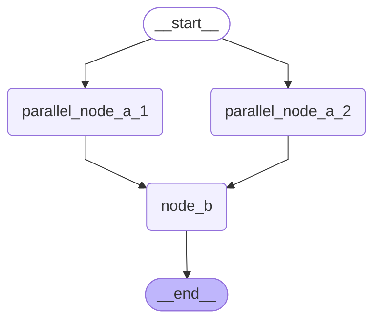

**运行结果如下**

```python
# === 第 1 个检查点：input 阶段（step=-1），仅有 __start__ 任务 ===
(
    'checkpoints',
    {
        'config': {
            'configurable': {
                'checkpoint_ns': '',
                'thread_id': '123',
                'checkpoint_id': '1f17e909-a431-6009-bfff-dd033caf8a09'
            }
        },
        'parent_config': None,
        'values': {},
        'metadata': {
            'source': 'input',
            'step': -1,
            'parents': {}
        },
        'next': ['__start__'],
        'tasks': [
            {
                'id': '6f4add75-8430-fd5b-46d5-93f40b5f142a',
                'name': '__start__',
                'interrupts': (),
                'state': None
            }
        ]
    }
)

# === 第 2 个检查点：loop 阶段（step=0），两个并行节点待执行 ===
(
    'checkpoints',
    {
        'config': {
            'configurable': {
                'checkpoint_ns': '',
                'thread_id': '123',
                'checkpoint_id': '1f17e909-a436-66f0-8000-61f51460d18e'
            }
        },
        'parent_config': {
            'configurable': {
                'checkpoint_ns': '',
                'thread_id': '123',
                'checkpoint_id': '1f17e909-a431-6009-bfff-dd033caf8a09'
            }
        },
        'values': {
            'initial_state': '初始状态'
        },
        'metadata': {
            'source': 'loop',
            'step': 0,
            'parents': {}
        },
        'next': ['parallel_node_a_1', 'parallel_node_a_2'],
        'tasks': [
            {
                'id': '0aa4a4d7-1e7f-f02f-25ef-46c088c7e1e0',
                'name': 'parallel_node_a_1',
                'interrupts': (),
                'state': None
            },
            {
                'id': 'd3670671-0bdb-6574-be1e-915be93b239e',
                'name': 'parallel_node_a_2',
                'interrupts': (),
                'state': None
            }
        ]
    }
)

# === 第 3 个检查点：loop 阶段（step=1），并行节点执行完毕，node_b 待执行 ===
(
    'checkpoints',
    {
        'config': {
            'configurable': {
                'checkpoint_ns': '',
                'thread_id': '123',
                'checkpoint_id': '1f17e909-a439-67c6-8001-f441fbddc2f9'
            }
        },
        'parent_config': {
            'configurable': {
                'checkpoint_ns': '',
                'thread_id': '123',
                'checkpoint_id': '1f17e909-a436-66f0-8000-61f51460d18e'
            }
        },
        'values': {
            'initial_state': '初始状态',
            'parallel_node_a_1': '并行节点A-1的输出',
            'parallel_node_a_2': '并行节点A-2的输出'
        },
        'metadata': {
            'source': 'loop',
            'step': 1,
            'parents': {}
        },
        'next': ['node_b'],
        'tasks': [
            {
                'id': 'cc97ac77-de6f-470b-d3c5-d0a94ea5534e',
                'name': 'node_b',
                'interrupts': (),
                'state': None
            }
        ]
    }
)

============================== -> 中断前后分界线 <- ==============================

# === 第 4 个检查点：中断发生时（step=1），node_b 的 interrupts 字段包含中断信息 ===
(
    'checkpoints',
    {
        'config': {
            'configurable': {
                'checkpoint_ns': '',
                'thread_id': '123',
                'checkpoint_id': '1f17e909-a439-67c6-8001-f441fbddc2f9'
            }
        },
        'parent_config': {
            'configurable': {
                'thread_id': '123',
                'checkpoint_ns': '',
                'checkpoint_id': '1f17e909-a436-66f0-8000-61f51460d18e'
            }
        },
        'values': {
            'initial_state': '初始状态',
            'parallel_node_a_1': '并行节点A-1的输出',
            'parallel_node_a_2': '并行节点A-2的输出'
        },
        'metadata': {
            'source': 'loop',
            'step': 1,
            'parents': {}
        },
        'next': ['node_b'],
        'tasks': [
            {
                'id': 'cc97ac77-de6f-470b-d3c5-d0a94ea5534e',
                'name': 'node_b',
                'interrupts': (
                    {
                        'value': 'hello',
                        'id': '486f817f7367de26620067969c8780eb'
                    },
                ),
                'state': None
            }
        ]
    }
)

# === 第 5 个检查点：resume 后（step=2），node_b 执行完毕，next 为空 ===
(
    'checkpoints',
    {
        'config': {
            'configurable': {
                'checkpoint_ns': '',
                'thread_id': '123',
                'checkpoint_id': '1f17e926-5137-6203-8002-4e1f7ffb6aa1'
            }
        },
        'parent_config': {
            'configurable': {
                'checkpoint_ns': '',
                'thread_id': '123',
                'checkpoint_id': '1f17e909-a439-67c6-8001-f441fbddc2f9'
            }
        },
        'values': {
            'initial_state': '初始状态',
            'parallel_node_a_1': '并行节点A-1的输出',
            'parallel_node_a_2': '并行节点A-2的输出',
            'node_b_output': '节点B的输出'
        },
        'metadata': {
            'source': 'loop',
            'step': 2,
            'parents': {}
        },
        'next': [],
        'tasks': []
    }
)
```

**查看历史检查点列表**

```python
list(graph.get_state_history(config=config))
```

**运行结果如下**

```json
[
    StateSnapshot(
        values={
            'initial_state': '初始状态',
            'parallel_node_a_1': '并行节点A-1的输出',
            'parallel_node_a_2': '并行节点A-2的输出',
            'node_b_output': '节点B的输出'
        },
        next=(),
        config={
            'configurable': {
                'thread_id': '123',
                'checkpoint_ns': '',
                'checkpoint_id': '1f16eb81-f230-641b-8002-53e494a0e53c'
            }
        },
        metadata={
            'source': 'loop',
            'step': 2,
            'parents': {}
        },
        created_at='2026-06-23T04:00:50.062223+00:00',
        parent_config={
            'configurable': {
                'thread_id': '123',
                'checkpoint_ns': '',
                'checkpoint_id': '1f16eb81-f229-6a9b-8001-4049f4629aea'
            }
        },
        tasks=(),
        interrupts=()
    ),

    StateSnapshot(
        values={
            'initial_state': '初始状态',
            'parallel_node_a_1': '并行节点A-1的输出',
            'parallel_node_a_2': '并行节点A-2的输出'
        },
        next=(
            'node_b',
        ),
        config={
            'configurable': {
                'thread_id': '123',
                'checkpoint_ns': '',
                'checkpoint_id': '1f16eb81-f229-6a9b-8001-4049f4629aea'
            }
        },
        metadata={
            'source': 'loop',
            'step': 1,
            'parents': {}
        },
        created_at='2026-06-23T04:00:50.059522+00:00',
        parent_config={
            'configurable': {
                'thread_id': '123',
                'checkpoint_ns': '',
                'checkpoint_id': '1f16eb81-f225-646d-8000-b7e7c665f75a'
            }
        },
        tasks=(
            PregelTask(
                id='f2153246-63f8-7422-31f6-2712d781be78',
                name='node_b',
                path=(
                    '__pregel_pull',
                    'node_b'
                ),
                error=None,
                interrupts=(
                    Interrupt(
                        value='hello',
                        id='6e3aa823181df313cfac730c024f4ed7'
                    ),
                ),
                state=None,
                result={
                    'node_b_output': '节点B的输出'
                }
            ),
        ),
        interrupts=(
            Interrupt(
                value='hello',
                id='6e3aa823181df313cfac730c024f4ed7'
            ),
        )
    ),

    StateSnapshot(
        values={
            'initial_state': '初始状态'
        },
        next=(
            'parallel_node_a_1',
            'parallel_node_a_2'
        ),
        config={
            'configurable': {
                'thread_id': '123',
                'checkpoint_ns': '',
                'checkpoint_id': '1f16eb81-f225-646d-8000-b7e7c665f75a'
            }
        },
        metadata={
            'source': 'loop',
            'step': 0,
            'parents': {}
        },
        created_at='2026-06-23T04:00:50.057725+00:00',
        parent_config={
            'configurable': {
                'thread_id': '123',
                'checkpoint_ns': '',
                'checkpoint_id': '1f16eb81-f221-6a80-bfff-d157e04c0492'
            }
        },
        tasks=(
            PregelTask(
                id='419afd20-961a-9a90-49dd-d19f1448ebe0',
                name='parallel_node_a_1',
                path=(
                    '__pregel_pull',
                    'parallel_node_a_1'
                ),
                error=None,
                interrupts=(),
                state=None,
                result={
                    'parallel_node_a_1': '并行节点A-1的输出'
                }
            ),
            PregelTask(
                id='339d1e80-39f2-24d5-c677-3fb3f8314fd6',
                name='parallel_node_a_2',
                path=(
                    '__pregel_pull',
                    'parallel_node_a_2'
                ),
                error=None,
                interrupts=(),
                state=None,
                result={
                    'parallel_node_a_2': '并行节点A-2的输出'
                }
            )
        ),
        interrupts=()
    ),

    StateSnapshot(
        values={},
        next=(
            '__start__',
        ),
        config={
            'configurable': {
                'thread_id': '123',
                'checkpoint_ns': '',
                'checkpoint_id': '1f16eb81-f221-6a80-bfff-d157e04c0492'
            }
        },
        metadata={
            'source': 'input',
            'step': -1,
            'parents': {}
        },
        created_at='2026-06-23T04:00:50.056245+00:00',
        parent_config=None,
        tasks=(
            PregelTask(
                id='20116610-8f9e-c556-b647-778737961e5a',
                name='__start__',
                path=(
                    '__pregel_pull',
                    '__start__'
                ),
                error=None,
                interrupts=(),
                state=None,
                result={
                    'initial_state': '初始状态'
                }
            ),
        ),
        interrupts=()
    )
]
```

| 对比维度 | `get_state_history()` | `checkpoints` 流 |
|:---|:---|:---|
| 排序方式 | 时间倒序（最新在前） | 超步编号升序（正向执行顺序） |
| 顶层 `interrupts` | 有 | **无**（中断信息附着在 `tasks[].interrupts` 中） |

**中断时序说明**：检查点 `chunk` 在超步**第一阶段**输出，中断在**第二阶段**触发。因此中断发生时最新检查点仍为上一步（`step=1`），任务中断信息尚为空；恢复执行后第一阶段重新输出 `step=1` 检查点时，中断信息已被记录。

#### 11.2.2.5. `tasks`

**`tasks`** 模式以任务为单位输出开始事件和结果事件。它比 **`updates`** 更偏向运行时观测：除了任务结果，还会暴露任务输入、触发通道、异常和中断信息。

**示例如下**

```python
from typing import TypedDict
from langgraph.graph import StateGraph, START, END

class OverAllState(TypedDict):
    initial_state: str
    parallel_node_a_1: str
    parallel_node_a_2: str
    node_b_output: str

def parallel_node_a_1(state: OverAllState) -> OverAllState:
    return {
        "parallel_node_a_1": "并行节点A-1的输出"
    }

def parallel_node_a_2(state: OverAllState) -> OverAllState:
    return {
        "parallel_node_a_2": "并行节点A-2的输出"
    }

def node_b(state: OverAllState) -> OverAllState:
    return {
        "node_b_output": "节点B的输出"
    }

builder = StateGraph(state_schema=OverAllState)
builder.add_node("parallel_node_a_1", parallel_node_a_1)
builder.add_node("parallel_node_a_2", parallel_node_a_2)
builder.add_node("node_b", node_b)
builder.add_edge(START, "parallel_node_a_1")
builder.add_edge(START, "parallel_node_a_2")
builder.add_edge(["parallel_node_a_1", "parallel_node_a_2"], "node_b")
builder.add_edge("node_b", END)

graph = builder.compile()

for chunk in graph.stream(
    {"initial_state": "初始状态"},
    stream_mode=["tasks"]
):
    print(chunk)
```

**运行结果如下**

```json
(
    'tasks',
    {
        'id': '0b0c1e51-456f-d37c-346c-2109d78f8c2a',
        'name': 'parallel_node_a_1',
        'input': {
            'initial_state': '初始状态'
        },
        'triggers': (
            'branch:to:parallel_node_a_1',
        )
    }
)

(
    'tasks',
    {
        'id': '018ab5c2-0a5a-9094-8876-05668d3f27e0',
        'name': 'parallel_node_a_2',
        'input': {
            'initial_state': '初始状态'
        },
        'triggers': (
            'branch:to:parallel_node_a_2',
        )
    }
)

(
    'tasks',
    {
        'id': '0b0c1e51-456f-d37c-346c-2109d78f8c2a',
        'name': 'parallel_node_a_1',
        'error': None,
        'result': {
            'parallel_node_a_1': '并行节点A-1的输出'
        },
        'interrupts': []
    }
)

(
    'tasks',
    {
        'id': '018ab5c2-0a5a-9094-8876-05668d3f27e0',
        'name': 'parallel_node_a_2',
        'error': None,
        'result': {
            'parallel_node_a_2': '并行节点A-2的输出'
        },
        'interrupts': []
    }
)

(
    'tasks',
    {
        'id': '6ebeabdb-1735-2cab-ca3e-ea2fa67be0ff',
        'name': 'node_b',
        'input': {
            'initial_state': '初始状态',
            'parallel_node_a_1': '并行节点A-1的输出',
            'parallel_node_a_2': '并行节点A-2的输出'
        },
        'triggers': (
            'branch:to:node_b',
            'join:parallel_node_a_1+parallel_node_a_2:node_b'
        )
    }
)

(
    'tasks',
    {
        'id': '6ebeabdb-1735-2cab-ca3e-ea2fa67be0ff',
        'name': 'node_b',
        'error': None,
        'result': {
            'node_b_output': '节点B的输出'
        },
        'interrupts': []
    }
)
```

**任务 `chunk` 分为两类**：

| 事件类型 | 产生时机 | 关键字段 |
|:---|:---|:---|
| **任务开始事件** | 任务准备完毕，尚未执行 | `input`（任务输入）、`triggers`（触发通道） |
| **任务结果事件** | 任务执行完成/失败/中断后 | `error`（异常，`None`=正常）、`result`、`interrupts` |

并行任务时：所有**开始事件**（第一阶段）全部输出后，才出现**结果事件**（第二阶段）。

#### 11.2.2.6. `debug`

**示例如下**

```python
from typing import TypedDict
from langgraph.graph import StateGraph, START, END
from langgraph.checkpoint.memory import InMemorySaver

from langgraph.types import interrupt, Command

class OverAllState(TypedDict):
    initial_state: str
    parallel_node_a_1: str
    parallel_node_a_2: str
    node_b_output: str

def parallel_node_a_1(state: OverAllState) -> OverAllState:
    return {
        "parallel_node_a_1": "并行节点A-1的输出"
    }

def parallel_node_a_2(state: OverAllState) -> OverAllState:
    return {
        "parallel_node_a_2": "并行节点A-2的输出"
    }

def node_b(state: OverAllState) -> OverAllState:
    interrupt("hello")
    return {
        "node_b_output": "节点B的输出"
    }

builder = StateGraph(state_schema=OverAllState)
builder.add_node("parallel_node_a_1", parallel_node_a_1)
builder.add_node("parallel_node_a_2", parallel_node_a_2)
builder.add_node("node_b", node_b)
builder.add_edge(START, "parallel_node_a_1")
builder.add_edge(START, "parallel_node_a_2")
builder.add_edge(["parallel_node_a_1", "parallel_node_a_2"], "node_b")
builder.add_edge("node_b", END)

checkpointer = InMemorySaver()
graph = builder.compile(checkpointer=checkpointer)

config = {"configurable": {"thread_id": "123"}}
for chunk in graph.stream(
    {"initial_state": "初始状态"},
    stream_mode=["debug"],
    config=config
):
    print(chunk)

print('=' * 30, '-> 中断前后分界线 <-', '=' * 30)

for chunk in graph.stream(
    Command(resume=""),
    stream_mode=["debug"],
    config=config
):
    print(chunk)
```

**运行结果如下**

```json
(
    'debug',
    {
        'step': -1,
        'timestamp': '2026-06-23T06:02:59.369405+00:00',
        'type': 'checkpoint',
        'payload': {
            'config': {
                'configurable': {
                    'checkpoint_ns': '',
                    'thread_id': '123',
                    'checkpoint_id': '1f16ec92-fbe6-68b4-bfff-30257767db2f'
                }
            },
            'parent_config': None,
            'values': {},
            'metadata': {
                'source': 'input',
                'step': -1,
                'parents': {}
            },
            'next': [
                '__start__'
            ],
            'tasks': [
                {
                    'id': '3a25e32c-3a9a-a6fa-3c77-e958d2cf0021',
                    'name': '__start__',
                    'interrupts': (),
                    'state': None
                }
            ]
        }
    }
)

(
    'debug',
    {
        'step': 0,
        'timestamp': '2026-06-23T06:02:59.371035+00:00',
        'type': 'checkpoint',
        'payload': {
            'config': {
                'configurable': {
                    'checkpoint_ns': '',
                    'thread_id': '123',
                    'checkpoint_id': '1f16ec92-fbe9-63f9-8000-bc529e935a70'
                }
            },
            'parent_config': {
                'configurable': {
                    'checkpoint_ns': '',
                    'thread_id': '123',
                    'checkpoint_id': '1f16ec92-fbe6-68b4-bfff-30257767db2f'
                }
            },
            'values': {
                'initial_state': '初始状态'
            },
            'metadata': {
                'source': 'loop',
                'step': 0,
                'parents': {}
            },
            'next': [
                'parallel_node_a_1',
                'parallel_node_a_2'
            ],
            'tasks': [
                {
                    'id': '8f4954b8-e096-ed44-fd3b-b5741b66ce14',
                    'name': 'parallel_node_a_1',
                    'interrupts': (),
                    'state': None
                },
                {
                    'id': '33b02562-5b8b-c072-3dd4-d939f02f3835',
                    'name': 'parallel_node_a_2',
                    'interrupts': (),
                    'state': None
                }
            ]
        }
    }
)

(
    'debug',
    {
        'step': 1,
        'timestamp': '2026-06-23T06:02:59.371050+00:00',
        'type': 'task',
        'payload': {
            'id': '8f4954b8-e096-ed44-fd3b-b5741b66ce14',
            'name': 'parallel_node_a_1',
            'input': {
                'initial_state': '初始状态'
            },
            'triggers': (
                'branch:to:parallel_node_a_1',
            )
        }
    }
)

(
    'debug',
    {
        'step': 1,
        'timestamp': '2026-06-23T06:02:59.371054+00:00',
        'type': 'task',
        'payload': {
            'id': '33b02562-5b8b-c072-3dd4-d939f02f3835',
            'name': 'parallel_node_a_2',
            'input': {
                'initial_state': '初始状态'
            },
            'triggers': (
                'branch:to:parallel_node_a_2',
            )
        }
    }
)

(
    'debug',
    {
        'step': 1,
        'timestamp': '2026-06-23T06:02:59.371811+00:00',
        'type': 'task_result',
        'payload': {
            'id': '8f4954b8-e096-ed44-fd3b-b5741b66ce14',
            'name': 'parallel_node_a_1',
            'error': None,
            'result': {
                'parallel_node_a_1': '并行节点A-1的输出'
            },
            'interrupts': []
        }
    }
)

(
    'debug',
    {
        'step': 1,
        'timestamp': '2026-06-23T06:02:59.371861+00:00',
        'type': 'task_result',
        'payload': {
            'id': '33b02562-5b8b-c072-3dd4-d939f02f3835',
            'name': 'parallel_node_a_2',
            'error': None,
            'result': {
                'parallel_node_a_2': '并行节点A-2的输出'
            },
            'interrupts': []
        }
    }
)

(
    'debug',
    {
        'step': 1,
        'timestamp': '2026-06-23T06:02:59.372140+00:00',
        'type': 'checkpoint',
        'payload': {
            'config': {
                'configurable': {
                    'checkpoint_ns': '',
                    'thread_id': '123',
                    'checkpoint_id': '1f16ec92-fbee-6f65-8001-4e724c2acb07'
                }
            },
            'parent_config': {
                'configurable': {
                    'checkpoint_ns': '',
                    'thread_id': '123',
                    'checkpoint_id': '1f16ec92-fbe9-63f9-8000-bc529e935a70'
                }
            },
            'values': {
                'initial_state': '初始状态',
                'parallel_node_a_1': '并行节点A-1的输出',
                'parallel_node_a_2': '并行节点A-2的输出'
            },
            'metadata': {
                'source': 'loop',
                'step': 1,
                'parents': {}
            },
            'next': [
                'node_b'
            ],
            'tasks': [
                {
                    'id': 'e7d4c64e-8ab7-99ec-4031-170fd0122ed7',
                    'name': 'node_b',
                    'interrupts': (),
                    'state': None
                }
            ]
        }
    }
)

(
    'debug',
    {
        'step': 2,
        'timestamp': '2026-06-23T06:02:59.372150+00:00',
        'type': 'task',
        'payload': {
            'id': 'e7d4c64e-8ab7-99ec-4031-170fd0122ed7',
            'name': 'node_b',
            'input': {
                'initial_state': '初始状态',
                'parallel_node_a_1': '并行节点A-1的输出',
                'parallel_node_a_2': '并行节点A-2的输出'
            },
            'triggers': (
                'branch:to:node_b',
                'join:parallel_node_a_1+parallel_node_a_2:node_b'
            )
        }
    }
)

(
    'debug',
    {
        'step': 2,
        'timestamp': '2026-06-23T06:02:59.372332+00:00',
        'type': 'task_result',
        'payload': {
            'id': 'e7d4c64e-8ab7-99ec-4031-170fd0122ed7',
            'name': 'node_b',
            'error': None,
            'result': {},
            'interrupts': [
                {
                    'value': 'hello',
                    'id': 'b195d3f05c81aac2aab438899fe67823'
                }
            ]
        }
    }
)

============================== -> 中断前后分界线 <- ==============================

(
    'debug',
    {
        'step': 1,
        'timestamp': '2026-06-23T06:02:59.373847+00:00',
        'type': 'checkpoint',
        'payload': {
            'config': {
                'configurable': {
                    'checkpoint_ns': '',
                    'thread_id': '123',
                    'checkpoint_id': '1f16ec92-fbee-6f65-8001-4e724c2acb07'
                }
            },
            'parent_config': {
                'configurable': {
                    'thread_id': '123',
                    'checkpoint_ns': '',
                    'checkpoint_id': '1f16ec92-fbe9-63f9-8000-bc529e935a70'
                }
            },
            'values': {
                'initial_state': '初始状态',
                'parallel_node_a_1': '并行节点A-1的输出',
                'parallel_node_a_2': '并行节点A-2的输出'
            },
            'metadata': {
                'source': 'loop',
                'step': 1,
                'parents': {}
            },
            'next': [
                'node_b'
            ],
            'tasks': [
                {
                    'id': 'e7d4c64e-8ab7-99ec-4031-170fd0122ed7',
                    'name': 'node_b',
                    'interrupts': (
                        {
                            'value': 'hello',
                            'id': 'b195d3f05c81aac2aab438899fe67823'
                        },
                    ),
                    'state': None
                }
            ]
        }
    }
)

(
    'debug',
    {
        'step': 2,
        'timestamp': '2026-06-23T06:02:59.373864+00:00',
        'type': 'task',
        'payload': {
            'id': 'e7d4c64e-8ab7-99ec-4031-170fd0122ed7',
            'name': 'node_b',
            'input': {
                'initial_state': '初始状态',
                'parallel_node_a_1': '并行节点A-1的输出',
                'parallel_node_a_2': '并行节点A-2的输出'
            },
            'triggers': (
                'branch:to:node_b',
                'join:parallel_node_a_1+parallel_node_a_2:node_b'
            )
        }
    }
)

(
    'debug',
    {
        'step': 2,
        'timestamp': '2026-06-23T06:02:59.374037+00:00',
        'type': 'task_result',
        'payload': {
            'id': 'e7d4c64e-8ab7-99ec-4031-170fd0122ed7',
            'name': 'node_b',
            'error': None,
            'result': {
                'node_b_output': '节点B的输出'
            },
            'interrupts': []
        }
    }
)

(
    'debug',
    {
        'step': 2,
        'timestamp': '2026-06-23T06:02:59.374356+00:00',
        'type': 'checkpoint',
        'payload': {
            'config': {
                'configurable': {
                    'checkpoint_ns': '',
                    'thread_id': '123',
                    'checkpoint_id': '1f16ec92-fbf3-6ffe-8002-32361c07b81c'
                }
            },
            'parent_config': {
                'configurable': {
                    'checkpoint_ns': '',
                    'thread_id': '123',
                    'checkpoint_id': '1f16ec92-fbee-6f65-8001-4e724c2acb07'
                }
            },
            'values': {
                'initial_state': '初始状态',
                'parallel_node_a_1': '并行节点A-1的输出',
                'parallel_node_a_2': '并行节点A-2的输出',
                'node_b_output': '节点B的输出'
            },
            'metadata': {
                'source': 'loop',
                'step': 2,
                'parents': {}
            },
            'next': [],
            'tasks': []
        }
    }
)
```

**查看历史检查点**

```python
list(graph.get_state_history(config=config))
```

**结果如下**

```json
[
    StateSnapshot(
        values={
            'initial_state': '初始状态',
            'parallel_node_a_1': '并行节点A-1的输出',
            'parallel_node_a_2': '并行节点A-2的输出',
            'node_b_output': '节点B的输出'
        },
        next=(),
        config={
            'configurable': {
                'thread_id': '123',
                'checkpoint_ns': '',
                'checkpoint_id': '1f16ec92-fbf3-6ffe-8002-32361c07b81c'
            }
        },
        metadata={
            'source': 'loop',
            'step': 2,
            'parents': {}
        },
        created_at='2026-06-23T06:02:59.374073+00:00',
        parent_config={
            'configurable': {
                'thread_id': '123',
                'checkpoint_ns': '',
                'checkpoint_id': '1f16ec92-fbee-6f65-8001-4e724c2acb07'
            }
        },
        tasks=(),
        interrupts=()
    ),

    StateSnapshot(
        values={
            'initial_state': '初始状态',
            'parallel_node_a_1': '并行节点A-1的输出',
            'parallel_node_a_2': '并行节点A-2的输出'
        },
        next=(
            'node_b',
        ),
        config={
            'configurable': {
                'thread_id': '123',
                'checkpoint_ns': '',
                'checkpoint_id': '1f16ec92-fbee-6f65-8001-4e724c2acb07'
            }
        },
        metadata={
            'source': 'loop',
            'step': 1,
            'parents': {}
        },
        created_at='2026-06-23T06:02:59.372008+00:00',
        parent_config={
            'configurable': {
                'thread_id': '123',
                'checkpoint_ns': '',
                'checkpoint_id': '1f16ec92-fbe9-63f9-8000-bc529e935a70'
            }
        },
        tasks=(
            PregelTask(
                id='e7d4c64e-8ab7-99ec-4031-170fd0122ed7',
                name='node_b',
                path=(
                    '__pregel_pull',
                    'node_b'
                ),
                error=None,
                interrupts=(
                    Interrupt(
                        value='hello',
                        id='b195d3f05c81aac2aab438899fe67823'
                    ),
                ),
                state=None,
                result={
                    'node_b_output': '节点B的输出'
                }
            ),
        ),
        interrupts=(
            Interrupt(
                value='hello',
                id='b195d3f05c81aac2aab438899fe67823'
            ),
        )
    ),

    StateSnapshot(
        values={
            'initial_state': '初始状态'
        },
        next=(
            'parallel_node_a_1',
            'parallel_node_a_2'
        ),
        config={
            'configurable': {
                'thread_id': '123',
                'checkpoint_ns': '',
                'checkpoint_id': '1f16ec92-fbe9-63f9-8000-bc529e935a70'
            }
        },
        metadata={
            'source': 'loop',
            'step': 0,
            'parents': {}
        },
        created_at='2026-06-23T06:02:59.369665+00:00',
        parent_config={
            'configurable': {
                'thread_id': '123',
                'checkpoint_ns': '',
                'checkpoint_id': '1f16ec92-fbe6-68b4-bfff-30257767db2f'
            }
        },
        tasks=(
            PregelTask(
                id='8f4954b8-e096-ed44-fd3b-b5741b66ce14',
                name='parallel_node_a_1',
                path=(
                    '__pregel_pull',
                    'parallel_node_a_1'
                ),
                error=None,
                interrupts=(),
                state=None,
                result={
                    'parallel_node_a_1': '并行节点A-1的输出'
                }
            ),
            PregelTask(
                id='33b02562-5b8b-c072-3dd4-d939f02f3835',
                name='parallel_node_a_2',
                path=(
                    '__pregel_pull',
                    'parallel_node_a_2'
                ),
                error=None,
                interrupts=(),
                state=None,
                result={
                    'parallel_node_a_2': '并行节点A-2的输出'
                }
            )
        ),
        interrupts=()
    ),

    StateSnapshot(
        values={},
        next=(
            '__start__',
        ),
        config={
            'configurable': {
                'thread_id': '123',
                'checkpoint_ns': '',
                'checkpoint_id': '1f16ec92-fbe6-68b4-bfff-30257767db2f'
            }
        },
        metadata={
            'source': 'input',
            'step': -1,
            'parents': {}
        },
        created_at='2026-06-23T06:02:59.368563+00:00',
        parent_config=None,
        tasks=(
            PregelTask(
                id='3a25e32c-3a9a-a6fa-3c77-e958d2cf0021',
                name='__start__',
                path=(
                    '__pregel_pull',
                    '__start__'
                ),
                error=None,
                interrupts=(),
                state=None,
                result={
                    'initial_state': '初始状态'
                }
            ),
        ),
        interrupts=()
    )
]
```

**`debug` 模式 = `checkpoints` + `tasks` 的统一封装**，外层增加调试字段：

| 字段 | 含义 |
|:---|:---|
| `step` | 超步编号 |
| `timestamp` | chunk 生成时间 |
| `type` | `checkpoint` / `task` / `task_result` |
| `payload` | 对应模式下 chunk 的原始内容 |

**chunk 输出顺序**：每个超步第一阶段按 `准备任务 → 检查点日志 → 任务日志` 的顺序生成，因此任务 chunk 位于前后两个超步的检查点 chunk 之间。中断恢复时对应超步会重新执行，任务 chunk 会再次生成。

   具体来说，**`step=2`** 的超步发生了中断，恢复运行时，**`step=2`** 会重新执行，其第一阶段会再次准备任务，并生成这一阶段的所有任务 **`chunk`**。

#### 11.2.2.7. `custom`

**`custom`** 模式允许**节点或工具**主动写出自定义数据，调用方通过 **`stream/astream`** 消费这些数据。

它适合输出进度、阶段说明、外部 API 的增量结果等非状态数据。

##### 11.2.2.7.1. 节点中写出内容

节点中写出内容通过 **`Runtime`** 实例的 **`stream_writer`**（也可通过 `get_stream_writer()` 获取，二者等效）。当 `stream_mode` 包含 `custom` 时，底层会定义 `stream_writer` 并注入 `Runtime`，相关源码：

**定义 `stream_writer`**

```python
if "custom" in stream_modes:

    def stream_writer(c: Any) -> None:
        stream.put(
            (
                tuple(
                    get_config()[CONF][CONFIG_KEY_CHECKPOINT_NS].split(
                        NS_SEP
                    )[:-1]
                ),
                "custom",
                c,
            )
        )
```

创建 **`Runtime`** 实例

```python
runtime = Runtime(
    context=_coerce_context(self.context_schema, context),
    store=store,
    stream_writer=stream_writer,
    previous=None,
)
```

**示例如下**

```python
from typing import TypedDict
from langgraph.graph import StateGraph, START, END
from langgraph.runtime import Runtime

class OverAllState(TypedDict):
    initial_state: str
    node_a_output: str
    node_b_output: str

def node_a(state: OverAllState, runtime: Runtime) -> OverAllState:
    stream_writer = runtime.stream_writer
    stream_writer("节点 A 正在执行...")

    return {
        "node_a_output": "节点A的输出"
    }

def node_b(state: OverAllState, runtime: Runtime) -> OverAllState:
    stream_writer = runtime.stream_writer
    stream_writer("节点 B 正在执行...")

    return {
        "node_b_output": "节点B的输出"
    }

builder = StateGraph(state_schema=OverAllState)
builder.add_node("node_a", node_a)
builder.add_node("node_b", node_b)
builder.add_edge(START, "node_a")
builder.add_edge("node_a", "node_b")
builder.add_edge("node_b", END)

graph = builder.compile()
for chunk in graph.stream(
    {"initial_state": "初始状态"},
    stream_mode=["custom"],
):
    print(chunk)
```

**运行结果如下**

```json
('custom', '节点 A 正在执行...')
('custom', '节点 B 正在执行...')
```

##### 11.2.2.7.2. 工具中写出内容

工具中写出内容通过 **`ToolRuntime`** 实例的 **`stream_writer`**，用法与节点中一致。

**示例如下**

```python
from typing import Literal
from langgraph.graph import StateGraph, START, END, MessagesState
from langgraph.prebuilt.tool_node import ToolNode, ToolRuntime
from langgraph.runtime import Runtime
from langchain.tools import tool

from langchain.messages import HumanMessage
from langchain_deepseek import ChatDeepSeek
from dotenv import load_dotenv

load_dotenv(override=True)
model = ChatDeepSeek(
    model="deepseek-v4-flash",
    extra_body={
        "thinking": {
            "type": "disabled"
        }
    }
)

@tool(parse_docstring=True)
def get_weather(city: str, runtime: ToolRuntime) -> str:
    """
    根据城市查询当日天气

    Args:
        city: 城市名称
    """
    stream_writer = runtime.stream_writer
    stream_writer(f"正在查询 {city} 今天的天气...")
    return f"{city} 今天天气不错"

tools = [get_weather]
model_with_tools = model.bind_tools(tools=tools)

def llm_node(state: MessagesState, runtime: Runtime) -> MessagesState:
    messages = state["messages"]
    response = model_with_tools.invoke(messages)

    stream_writer = runtime.stream_writer
    stream_writer("正在执行 llm_node...")

    return {
        "messages": [response]
    }

def router(state: MessagesState) -> Literal["tool_node", END]:
    last_msg = state["messages"][-1]
    if last_msg.tool_calls:
        return "tool_node"
    return END

builder = StateGraph(state_schema=MessagesState)
builder.add_node("llm_node", llm_node)
builder.add_node("tool_node", ToolNode(tools=tools))
builder.add_edge(START, "llm_node")
builder.add_conditional_edges("llm_node", router, path_map=["tool_node", END])
builder.add_edge("tool_node", "llm_node")

graph = builder.compile()

for chunk in graph.stream(
    {"messages": [HumanMessage("今天北京天气如何？")]},
    stream_mode=["custom"]
):
    print(chunk)
```

**运行结果如下**

```json
('custom', '正在执行 llm_node...')
('custom', '正在查询 北京 今天的天气...')
('custom', '正在执行 llm_node...')
```

### 11.2.3. 底层机制

以 **`LangGraph 1.1.2`** 的 **`stream()`** 为例，流式处理分为三个阶段：

| 阶段 | 说明 |
|:---|:---|
| **创建队列** | `stream()` 调用 `SyncQueue()` 创建 FIFO 队列，接收运行时写入的 chunk |
| **生产** | 根据 `stream_mode`，在运行时的不同阶段将原始数据写入队列 |
| **消费** | 在两处调用 `_output()` 函数，按 FIFO 从队列取出数据 `yield` 给调用者：① `runner.tick()` 交还控制权时；② 超步循环结束后清空收尾 |

对 **`messages`** 和 **`custom`** 等需及时输出的模式，框架启用**等待器**，队列有新数据时立即交还控制权。

## 11.3. `astream_events`

**`astream_events`** 用于异步获取图运行过程中产生的 **`Runnable` 标准事件**。它关注的是可执行组件的生命周期、父子调用关系、输入输出和元数据，而不是单纯返回图状态。

**`Runnable`接口**

**`Runnable`** 是 `LangChain` 与 `LangGraph` 生态的统一可执行对象协议（`langchain_core.runnables`），统一了模型、工具、Agent、节点和编译图等组件的调用方式。

| 方法 | 说明 |
|:---|:---|
| `invoke()` / `ainvoke()` | 同步/异步调用 |
| `stream()` / `astream()` | 同步/异步流式执行 |
| `astream_events()` | 异步获取标准事件 |
| `batch()` | 批量执行 |

常见 `Runnable` 组件：`CompiledStateGraph`、`PromptTemplate`、`ChatModel`、`Tool`、`Retriever`、`RunnableSequence`。

**`Runnable`事件**

**`Runnable`** 执行过程会被框架转换为标准化事件，遵循 `on_<type>_<phase>` 命名规则：

| 阶段 | 事件后缀 | 含义 |
|:---|:---|:---|
| 开始 | `_start` | 组件开始执行 |
| 中间 | `_stream` | 产生中间结果 |
| 结束 | `_end` | 组件执行结束 |

类型（`<type>`）可为 `chain`、`chat_model`、`llm`、`tool`、`retriever`、`prompt` 等。并非所有类型都有三种事件——例如工具通常只有 `on_tool_start` 和 `on_tool_end`。

实际运行拿到的 **`Runnable` 事件** 示例如下

```json
{
    'event': 'on_chain_start',
    'data': {
        'input': {
            'initial_state': '初始状态'
        }
    },
    'name': 'LangGraph',
    'tags': [],
    'run_id': '019eeedd-9dfd-7400-b465-6b95f7292333',
    'metadata': {},
    'parent_ids': []
}
```

### 11.3.1. `astream_events`的版本

从 **`LangGraph 1.2.0`** 开始，**`astream_events`** 支持三个版本：

| 版本 | 基础 | 特点 | 入口 |
|:---|:---|:---|:---|
| **`v1`** | `Runnable` 标准事件 | `parent_ids` 始终为空列表 | `astream_events(version="v1")` |
| **`v2`**（默认） | `Runnable` 标准事件 | `parent_ids` 可表达完整父级运行链，改进父子调用关系 | `astream_events(version="v2")` |
| **`v3`** | `Pregel` 原始流（= `stream/astream` 底层） | 全新协议，通过类型化投影消费（见下表），独立于 v1/v2 | `astream_events(version="v3")` / `stream_events(version="v3")` |

**`v3`** 从底层 `stream/astream` 获取 `Pregel` 原始流数据，经事件路由器与 `StreamTransformer` 生成类型化投影。投影之间可独立/并发消费：

| 投影                     | 用法                         |
| :----------------------- | :--------------------------- |
| **`stream`**             | 遍历每个协议事件             |
| **`stream.messages`**    | 流式传输聊天模型的消息。     |
| **`stream.values`**      | 流式传输状态快照             |
| **`stream.output`**      | 等待计算图的最终输出         |
| **`stream.subgraphs`**   | 观测子图的运行               |
| **`stream.interrupts`**  | 观测 **`HITL`** 的中断信息   |
| **`stream.interrupted`** | 检查运行是否因人工输入而中断 |
| **`stream.extensions`**  | 消费自定义流的投影           |

不同投影之间可以独立或并发消费，读取 **`stream.messages`** 不会消耗 **`stream.values`** 、 **`stream.subgraphs`** 或 **`stream.output`** 所需的事件。

`Pregel` 流即 `stream/astream` 的底层支持，上文 7 种 `stream_mode` 分别对应其中的 7 类流式数据。v3 并非 v1/v2 的封装——二者数据协议和内部管线独立，但共享同一组公开 API 入口和底层图运行时。


当前版本（**`LangGraph 1.1.2`**）仅支持 `astream_events` 的 **`v1/v2`**，默认版本为 **`v2`**。

### 11.3.2. `astream_events`的用法

事件流不是我们研究的重点，此处仅提供最简示例。

**示例如下**

底层也会调用 **`astream`** 来真正触发计算图的运行。

```python
from typing import TypedDict
from langgraph.graph import StateGraph, START, END

class OverAllState(TypedDict):
    initial_state: str
    node_a_output: str
    node_b_output: str

def node_a(state: OverAllState) -> OverAllState:
    return {
        "node_a_output": "节点A的输出"
    }

def node_b(state: OverAllState) -> OverAllState:
    return {
        "node_b_output": "节点B的输出"
    }

builder = StateGraph(state_schema=OverAllState)
builder.add_node("node_a", node_a)
builder.add_node("node_b", node_b)
builder.add_edge(START, "node_a")
builder.add_edge("node_a", "node_b")
builder.add_edge("node_b", END)

graph = builder.compile()
async for chunk in graph.astream_events(
    {"initial_state": "初始状态"},
    version="v2"
):
    print(chunk)
```

**运行结果如下**

```python
{
    'event': 'on_chain_start',
    'data': {
        'input': {
            'initial_state': '初始状态'
        }
    },
    'name': 'LangGraph',
    'tags': [],
    'run_id': '019ef40f-2522-7212-9ad6-cb83c499652d',
    'metadata': {},
    'parent_ids': []
}

{
    'event': 'on_chain_start',
    'data': {
        'input': {
            'initial_state': '初始状态'
        }
    },
    'name': 'node_a',
    'tags': [
        'graph:step:1'
    ],
    'run_id': '019ef40f-2524-7f83-9501-9248f93fd0a4',
    'metadata': {
        'langgraph_step': 1,
        'langgraph_node': 'node_a',
        'langgraph_triggers': (
            'branch:to:node_a',
        ),
        'langgraph_path': (
            '__pregel_pull',
            'node_a'
        ),
        'langgraph_checkpoint_ns': 'node_a:9a47e3e1-ccab-85cc-f837-f3c986bafd1f'
    },
    'parent_ids': [
        '019ef40f-2522-7212-9ad6-cb83c499652d'
    ]
}

{
    'event': 'on_chain_stream',
    'run_id': '019ef40f-2524-7f83-9501-9248f93fd0a4',
    'name': 'node_a',
    'tags': [
        'graph:step:1'
    ],
    'metadata': {
        'langgraph_step': 1,
        'langgraph_node': 'node_a',
        'langgraph_triggers': (
            'branch:to:node_a',
        ),
        'langgraph_path': (
            '__pregel_pull',
            'node_a'
        ),
        'langgraph_checkpoint_ns': 'node_a:9a47e3e1-ccab-85cc-f837-f3c986bafd1f'
    },
    'data': {
        'chunk': {
            'node_a_output': '节点A的输出'
        }
    },
    'parent_ids': [
        '019ef40f-2522-7212-9ad6-cb83c499652d'
    ]
}

{
    'event': 'on_chain_end',
    'data': {
        'output': {
            'node_a_output': '节点A的输出'
        },
        'input': {
            'initial_state': '初始状态'
        }
    },
    'run_id': '019ef40f-2524-7f83-9501-9248f93fd0a4',
    'name': 'node_a',
    'tags': [
        'graph:step:1'
    ],
    'metadata': {
        'langgraph_step': 1,
        'langgraph_node': 'node_a',
        'langgraph_triggers': (
            'branch:to:node_a',
        ),
        'langgraph_path': (
            '__pregel_pull',
            'node_a'
        ),
        'langgraph_checkpoint_ns': 'node_a:9a47e3e1-ccab-85cc-f837-f3c986bafd1f'
    },
    'parent_ids': [
        '019ef40f-2522-7212-9ad6-cb83c499652d'
    ]
}

{
    'event': 'on_chain_stream',
    'run_id': '019ef40f-2522-7212-9ad6-cb83c499652d',
    'name': 'LangGraph',
    'tags': [],
    'metadata': {},
    'data': {
        'chunk': {
            'node_a': {
                'node_a_output': '节点A的输出'
            }
        }
    },
    'parent_ids': []
}

{
    'event': 'on_chain_start',
    'data': {
        'input': {
            'initial_state': '初始状态',
            'node_a_output': '节点A的输出'
        }
    },
    'name': 'node_b',
    'tags': [
        'graph:step:2'
    ],
    'run_id': '019ef40f-2526-70a3-8ad1-04ce18598b65',
    'metadata': {
        'langgraph_step': 2,
        'langgraph_node': 'node_b',
        'langgraph_triggers': (
            'branch:to:node_b',
        ),
        'langgraph_path': (
            '__pregel_pull',
            'node_b'
        ),
        'langgraph_checkpoint_ns': 'node_b:1fc56ad3-e5a9-e2a2-4c3e-b8cffec34d9c'
    },
    'parent_ids': [
        '019ef40f-2522-7212-9ad6-cb83c499652d'
    ]
}

{
    'event': 'on_chain_stream',
    'run_id': '019ef40f-2526-70a3-8ad1-04ce18598b65',
    'name': 'node_b',
    'tags': [
        'graph:step:2'
    ],
    'metadata': {
        'langgraph_step': 2,
        'langgraph_node': 'node_b',
        'langgraph_triggers': (
            'branch:to:node_b',
        ),
        'langgraph_path': (
            '__pregel_pull',
            'node_b'
        ),
        'langgraph_checkpoint_ns': 'node_b:1fc56ad3-e5a9-e2a2-4c3e-b8cffec34d9c'
    },
    'data': {
        'chunk': {
            'node_b_output': '节点B的输出'
        }
    },
    'parent_ids': [
        '019ef40f-2522-7212-9ad6-cb83c499652d'
    ]
}

{
    'event': 'on_chain_end',
    'data': {
        'output': {
            'node_b_output': '节点B的输出'
        },
        'input': {
            'initial_state': '初始状态',
            'node_a_output': '节点A的输出'
        }
    },
    'run_id': '019ef40f-2526-70a3-8ad1-04ce18598b65',
    'name': 'node_b',
    'tags': [
        'graph:step:2'
    ],
    'metadata': {
        'langgraph_step': 2,
        'langgraph_node': 'node_b',
        'langgraph_triggers': (
            'branch:to:node_b',
        ),
        'langgraph_path': (
            '__pregel_pull',
            'node_b'
        ),
        'langgraph_checkpoint_ns': 'node_b:1fc56ad3-e5a9-e2a2-4c3e-b8cffec34d9c'
    },
    'parent_ids': [
        '019ef40f-2522-7212-9ad6-cb83c499652d'
    ]
}

{
    'event': 'on_chain_stream',
    'run_id': '019ef40f-2522-7212-9ad6-cb83c499652d',
    'name': 'LangGraph',
    'tags': [],
    'metadata': {},
    'data': {
        'chunk': {
            'node_b': {
                'node_b_output': '节点B的输出'
            }
        }
    },
    'parent_ids': []
}

{
    'event': 'on_chain_end',
    'data': {
        'output': {
            'initial_state': '初始状态',
            'node_a_output': '节点A的输出',
            'node_b_output': '节点B的输出'
        }
    },
    'run_id': '019ef40f-2522-7212-9ad6-cb83c499652d',
    'name': 'LangGraph',
    'tags': [],
    'metadata': {},
    'parent_ids': []
}
```

**事件分类**：纵向按生命周期分为 `on_xxx_start`（开始）、`on_xxx_stream`（中间结果）、`on_xxx_end`（结束）；横向按 `Runnable` 类型分为以下事件：

| 组件类型 | 事件前缀 | name 示例 |
|:---|:---|:---|
| 模型 | `on_chat_model_*` / `on_llm_*` | `'[model name]'` |
| 工具 | `on_tool_*`（仅 start/end） | `'some_tool'` |
| 检索器 | `on_retriever_*` | `'[retriever name]'` |
| 提示词模板 | `on_prompt_*` | `'[template_name]'` |
| 通用（含编译图、普通节点） | `on_chain_*` | `'format_docs'` 等 |

**关键字段**：

| 字段 | 含义 |
|:---|:---|
| `event` | 事件类型 |
| `run_id` | 当前 Runnable 运行实例的唯一 ID |
| `name` | 运行实例名称 |
| `metadata` | 运行相关元数据 |
| `data` | 事件输入/输出/中间结果 |
| `parent_ids` | 从根运行实例到父运行实例的 ID 链（最外层 LangGraph 为空，子节点包含父 run_id） |

# 12. 子图

状态图节点中调用另外的状态图或直接将另外的状态图作为其节点则后者为子图。

**注意：**

为节点命名时特别注意避开 **`Mermaid`** 关键字，否则拓扑结构渲染可能失败，常见的 **`Mermaid`** 关键字如下

```python
subgraph
end
graph
flowchart
classDef
```

## 12.1. 两种子图嵌入方式

| 方式 | 用法 | 适用场景 | 通信方式 |
|:---|:---|:---|:---|
| **节点函数中调用子图** | 在节点函数内 `subgraph.invoke()` | 父子图状态完全隔离 | 手动做输入输出映射 |
| **子图直接作为父图节点** | `add_node("name", compiled_subgraph)` | 父子图共享状态字段 | 通过共享字段自动通信 |

### 12.1.1. 在节点函数中调用子图

如果父图和子图状态完全隔离，可以用这种方式。

#### 12.1.1.1. 用法

**示例如下**

```python
from typing import TypedDict
from langgraph.graph import StateGraph, START, END

# 构建子图
class SubgraphState(TypedDict):
    raw_text: str # 未清洗文本
    stripped_text: str # 去除收尾空格的文本
    punctuated_text: str # 句尾添加句号的文本

def subgraph_strip_node(state: SubgraphState) -> SubgraphState:
    raw_text = state["raw_text"]
    stripped_text = raw_text.strip()

    return {
        "stripped_text": stripped_text
    }

def subgraph_punctuate_node(state: SubgraphState) -> SubgraphState:
    stripped_text = state["stripped_text"]
    punctuated_text = stripped_text + "。"

    return {
        "punctuated_text": punctuated_text
    }

builder = StateGraph(state_schema=SubgraphState)
builder.add_node("subgraph_strip_node", subgraph_strip_node)
builder.add_node("subgraph_punctuate_node", subgraph_punctuate_node)

builder.add_edge(START, "subgraph_strip_node")
builder.add_edge("subgraph_strip_node", "subgraph_punctuate_node")
builder.add_edge("subgraph_punctuate_node", END)

subgraph = builder.compile()

# 构建父图
class ParentState(TypedDict):
    input_text: str # 输入的未清洗的文本
    cleaned_text: str # 清洗后的文本

def call_subgraph(state: ParentState) -> ParentState:
    input_text = state["input_text"]
    
    # 调用子图
    res = subgraph.invoke({"raw_text": input_text})
    cleaned_text = res["punctuated_text"]
    return {
        "cleaned_text": cleaned_text
    }

builder = StateGraph(state_schema=ParentState)
builder.add_node("call_subgraph", call_subgraph)

builder.add_edge(START, "call_subgraph")
builder.add_edge("call_subgraph", END)

parent_graph = builder.compile()

input_text = "   LangGraph 真有意思        "
res = parent_graph.invoke({"input_text": input_text})
cleaned_text = res["cleaned_text"]
print("=" * 30, "->   原始文本   <-", "=" * 30)
print(input_text)
print("=" * 30, "-> 清洗后的文本 <-", "=" * 30)
print(cleaned_text)

from IPython.display import display, Image
display(
    Image(
        parent_graph
        .get_graph(xray=True)
        .draw_mermaid_png()
    )
)
```

调用 **`get_graph()`** 时传递的 **`xray=True`** 表示自动解析并递归获取子图的拓扑结构。

**运行结果如下**

```json
============================== ->   原始文本   <- ==============================
   LangGraph 真有意思        
============================== -> 清洗后的文本 <- ==============================
LangGraph 真有意思。
```

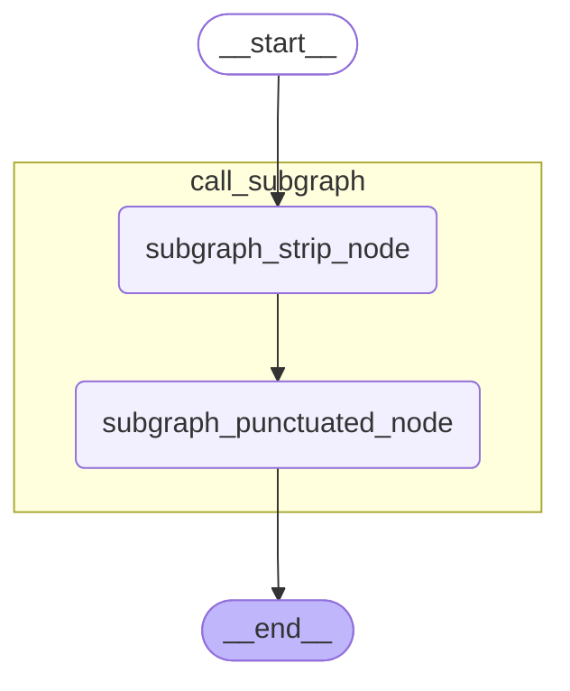

**注意：**

当前方式的子图信息依赖于 **`LangGraph`** 对于节点函数代码的解析，解析的关键代码如下

```python
res = subgraph.invoke({"raw_text": input_text})
```

这是推荐的写法，调用子图时最好不要链式调用，否则解析失败，**`LangGraph`** 可能无法感知子图，这不仅会导致 **`display`** 渲染时不包含子图的拓扑结构，还会导致启用检查点存储器时，无法查看子图检查点快照。

**错误写法示例如下**

当前案例看不到效果，下文的 **`Multi-turn`** 案例能看到差别

如果使用链式调用会影响子图的获取，尽量简洁使用

```python
assistant_response = subgraph.invoke(
    {"messages": messages}
)["messages"][-1].content
```

此时，**`LangGraph`** 无法感知这里的子图 **`subgraph`**

**正确写法如下**

```python
subgraph_response = subgraph.invoke(
    {"messages": messages}
)

assistant_response = subgraph_response["messages"][-1].content
```

#### 12.1.1.2. 查看子图

在上述代码的基础上执行以下代码

```python
list(parent_graph.get_subgraphs())
```

**结果如下**

```python
[('call_subgraph',
  <langgraph.graph.state.CompiledStateGraph at 0x19bd9e84ec0>)]
```

### 12.1.2. 子图直接作为父图的节点

#### 12.1.2.1. 用法

**示例如下**

```python
from typing import TypedDict
from langgraph.graph import StateGraph, START, END

# 定义全局共享状态
class OverAllState(TypedDict):
    raw_text: str # 未清洗文本
    cleaned_text: str # 清洗后的文本

# 构建子图
def subgraph_strip_node(state: OverAllState) -> OverAllState:
    raw_text = state["raw_text"]
    stripped_text = raw_text.strip()

    return {
        "cleaned_text": stripped_text
    }

def subgraph_punctuate_node(state: OverAllState) -> OverAllState:
    cleaned_text = state["cleaned_text"]
    punctuated_text = cleaned_text + "。"

    return {
        "cleaned_text": punctuated_text
    }

builder = StateGraph(state_schema=OverAllState)
builder.add_node("subgraph_strip_node", subgraph_strip_node)
builder.add_node("subgraph_punctuate_node", subgraph_punctuate_node)

builder.add_edge(START, "subgraph_strip_node")
builder.add_edge("subgraph_strip_node", "subgraph_punctuate_node")
builder.add_edge("subgraph_punctuate_node", END)

subgraph = builder.compile()

# 构建父图
builder = StateGraph(state_schema=OverAllState)
builder.add_node("subgraph_node", subgraph)

builder.add_edge(START, "subgraph_node")
builder.add_edge("subgraph_node", END)

parent_graph = builder.compile()

raw_text = "   LangGraph 真有意思        "
res = parent_graph.invoke({"raw_text": raw_text})
cleaned_text = res["cleaned_text"]
print("=" * 30, "->   原始文本   <-", "=" * 30)
print(raw_text)
print("=" * 30, "-> 清洗后的文本 <-", "=" * 30)
print(cleaned_text)

from IPython.display import display, Image
display(
    Image(
        parent_graph
        .get_graph(xray=True)
        .draw_mermaid_png()
    )
)
```

**运行结果如下**

```json
============================== ->   原始文本   <- ==============================
   LangGraph 真有意思        
============================== -> 清洗后的文本 <- ==============================
LangGraph 真有意思。
```

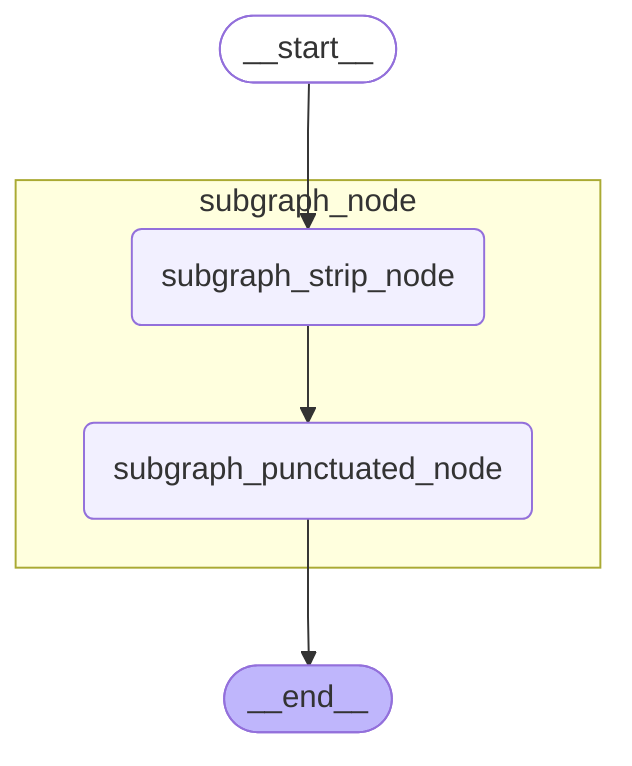

#### 12.1.2.2. 查看子图

**示例如下**

```python
list(parent_graph.get_subgraphs())
```

**运行结果如下**

```python
[('subgraph_node',
  <langgraph.graph.state.CompiledStateGraph at 0x297c50a2520>)]
```

## 12.2. 子图持久化

### 12.2.1. 查看子图检查点快照

本节测试都依赖于以下示例

```python
from typing import TypedDict
from langgraph.graph import StateGraph, START, END
from langgraph.checkpoint.memory import InMemorySaver

# 构建子图
class SubgraphState(TypedDict):
    raw_text: str # 未清洗文本
    stripped_text: str # 去除收尾空格的文本
    punctuated_text: str # 句尾添加句号的文本

def subgraph_strip_node(state: SubgraphState) -> SubgraphState:
    raw_text = state["raw_text"]
    stripped_text = raw_text.strip()

    return {
        "stripped_text": stripped_text
    }

def subgraph_punctuate_node(state: SubgraphState) -> SubgraphState:
    stripped_text = state["stripped_text"]
    punctuated_text = stripped_text + "。"

    return {
        "punctuated_text": punctuated_text
    }

builder = StateGraph(state_schema=SubgraphState)
builder.add_node("subgraph_strip_node", subgraph_strip_node)
builder.add_node("subgraph_punctuate_node", subgraph_punctuate_node)

builder.add_edge(START, "subgraph_strip_node")
builder.add_edge("subgraph_strip_node", "subgraph_punctuate_node")
builder.add_edge("subgraph_punctuate_node", END)

subgraph = builder.compile()

# 构建父图
class ParentState(TypedDict):
    input_text: str # 输入的未清洗的文本
    cleaned_text: str # 清洗后的文本

def call_subgraph(state: ParentState) -> ParentState:
    input_text = state["input_text"]

    res = subgraph.invoke({"raw_text": input_text})
    cleaned_text = res["punctuated_text"]
    return {
        "cleaned_text": cleaned_text
    }

builder = StateGraph(state_schema=ParentState)
builder.add_node("call_subgraph", call_subgraph)

builder.add_edge(START, "call_subgraph")
builder.add_edge("call_subgraph", END)

checkpointer=InMemorySaver()
parent_graph = builder.compile(checkpointer=checkpointer)

input_text = "   LangGraph 真有意思        "
config={"configurable": {"thread_id": "observe_checkpoint_1"}}
res = parent_graph.invoke(
    {"input_text": input_text},
    config=config
)
cleaned_text = res["cleaned_text"]
print("=" * 30, "->   原始文本   <-", "=" * 30)
print(input_text)
print("=" * 30, "-> 清洗后的文本 <-", "=" * 30)
print(cleaned_text)

from IPython.display import display, Image
display(
    Image(
        parent_graph
        .get_graph(xray=True)
        .draw_mermaid_png()
    )
)
```

**运行结果如下**

```python
============================== ->   原始文本   <- ==============================
   LangGraph 真有意思        
============================== -> 清洗后的文本 <- ==============================
LangGraph 真有意思。
```


#### 12.2.1.1. 在父图检查点快照中查看子图信息

**获取父图历史检查点列表**

```python
histories = list(parent_graph.get_state_history(config=config))
histories
```

**结果如下**

```python
[
    StateSnapshot(
        values={
            'input_text': '   LangGraph 真有意思        ',
            'cleaned_text': 'LangGraph 真有意思。'
        },
        next=(),
        config={
            'configurable': {
                'thread_id': 'observe_checkpoint_1',
                'checkpoint_ns': '',
                'checkpoint_id': '1f16fd86-3406-6072-8001-1e8b9691a9cf'
            }
        },
        metadata={
            'source': 'loop',
            'step': 1,
            'parents': {}
        },
        created_at='2026-06-24T14:24:19.397838+00:00',
        parent_config={
            'configurable': {
                'thread_id': 'observe_checkpoint_1',
                'checkpoint_ns': '',
                'checkpoint_id': '1f16fd86-33fb-6847-8000-8914ff1be716'
            }
        },
        tasks=(),
        interrupts=()
    ),
    StateSnapshot(
        values={
            'input_text': '   LangGraph 真有意思        '
        },
        next=(
            'call_subgraph',
        ),
        config={
            'configurable': {
                'thread_id': 'observe_checkpoint_1',
                'checkpoint_ns': '',
                'checkpoint_id': '1f16fd86-33fb-6847-8000-8914ff1be716'
            }
        },
        metadata={
            'source': 'loop',
            'step': 0,
            'parents': {}
        },
        created_at='2026-06-24T14:24:19.393533+00:00',
        parent_config={
            'configurable': {
                'thread_id': 'observe_checkpoint_1',
                'checkpoint_ns': '',
                'checkpoint_id': '1f16fd86-33fa-61a4-bfff-538c9fb00687'
            }
        },
        tasks=(
            PregelTask(
                id='9923d4be-9845-576d-785f-5b1d6da9a94f',
                name='call_subgraph',
                path=(
                    '__pregel_pull',
                    'call_subgraph'
                ),
                error=None,
                interrupts=(),
                state={
                    'configurable': {
                        'thread_id': 'observe_checkpoint_1',
                        'checkpoint_ns': 'call_subgraph:9923d4be-9845-576d-785f-5b1d6da9a94f'
                    }
                },
                result={
                    'cleaned_text': 'LangGraph 真有意思。'
                }
            ),
        ),
        interrupts=()
    ),
    StateSnapshot(
        values={},
        next=(
            '__start__',
        ),
        config={
            'configurable': {
                'thread_id': 'observe_checkpoint_1',
                'checkpoint_ns': '',
                'checkpoint_id': '1f16fd86-33fa-61a4-bfff-538c9fb00687'
            }
        },
        metadata={
            'source': 'input',
            'step': -1,
            'parents': {}
        },
        created_at='2026-06-24T14:24:19.392958+00:00',
        parent_config=None,
        tasks=(
            PregelTask(
                id='1b333b41-1e2d-1770-8dab-a09a47002aef',
                name='__start__',
                path=(
                    '__pregel_pull',
                    '__start__'
                ),
                error=None,
                interrupts=(),
                state=None,
                result={
                    'input_text': '   LangGraph 真有意思        '
                }
            ),
        ),
        interrupts=()
    )
]
```

可以看到，超步为 **`0`** 的快照下的 **`tasks`** 字段下只有一个任务实例，该任务实例在编号为 **`1`** 的超步执行，其中的 **`state`** 字段记录了子图检查点的 **`thread_id`** 和 **`checkpoint_ns`**，如下所示：

```python
state={
    'configurable': {
        'thread_id': 'observe_checkpoint_1',
        'checkpoint_ns': 'call_subgraph:9923d4be-9845-576d-785f-5b1d6da9a94f'
    }
}
```


- **`thread_id`**：整个线程的唯一 **`ID`**，和父图一致

- **`checkpoint_ns`**：子图命名空间，格式为

  ```python
  <子图所属父图节点名称>:<子图所属父图任务ID>
  ```

  我们在介绍 **`LangGraph`** 中提到，父图的 **`checkpoint_ns`** 通常为空字符串，在子图嵌套系统中该字段排上了用场：

  - 父图的 **`checkpoint_ns`** 仍未空字符串
  - 子图的 **`checkpoint_ns`** 遵循以上格式

  当嵌套层级不止一层时，命名空间将会通过 **`|`** 拼接，具体来说，假设拓扑结构如下：

  ```python
  父图
  └── call_subgraph          # 调用子图 A
      └── call_inner_graph   # 子图 A 调用子图 B
  ```

  那么命名空间为

  ```python
  父图：
  ""
  
  子图 A：
  call_subgraph:<task_id_1>
  
  子图 B：
  call_subgraph:<task_id_1>|call_inner_graph:<task_id_2>
  ```

  依次类推。

#### 12.2.1.2. 在父图检查点快照中展开子图最新快照

我们可以在父图的 **`state`** 字段中展开子图快照，也就是将 **`state`** 字段的值替换为子图的最新检查点快照

##### 12.2.1.2.1. 获取父图检查点配置

超步为 **`0`** 的检查点记录了子图的配置，所以我们要获取这个快照的父图配置，观察检查点快照列表可知：快照列表按照超步编号降序排列，且最小超步为 **`-1`**，取列表的倒数第二个元素即可拿到超步编号为 **`0`** 的检查点快照。

**代码如下**

```python
parent_config = histories[-2].config
parent_config
```

**结果如下**

```python
{
  'configurable': {
    'thread_id': 'observe_checkpoint_1',
    'checkpoint_ns': '',
    'checkpoint_id': '1f16fd86-33fb-6847-8000-8914ff1be716'
  }
}
```

##### 12.2.1.2.2. 展开子图快照

在调用 **`get_state()`** 时传递带有 **`checkpoint_id`** 的父图配置，并传递 **`subgraphs=True`** 即可展开子图快照。

**示例如下**

查看子图所有的检查点内容

```python
parent_graph.get_state(config=parent_config, subgraphs=True)
```

**运行结果如下**

```python
StateSnapshot(
  values={
    'input_text': '   LangGraph 真有意思        '
  },
  next=(
    'call_subgraph',
  ),
  config={
    'configurable': {
      'thread_id': 'observe_checkpoint_1',
      'checkpoint_ns': '',
      'checkpoint_id': '1f16fd86-33fb-6847-8000-8914ff1be716'
    }
  },
  metadata={
    'source': 'loop',
    'step': 0,
    'parents': {}
  },
  created_at='2026-06-24T14:24:19.393533+00:00',
  parent_config={
    'configurable': {
      'thread_id': 'observe_checkpoint_1',
      'checkpoint_ns': '',
      'checkpoint_id': '1f16fd86-33fa-61a4-bfff-538c9fb00687'
    }
  },
  tasks=(
    PregelTask(
      id='9923d4be-9845-576d-785f-5b1d6da9a94f',
      name='call_subgraph',
      path=(
        '__pregel_pull',
        'call_subgraph'
      ),
      error=None,
      interrupts=(),
      state=StateSnapshot(
        values={
          'raw_text': '   LangGraph 真有意思        ',
          'stripped_text': 'LangGraph 真有意思',
          'punctuated_text': 'LangGraph 真有意思。'
        },
        next=(),
        config={
          'configurable': {
            'thread_id': 'observe_checkpoint_1',
            'checkpoint_ns': 'call_subgraph:9923d4be-9845-576d-785f-5b1d6da9a94f',
            'checkpoint_id': '1f16fd86-3404-640e-8002-84e2d98a88dc',
            'checkpoint_map': {
              '': '1f16fd86-33fb-6847-8000-8914ff1be716',
              'call_subgraph:9923d4be-9845-576d-785f-5b1d6da9a94f': '1f16fd86-3404-640e-8002-84e2d98a88dc'
            }
          }
        },
        metadata={
          'source': 'loop',
          'step': 2,
          'parents': {
            '': '1f16fd86-33fb-6847-8000-8914ff1be716'
          }
        },
        created_at='2026-06-24T14:24:19.397114+00:00',
        parent_config={
          'configurable': {
            'thread_id': 'observe_checkpoint_1',
            'checkpoint_ns': 'call_subgraph:9923d4be-9845-576d-785f-5b1d6da9a94f',
            'checkpoint_id': '1f16fd86-3401-694f-8001-2c6a2666b501',
            'checkpoint_map': {
              '': '1f16fd86-33fb-6847-8000-8914ff1be716',
              'call_subgraph:9923d4be-9845-576d-785f-5b1d6da9a94f': '1f16fd86-3401-694f-8001-2c6a2666b501'
            }
          }
        },
        tasks=(),
        interrupts=()
      ),
      result={
        'cleaned_text': 'LangGraph 真有意思。'
      }
    ),
  ),
  interrupts=()
)
```

可以看到，**`state`** 字段已展开为子图的最新检查点快照。

#### 12.2.1.3. 获取子图配置，查看完整子图检查点列表

某些场景下，我们希望查看完整的子图检查点快照列表，此时只需要将包含 **`thread_id`** 和子图命名空间 **`checkpoint_ns`** 的配置信息传递给 **`get_state_history()`** 即可实现。

##### 12.2.1.3.1. 获取子图检查点配置

**示例如下**

```python
subgraph_config = histories[-2].tasks[0].state
subgraph_config
```

**结果如下**

```python
{
  'configurable': {
    'thread_id': 'observe_checkpoint_1',
    'checkpoint_ns': 'call_subgraph:9923d4be-9845-576d-785f-5b1d6da9a94f'
  }
}
```

##### 12.2.1.3.2. 查看完整子图检查点快照列表

**示例如下**

```python
list(parent_graph.get_state_history(config=subgraph_config))
```

**结果如下**

```python
[
    StateSnapshot(
        values={
            'raw_text': '   LangGraph 真有意思        ',
            'stripped_text': 'LangGraph 真有意思',
            'punctuated_text': 'LangGraph 真有意思。'
        },
        next=(),
        config={
            'configurable': {
                'thread_id': 'observe_checkpoint_1',
                'checkpoint_ns': 'call_subgraph:9923d4be-9845-576d-785f-5b1d6da9a94f',
                'checkpoint_id': '1f16fd86-3404-640e-8002-84e2d98a88dc',
                'checkpoint_map': {
                    '': '1f16fd86-33fb-6847-8000-8914ff1be716',
                    'call_subgraph:9923d4be-9845-576d-785f-5b1d6da9a94f': '1f16fd86-3404-640e-8002-84e2d98a88dc'
                }
            }
        },
        metadata={
            'source': 'loop',
            'step': 2,
            'parents': {
                '': '1f16fd86-33fb-6847-8000-8914ff1be716'
            }
        },
        created_at='2026-06-24T14:24:19.397114+00:00',
        parent_config={
            'configurable': {
                'thread_id': 'observe_checkpoint_1',
                'checkpoint_ns': 'call_subgraph:9923d4be-9845-576d-785f-5b1d6da9a94f',
                'checkpoint_id': '1f16fd86-3401-694f-8001-2c6a2666b501',
                'checkpoint_map': {
                    '': '1f16fd86-33fb-6847-8000-8914ff1be716',
                    'call_subgraph:9923d4be-9845-576d-785f-5b1d6da9a94f': '1f16fd86-3401-694f-8001-2c6a2666b501'
                }
            }
        },
        tasks=(),
        interrupts=()
    ),
    StateSnapshot(
        values={
            'raw_text': '   LangGraph 真有意思        ',
            'stripped_text': 'LangGraph 真有意思'
        },
        next=(
            'subgraph_punctuate_node',
        ),
        config={
            'configurable': {
                'thread_id': 'observe_checkpoint_1',
                'checkpoint_ns': 'call_subgraph:9923d4be-9845-576d-785f-5b1d6da9a94f',
                'checkpoint_id': '1f16fd86-3401-694f-8001-2c6a2666b501',
                'checkpoint_map': {
                    '': '1f16fd86-33fb-6847-8000-8914ff1be716',
                    'call_subgraph:9923d4be-9845-576d-785f-5b1d6da9a94f': '1f16fd86-3401-694f-8001-2c6a2666b501'
                }
            }
        },
        metadata={
            'source': 'loop',
            'step': 1,
            'parents': {
                '': '1f16fd86-33fb-6847-8000-8914ff1be716'
            }
        },
        created_at='2026-06-24T14:24:19.396020+00:00',
        parent_config={
            'configurable': {
                'thread_id': 'observe_checkpoint_1',
                'checkpoint_ns': 'call_subgraph:9923d4be-9845-576d-785f-5b1d6da9a94f',
                'checkpoint_id': '1f16fd86-33ff-6ad9-8000-0fb11208046d',
                'checkpoint_map': {
                    '': '1f16fd86-33fb-6847-8000-8914ff1be716',
                    'call_subgraph:9923d4be-9845-576d-785f-5b1d6da9a94f': '1f16fd86-33ff-6ad9-8000-0fb11208046d'
                }
            }
        },
        tasks=(
            PregelTask(
                id='d37272d8-d167-4fb9-6e31-466a58bf91cc',
                name='subgraph_punctuate_node',
                path=(
                    '__pregel_pull',
                    'subgraph_punctuate_node'
                ),
                error=None,
                interrupts=(),
                state=None,
                result={
                    'punctuated_text': 'LangGraph 真有意思。'
                }
            ),
        ),
        interrupts=()
    ),
    StateSnapshot(
        values={
            'raw_text': '   LangGraph 真有意思        '
        },
        next=(
            'subgraph_strip_node',
        ),
        config={
            'configurable': {
                'thread_id': 'observe_checkpoint_1',
                'checkpoint_ns': 'call_subgraph:9923d4be-9845-576d-785f-5b1d6da9a94f',
                'checkpoint_id': '1f16fd86-33ff-6ad9-8000-0fb11208046d',
                'checkpoint_map': {
                    '': '1f16fd86-33fb-6847-8000-8914ff1be716',
                    'call_subgraph:9923d4be-9845-576d-785f-5b1d6da9a94f': '1f16fd86-33ff-6ad9-8000-0fb11208046d'
                }
            }
        },
        metadata={
            'source': 'loop',
            'step': 0,
            'parents': {
                '': '1f16fd86-33fb-6847-8000-8914ff1be716'
            }
        },
        created_at='2026-06-24T14:24:19.395239+00:00',
        parent_config={
            'configurable': {
                'thread_id': 'observe_checkpoint_1',
                'checkpoint_ns': 'call_subgraph:9923d4be-9845-576d-785f-5b1d6da9a94f',
                'checkpoint_id': '1f16fd86-33fe-685b-bfff-d0a73977e807',
                'checkpoint_map': {
                    '': '1f16fd86-33fb-6847-8000-8914ff1be716',
                    'call_subgraph:9923d4be-9845-576d-785f-5b1d6da9a94f': '1f16fd86-33fe-685b-bfff-d0a73977e807'
                }
            }
        },
        tasks=(
            PregelTask(
                id='9d9a1009-3212-b789-f40a-3d8f213ce4fb',
                name='subgraph_strip_node',
                path=(
                    '__pregel_pull',
                    'subgraph_strip_node'
                ),
                error=None,
                interrupts=(),
                state=None,
                result={
                    'stripped_text': 'LangGraph 真有意思'
                }
            ),
        ),
        interrupts=()
    ),
    StateSnapshot(
        values={},
        next=(
            '__start__',
        ),
        config={
            'configurable': {
                'thread_id': 'observe_checkpoint_1',
                'checkpoint_ns': 'call_subgraph:9923d4be-9845-576d-785f-5b1d6da9a94f',
                'checkpoint_id': '1f16fd86-33fe-685b-bfff-d0a73977e807',
                'checkpoint_map': {
                    '': '1f16fd86-33fb-6847-8000-8914ff1be716',
                    'call_subgraph:9923d4be-9845-576d-785f-5b1d6da9a94f': '1f16fd86-33fe-685b-bfff-d0a73977e807'
                }
            }
        },
        metadata={
            'source': 'input',
            'step': -1,
            'parents': {
                '': '1f16fd86-33fb-6847-8000-8914ff1be716'
            }
        },
        created_at='2026-06-24T14:24:19.394769+00:00',
        parent_config=None,
        tasks=(
            PregelTask(
                id='5516615f-62ca-2dc4-d41e-6a8f20a981bb',
                name='__start__',
                path=(
                    '__pregel_pull',
                    '__start__'
                ),
                error=None,
                interrupts=(),
                state=None,
                result={
                    'raw_text': '   LangGraph 真有意思        '
                }
            ),
        ),
        interrupts=()
    )
]
```

- 上述快照的命名空间都不是空字符串，且保持一致，全部属于同一个子图

- **`metadata['parents']`** 记录了父检查点的信息，格式为

  **`<父检查点命名空间>:<父检查点ID>`**

- **`config['configurable']['checkpoint_map']`** 记录了父图和当前子图检查点命名空间和 **`ID`** 的映射关系，包含两个条目，格式如下

  ```python
  <父图检查点命名空间>:<父图检查点ID>,
  <当前子图检查点命名空间>:<当前子图检查点ID>
  ```

### 12.2.2. 持久化策略

本节讨论的持久化策略以**父图启用检查点存储器**为前提。子图支持三种策略：

| 策略 | 编译参数 | 检查点保存 | 中断恢复 | 多轮记忆 |
|:---|:---|:---|:---|:---|
| **`Per-invocation`**（默认） | `checkpointer=None` 或省略 | ✓ | ✓ | ✗（同 thread_id 再次调用不加载历史） |
| **`Per-thread`** | `checkpointer=True` | ✓ | ✓ | ✓（同 thread_id 调用加载历史） |
| **`Stateless`** | `checkpointer=False` | ✗ | ✗ | ✗ |

> **三种策略的唯一区别在于子图编译时的 `checkpointer` 参数**，其余代码完全相同。下面按场景组织，每个场景展示一份完整代码，策略切换只需修改一行。

#### 12.2.2.1. 场景一：中断（interrupt）

子图节点中使用 `interrupt()` 中断执行，等待用户输入后恢复。

```python
from typing import TypedDict
from langgraph.graph import StateGraph, START, END
from langgraph.types import interrupt, Command
from langgraph.checkpoint.memory import InMemorySaver

from loguru import logger

# 定义全局共享状态
class OverAllState(TypedDict):
    raw_text: str # 未清洗文本
    cleaned_text: str # 清洗后的文本

# 构建子图
def subgraph_strip_node(state: OverAllState) -> OverAllState:
    logger.info("子图 subgraph_strip_node 节点执行了")
    raw_text = state["raw_text"]
    stripped_text = raw_text.strip()

    return {
        "cleaned_text": stripped_text
    }

def subgraph_punctuate_node(state: OverAllState) -> OverAllState:
    logger.info("子图 subgraph_punctuate_node 节点执行了")
    cleaned_text = state["cleaned_text"]
    punctuation = interrupt("您希望在句尾添加的标点符号是？[。/，/！/？/；]")
    punctuation1 = interrupt("您希望在句尾添加的标点符号是？[。/，/！/？/；]")
    punctuated_text = cleaned_text + punctuation + punctuation1

    return {
        "cleaned_text": punctuated_text
    }

builder = StateGraph(state_schema=OverAllState)
builder.add_node("subgraph_strip_node", subgraph_strip_node)
builder.add_node("subgraph_punctuate_node", subgraph_punctuate_node)

builder.add_edge(START, "subgraph_strip_node")
builder.add_edge("subgraph_strip_node", "subgraph_punctuate_node")
builder.add_edge("subgraph_punctuate_node", END)

# ==================================================
# 【策略切换点】只需修改这一行
# subgraph = builder.compile()  # Per-invocation（默认）
# subgraph = builder.compile(checkpointer=True)   # Per-thread
subgraph = builder.compile(checkpointer=False)  # Stateless（中断不可用）
# ==================================================

# 构建父图
builder = StateGraph(state_schema=OverAllState)
builder.add_node("subgraph_node", subgraph)

builder.add_edge(START, "subgraph_node")
builder.add_edge("subgraph_node", END)

checkpointer = InMemorySaver()
parent_graph = builder.compile(checkpointer=checkpointer)

raw_text = "   LangGraph 真有意思        "
config = {"configurable": {"thread_id": "123"}}
# 首次调用
interrupted_res = parent_graph.invoke(
    {"raw_text": raw_text},
    config=config
)
print("=" * 30, "->   中断信息   <-", "=" * 30)
print(interrupted_res)


from IPython.display import display, Image
display(
    Image(
        parent_graph
        .get_graph(xray=True)
        .draw_mermaid_png()
    )
)

# 恢复调用
parent_graph.invoke(
    Command(resume="！"),
    config=config
)
res = parent_graph.invoke(
    Command(resume="！"),
    config=config
)

cleaned_text = res["cleaned_text"]
print("=" * 30, "->   原始文本   <-", "=" * 30)
print(raw_text)
print("=" * 30, "-> 清洗后的文本 <-", "=" * 30)
print(cleaned_text)
```

**运行结果（Per-invocation / Per-thread 均可）**

```python
2026-06-25 09:41:40.629 | INFO     | __main__:subgraph_strip_node:15 - 子图 subgraph_strip_node 节点执行了
2026-06-25 09:41:40.630 | INFO     | __main__:subgraph_punctuate_node:24 - 子图 subgraph_punctuate_node 节点执行了
============================== ->   中断信息   <- ==============================
{'raw_text': '   LangGraph 真有意思        ', '__interrupt__': [Interrupt(value='您希望在句尾添加的标点符号是？[。/，/！/？/；]', id='a4c6479870430be1a857af43cc7eff99')]}
2026-06-25 09:41:40.633 | INFO     | __main__:subgraph_punctuate_node:24 - 子图 subgraph_punctuate_node 节点执行了
============================== ->   原始文本   <- ==============================
   LangGraph 真有意思        
============================== -> 清洗后的文本 <- ==============================
LangGraph 真有意思！
```


> **策略差异**：三种策略下中断机制行为一致，`Per-invocation` 和 `Per-thread` 均支持中断恢复，`Stateless` 不支持中断。

| 策略 | 编译参数 | 中断 |
|:---|:---|:---|
| Per-invocation（默认） | `subgraph = builder.compile()` | ✅ |
| Per-thread | `subgraph = builder.compile(checkpointer=True)` | ✅ |
| Stateless | `subgraph = builder.compile(checkpointer=False)` | ❌ |

#### 12.2.2.2. 场景二：多轮对话

父图多次调用子图进行 LLM 对话，验证子图是否保留历史消息。

```python
from typing import TypedDict
from langgraph.graph import StateGraph, START, END, MessagesState
from langgraph.checkpoint.memory import InMemorySaver

from langchain.messages import HumanMessage, SystemMessage, AIMessage
from langchain_deepseek import ChatDeepSeek

import sys
from loguru import logger
# 删除 Loguru 默认的 stderr sink
logger.remove()
# 重新添加支持颜色的 sink
logger.add(sys.stdout, colorize=True)

from dotenv import load_dotenv

load_dotenv(override=True)

model = ChatDeepSeek(
    model="deepseek-v4-flash",
    extra_body={
        "thinking": {
            "type": "disabled"
        }
    }
)

# 构建子图
def llm_node(state: MessagesState) -> MessagesState:
    messages = state["messages"]
    logger.info("=" * 30)
    logger.info("调用子图的 llm_node 节点，当前的 messages: ")
    for index, message in enumerate(messages, start=1):
        logger.opt(colors=True).info(
            "\n<cyan><bold>[消息 {}]</bold></cyan>\n"
            "<yellow>类型：</yellow><magenta>{}</magenta>\n"
            "<yellow>内容：</yellow><green>{}</green>",
            index,
            message.type,
            message.content
        )
    logger.info("=" * 30)

    response = model.invoke(input=messages)
    ai_msg = AIMessage(content=response.content)

    return {
        "messages": [ai_msg]
    }

builder = StateGraph(state_schema=MessagesState)
builder.add_node("llm_node", llm_node)
builder.add_edge(START, "llm_node")
builder.add_edge("llm_node", END)

# ==================================================
# 【策略切换点】只需修改这一行
subgraph = builder.compile()  # Per-invocation（默认）：无记忆
# subgraph = builder.compile(checkpointer=True)   # Per-thread：有记忆
# ==================================================

# 构建父图
class OverAllState(TypedDict):
    user_input: str # 用户提问
    assistant_response: str # 助手回答

def call_subgraph(state: OverAllState) -> OverAllState:
    user_input = state["user_input"]

    messages = [
        SystemMessage("尽可能用简短的语言回答"),
        HumanMessage(user_input)
    ]
    subgraph_response = subgraph.invoke(
        {"messages": messages}
    )

    assistant_response = subgraph_response["messages"][-1].content

    return {
        "assistant_response": assistant_response
    }

builder = StateGraph(state_schema=OverAllState)
builder.add_node("call_subgraph", call_subgraph)
builder.add_edge(START, "call_subgraph")
builder.add_edge("call_subgraph", END)

checkpointer = InMemorySaver()
parent_graph = builder.compile(checkpointer=checkpointer)

config = {"configurable": {"thread_id": "multi-turn-demo"}}

first_invoke = parent_graph.invoke(
    {"user_input": "我是老王，从现在开始，你是小王"},
    config = config
)
print("=" * 30, "-> 第一次调用 <-", "=" * 30)
print(first_invoke)

second_invoke = parent_graph.invoke(
    {"user_input": "我是谁？你是谁？"},
    config = config
)
print("=" * 30, "-> 第二次调用 <-", "=" * 30)
print(second_invoke)

from IPython.display import display, Image
display(
    Image(
        parent_graph
        .get_graph(xray=True)
        .draw_mermaid_png()
    )
)
```

**Per-invocation 运行结果（无记忆）**

```
2026-06-25 09:43:14.012 | INFO     | __main__:llm_node:31 - ==============================
2026-06-25 09:43:14.013 | INFO     | __main__:llm_node:32 - 调用子图的 llm_node 节点，当前的 messages: 
2026-06-25 09:43:14.014 | INFO     | __main__:llm_node:34 - 
[消息 1]
类型：system
内容：尽可能用简短的语言回答
2026-06-25 09:43:14.014 | INFO     | __main__:llm_node:34 - 
[消息 2]
类型：human
内容：我是老王，从现在开始，你是小王
2026-06-25 09:43:14.015 | INFO     | __main__:llm_node:42 - ==============================
============================== -> 第一次调用 <- ==============================
{'user_input': '我是老王，从现在开始，你是小王', 'assistant_response': '好的，老王。我是小王，您有什么吩咐？'}
2026-06-25 09:43:14.814 | INFO     | __main__:llm_node:31 - ==============================
2026-06-25 09:43:14.815 | INFO     | __main__:llm_node:32 - 调用子图的 llm_node 节点，当前的 messages: 
2026-06-25 09:43:14.815 | INFO     | __main__:llm_node:34 - 
[消息 1]
类型：system
内容：尽可能用简短的语言回答
2026-06-25 09:43:14.816 | INFO     | __main__:llm_node:34 - 
[消息 2]
类型：human
内容：我是谁？你是谁？
2026-06-25 09:43:14.816 | INFO     | __main__:llm_node:42 - ==============================
============================== -> 第二次调用 <- ==============================
{'user_input': '我是谁？你是谁？', 'assistant_response': '你是用户，我是DeepSeek，一个由深度求索公司开发的AI助手。'}
```

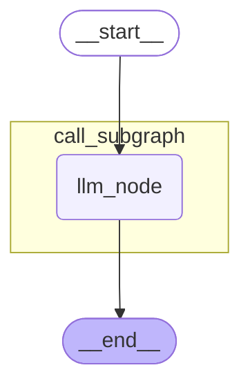


第二次调用时子图 `messages` 被重置，无法获知第一次调用时传递的信息。**Per-invocation 模式无法在子图中进行多轮对话。**

**Per-thread 运行结果（有记忆）**——仅子图编译改为 `builder.compile(checkpointer=True)`：

```
2026-08-15 16:56:05.391 | INFO     | __main__:llm_node:34 - ==============================
2026-08-15 16:56:05.392 | INFO     | __main__:llm_node:35 - 调用子图的 llm_node 节点，当前的 messages: 
2026-08-15 16:56:05.392 | INFO     | __main__:llm_node:37 - 
[消息 1]
类型：system
内容：尽可能用简短的语言回答
2026-08-15 16:56:05.392 | INFO     | __main__:llm_node:37 - 
[消息 2]
类型：human
内容：我是老王，从现在开始，你是小王
2026-08-15 16:56:05.393 | INFO     | __main__:llm_node:45 - ==============================
============================== -> 第一次调用 <- ==============================
{'user_input': '我是老王，从现在开始，你是小王', 'assistant_response': '好的，老王。我是小王。'}
2026-08-15 16:56:08.104 | INFO     | __main__:llm_node:34 - ==============================
2026-08-15 16:56:08.104 | INFO     | __main__:llm_node:35 - 调用子图的 llm_node 节点，当前的 messages: 
2026-08-15 16:56:08.104 | INFO     | __main__:llm_node:37 - 
[消息 1]
类型：system
内容：尽可能用简短的语言回答
2026-08-15 16:56:08.105 | INFO     | __main__:llm_node:37 - 
[消息 2]
类型：human
内容：我是老王，从现在开始，你是小王
2026-08-15 16:56:08.105 | INFO     | __main__:llm_node:37 - 
[消息 3]
...
内容：我是谁？你是谁？
2026-08-15 16:56:08.107 | INFO     | __main__:llm_node:45 - ==============================
============================== -> 第二次调用 <- ==============================
{'user_input': '我是谁？你是谁？', 'assistant_response': '你老王，我小王。'}
```


历史消息被保留，上下文连续。**Per-thread 模式适用于子图多轮对话场景。**

> **策略差异**

| 策略 | 编译参数 | 多轮记忆 |
|:---|:---|:---|
| Per-invocation（默认） | `subgraph = builder.compile()` | ❌ 每次调用状态重置 |
| Per-thread | `subgraph = builder.compile(checkpointer=True)` | ✅ 跨调用状态连续 |

#### 12.2.2.3. 场景三：多次调用同一子图

父图的一个节点内循环多次调用同一子图。

```python
from typing import TypedDict
from langgraph.graph import StateGraph, START, END, MessagesState
from langgraph.checkpoint.memory import InMemorySaver

from langchain.messages import HumanMessage, SystemMessage, AIMessage
from langchain_deepseek import ChatDeepSeek

import sys
from loguru import logger
logger.remove()
logger.add(sys.stdout, colorize=True)

from dotenv import load_dotenv

load_dotenv(override=True)

model = ChatDeepSeek(
    model="deepseek-v4-flash",
    extra_body={
        "thinking": {
            "type": "disabled"
        }
    }
)

# 构建子图
def llm_node(state: MessagesState) -> MessagesState:
    messages = state["messages"]
    logger.info("=" * 30)
    logger.info("调用子图的 llm_node 节点，当前的 messages: ")
    for index, message in enumerate(messages, start=1):
        logger.opt(colors=True).info(
            "\n<cyan><bold>[消息 {}]</bold></cyan>\n"
            "<yellow>类型：</yellow><magenta>{}</magenta>\n"
            "<yellow>内容：</yellow><green>{}</green>",
            index,
            message.type,
            message.content
        )
    logger.info("=" * 30)
    response = model.invoke(input=messages)
    ai_msg = AIMessage(content=response.content)

    return {
        "messages": [ai_msg]
    }

builder = StateGraph(state_schema=MessagesState)
builder.add_node("llm_node", llm_node)
builder.add_edge(START, "llm_node")
builder.add_edge("llm_node", END)

# ==================================================
# 【策略切换点】只需修改这一行
subgraph = builder.compile()  # Per-invocation（默认）：每次调用状态隔离
# subgraph = builder.compile(checkpointer=True)   # Per-thread：历史相互干扰
# ==================================================

# 构建父图
class OverAllState(TypedDict):
    user_inputs: list[str] # 用户提问
    assistant_responses: str # 助手回答

def call_subgraph(state: OverAllState) -> OverAllState:
    user_inputs = state["user_inputs"]

    assistant_responses = []
    for user_input in user_inputs:
        subgraph_response = subgraph.invoke(
            {
                "messages": [
                    SystemMessage("用最简短的话回答用户的提问"),
                    HumanMessage(user_input)
                ]
            }
        )
        assistant_response = subgraph_response["messages"][-1].content
        assistant_responses.append(assistant_response)

    return {
        "assistant_responses": assistant_responses
    }

builder = StateGraph(state_schema=OverAllState)
builder.add_node("call_subgraph", call_subgraph)
builder.add_edge(START, "call_subgraph")
builder.add_edge("call_subgraph", END)

checkpointer = InMemorySaver()
parent_graph = builder.compile(checkpointer=checkpointer)

config = {"configurable": {"thread_id": "multi-call-same-demo"}}

first_response = parent_graph.invoke(
    {
        "user_inputs": [
            "5*5等于几",
            "10*10等于几"
        ]
    },
    config = config
)
print("=" * 30, "-> 第一次运行结果 <-", "=" * 30)
print(first_response)

second_response = parent_graph.invoke(
    {
        "user_inputs": [
            "再+1呢?",
            "再+10000呢?"
        ]
    },
    config = config
)
print("=" * 30, "-> 第二次运行结果 <-", "=" * 30)
print(second_response)

from IPython.display import display, Image
display(
    Image(
        parent_graph
        .get_graph(xray=True)
        .draw_mermaid_png()
    )
)
```

**Per-thread 运行结果**

```
2026-07-14 11:53:58.056 | INFO     | __main__:llm_node:29 - ==============================
2026-07-14 11:53:58.056 | INFO     | __main__:llm_node:30 - 调用子图的 llm_node 节点，当前的 messages: 
2026-07-14 11:53:58.057 | INFO     | __main__:llm_node:32 - 
[消息 1]
类型：system
内容：用最简短的话回答用户的提问
2026-07-14 11:53:58.057 | INFO     | __main__:llm_node:32 - 
[消息 2]
类型：human
内容：5*5等于几
2026-07-14 11:53:58.058 | INFO     | __main__:llm_node:40 - ==============================
2026-07-14 11:53:58.652 | INFO     | __main__:llm_node:29 - ==============================
2026-07-14 11:53:58.652 | INFO     | __main__:llm_node:30 - 调用子图的 llm_node 节点，当前的 messages: 
2026-07-14 11:53:58.653 | INFO     | __main__:llm_node:32 - 
[消息 1]
类型：system
内容：用最简短的话回答用户的提问
2026-07-14 11:53:58.653 | INFO     | __main__:llm_node:32 - 
[消息 2]
类型：human
内容：10*10等于几
2026-07-14 11:53:58.654 | INFO     | __main__:llm_node:40 - ==============================
============================== -> 第一次运行结果 <- ==============================
{'user_inputs': ['5*5等于几', '10*10等于几'], 'assistant_responses': ['5*5等于25。', '10*10等于100。']}
2026-07-14 11:53:59.230 | INFO     | __main__:llm_node:29 - ==============================
2026-07-14 11:53:59.231 | INFO     | __main__:llm_node:30 - 调用子图的 llm_node 节点，当前的 messages: 
2026-07-14 11:53:59.231 | INFO     | __main__:llm_node:32 - 
[消息 1]
类型：system
内容：用最简短的话回答用户的提问
2026-07-14 11:53:59.232 | INFO     | __main__:llm_node:32 - 
[消息 2]
类型：human
内容：5*5等于几
2026-07-14 11:53:59.233 | INFO     | __main__:llm_node:32 - 
[消息 3]
类型：ai
内容：5*5等于25。
2026-07-14 11:53:59.234 | INFO     | __main__:llm_node:32 - 
[消息 4]
类型：system
内容：用最简短的话回答用户的提问
2026-07-14 11:53:59.234 | INFO     | __main__:llm_node:32 - 
[消息 5]
类型：human
内容：再+1呢?
2026-07-14 11:53:59.235 | INFO     | __main__:llm_node:40 - ==============================
2026-07-14 11:53:59.766 | INFO     | __main__:llm_node:29 - ==============================
2026-07-14 11:53:59.767 | INFO     | __main__:llm_node:30 - 调用子图的 llm_node 节点，当前的 messages: 
2026-07-14 11:53:59.767 | INFO     | __main__:llm_node:32 - 
[消息 1]
类型：system
内容：用最简短的话回答用户的提问
2026-07-14 11:53:59.768 | INFO     | __main__:llm_node:32 - 
[消息 2]
类型：human
内容：10*10等于几
2026-07-14 11:53:59.768 | INFO     | __main__:llm_node:32 - 
[消息 3]
类型：ai
内容：10*10等于100。
2026-07-14 11:53:59.769 | INFO     | __main__:llm_node:32 - 
[消息 4]
类型：system
内容：用最简短的话回答用户的提问
2026-07-14 11:53:59.769 | INFO     | __main__:llm_node:32 - 
[消息 5]
类型：human
内容：再+10000呢?
2026-07-14 11:53:59.769 | INFO     | __main__:llm_node:40 - ==============================
============================== -> 第二次运行结果 <- ==============================
{'user_inputs': ['再+1呢?', '再+10000呢?'], 'assistant_responses': ['25+1=26。', '10100']}
```


==每次调用子图时 `messages` 状态都是独立的。**Per-invocation 适用于父图中多次调用同一子图的场景，调用间互不干扰。**==

==**Per-thread 行为**（改为 `builder.compile(checkpointer=True)`）：同一节点内的多次子图调用，历史按调用位置独立——即第一次子图调用的历史是连续的，第二次子图调用的历史也是连续的，但两次之间独立。**如果调用顺序发生变化，检查点历史会相互干扰。**==

> **策略差异**

| 策略 | 编译参数 | 多次调用同一子图 |
|:---|:---|:---|
| Per-invocation（默认） | `subgraph = builder.compile()` | ✅ 每次调用完全隔离 |
| Per-thread | `subgraph = builder.compile(checkpointer=True)` | ❌ 历史按位置关联，可能干扰 |

#### 12.2.2.4. 场景四：多次调用不同子图

父图的一个节点内调用两个不同的子图。

```python
from typing import TypedDict
from langgraph.graph import StateGraph, START, END, MessagesState
from langgraph.checkpoint.memory import InMemorySaver

from langchain.messages import HumanMessage, SystemMessage, AIMessage
from langchain_deepseek import ChatDeepSeek

import sys
from loguru import logger
logger.remove()
logger.add(sys.stdout, colorize=True)

from dotenv import load_dotenv

load_dotenv(override=True)

model = ChatDeepSeek(
    model="deepseek-v4-flash",
    extra_body={
        "thinking": {
            "type": "disabled"
        }
    }
)

# ==================================================
# 【策略切换点】两个子图的编译参数
# ==================================================

# 构建水果子图
def fruit_node(state: MessagesState) -> MessagesState:
    messages = state["messages"]
    logger.info("=" * 30)
    logger.info("调用水果子图的 fruit_node 节点，当前的 messages: ")
    for index, message in enumerate(messages, start=1):
        logger.opt(colors=True).info(
            "\n<cyan><bold>[消息 {}]</bold></cyan>\n"
            "<yellow>类型：</yellow><magenta>{}</magenta>\n"
            "<yellow>内容：</yellow><green>{}</green>",
            index,
            message.type,
            message.content
        )
    logger.info("=" * 30)
    response = model.invoke(input=messages)
    ai_msg = AIMessage(content=response.content)

    return {
        "messages": [ai_msg]
    }

builder = StateGraph(state_schema=MessagesState)
builder.add_node("fruit_node", fruit_node)
builder.add_edge(START, "fruit_node")
builder.add_edge("fruit_node", END)

fruit_subgraph = builder.compile(checkpointer=True)

# 构建蔬菜子图
def vegetable_node(state: MessagesState) -> MessagesState:
    messages = state["messages"]
    logger.info("=" * 30)
    logger.info("调用蔬菜子图的 vegetable_node 节点，当前的 messages: ")
    for index, message in enumerate(messages, start=1):
        logger.opt(colors=True).info(
            "\n<cyan><bold>[消息 {}]</bold></cyan>\n"
            "<yellow>类型：</yellow><magenta>{}</magenta>\n"
            "<yellow>内容：</yellow><green>{}</green>",
            index,
            message.type,
            message.content
        )
    logger.info("=" * 30)
    response = model.invoke(input=messages)
    ai_msg = AIMessage(content=response.content)

    return {
        "messages": [ai_msg]
    }

builder = StateGraph(state_schema=MessagesState)
builder.add_node("vegetable_node", vegetable_node)
builder.add_edge(START, "vegetable_node")
builder.add_edge("vegetable_node", END)

vegetable_subgraph = builder.compile(checkpointer=True)

# 构建父图
class OverAllState(TypedDict):
    fruit: str # 水果
    vegetable: str # 蔬菜

    fruit_introduction: str # 水果介绍
    vegetable_introduction: str # 蔬菜介绍

def call_subgraph(state: OverAllState) -> OverAllState:
    fruit = state["fruit"]
    vegetable = state["vegetable"]

    fruit_messages = [
        SystemMessage("用最简短的话介绍用户输入的水果"),
        HumanMessage(fruit)
    ]

    vegetable_messages = [
        SystemMessage("用最简短的话介绍用户输入的蔬菜"),
        HumanMessage(vegetable)
    ]

    fruit_response = fruit_subgraph.invoke({"messages": fruit_messages})
    vegetable_response = vegetable_subgraph.invoke({"messages": vegetable_messages})

    fruit_introduction = fruit_response["messages"][-1].content
    vegetable_introduction = vegetable_response["messages"][-1].content

    return {
        "fruit_introduction": fruit_introduction,
        "vegetable_introduction": vegetable_introduction
    }

builder = StateGraph(state_schema=OverAllState)
builder.add_node("call_subgraph", call_subgraph)
builder.add_edge(START, "call_subgraph")
builder.add_edge("call_subgraph", END)

checkpointer = InMemorySaver()
parent_graph = builder.compile(checkpointer=checkpointer)

config = {"configurable": {"thread_id": "multi-call-diff-demo"}}

first_response = parent_graph.invoke(
    {
        "fruit": "桑葚",
        "vegetable": "西兰苔"
    },
    config = config
)
print("=" * 30, "-> 第一次运行结果 <-", "=" * 30)
print(first_response)

second_response = parent_graph.invoke(
    {
        "fruit": "香蕉",
        "vegetable": "西兰花"
    },
    config = config
)
print("=" * 30, "-> 第二次运行结果 <-", "=" * 30)
print(second_response)

from IPython.display import display, Image
display(
    Image(
        parent_graph
        .get_graph(xray=True)
        .draw_mermaid_png()
    )
)
```

**运行结果**

```
2026-06-25 11:37:49.176 | INFO     | __main__:fruit_node:32 - ==============================
2026-06-25 11:37:49.176 | INFO     | __main__:fruit_node:33 - 调用水果子图的 fruit_node 节点，当前的 messages: 
2026-06-25 11:37:49.177 | INFO     | __main__:fruit_node:35 - 
[消息 1]
类型：system
内容：用最简短的话介绍用户输入的水果
2026-06-25 11:37:49.178 | INFO     | __main__:fruit_node:35 - 
[消息 2]
类型：human
内容：桑葚
2026-06-25 11:37:49.178 | INFO     | __main__:fruit_node:43 - ==============================
2026-06-25 11:37:49.872 | INFO     | __main__:vegetable_node:61 - ==============================
2026-06-25 11:37:49.873 | INFO     | __main__:vegetable_node:62 - 调用蔬菜子图的 vegetable_node 节点，当前的 messages: 
2026-06-25 11:37:49.873 | INFO     | __main__:vegetable_node:64 - 
[消息 1]
类型：system
内容：用最简短的话介绍用户输入的蔬菜
2026-06-25 11:37:49.874 | INFO     | __main__:vegetable_node:64 - 
[消息 2]
类型：human
内容：西兰苔
2026-06-25 11:37:49.874 | INFO     | __main__:vegetable_node:72 - ==============================
============================== -> 第一次运行结果 <- ==============================
{'fruit': '桑葚', 'vegetable': '西兰苔', 'fruit_introduction': '紫黑多汁的浆果，味酸甜。', 'vegetable_introduction': '西兰苔是西兰花与芥蓝杂交的蔬菜，以鲜嫩花茎和球花为食。'}
...（第二次调用时水果、蔬菜子图各自保留历史消息，按调用位置独立）
{'fruit': '香蕉', 'vegetable': '西兰花', 'fruit_introduction': '黄色弯月形水果，软糯香甜。', 'vegetable_introduction': '西兰花，绿色花球状蔬菜，营养丰富。'}
```


本例在同一个节点中多次调用不同子图，通过专有状态保证了**水果一定发给 `fruit_subgraph`**、**蔬菜一定发给 `vegetable_subgraph`**，一定程度上可以确保不同子图的检查点历史不相互干扰。

但这种靠调用顺序区分的方式不够稳健——如果调用顺序变化，检查点历史也会错乱。官方推荐的做法见下一节。

#### 12.2.2.5. 场景五：独立节点调用不同子图（推荐）

为每个子图准备独立的父图节点，这样它们的命名空间是各自的节点名，完全独立。

```python
from typing import TypedDict, Literal
from collections.abc import Sequence
from langgraph.graph import StateGraph, START, END, MessagesState
from langgraph.checkpoint.memory import InMemorySaver

from langchain.messages import HumanMessage, SystemMessage, AIMessage
from langchain_deepseek import ChatDeepSeek

import sys
from loguru import logger
logger.remove()
logger.add(sys.stdout, colorize=True)

from dotenv import load_dotenv

load_dotenv(override=True)

model = ChatDeepSeek(
    model="deepseek-v4-flash",
    extra_body={
        "thinking": {
            "type": "disabled"
        }
    }
)

# 构建水果子图
def fruit_node(state: MessagesState) -> MessagesState:
    messages = state["messages"]
    logger.info("=" * 30)
    logger.info("调用水果子图的 fruit_node 节点，当前的 messages: ")
    for index, message in enumerate(messages, start=1):
        logger.opt(colors=True).info(
            "\n<cyan><bold>[消息 {}]</bold></cyan>\n"
            "<yellow>类型：</yellow><magenta>{}</magenta>\n"
            "<yellow>内容：</yellow><green>{}</green>",
            index,
            message.type,
            message.content
        )
    logger.info("=" * 30)
    response = model.invoke(input=messages)
    ai_msg = AIMessage(content=response.content)

    return {
        "messages": [ai_msg]
    }

builder = StateGraph(state_schema=MessagesState)
builder.add_node("fruit_node", fruit_node)
builder.add_edge(START, "fruit_node")
builder.add_edge("fruit_node", END)

fruit_subgraph = builder.compile(checkpointer=True)

# 构建蔬菜子图
def vegetable_node(state: MessagesState) -> MessagesState:
    messages = state["messages"]
    logger.info("=" * 30)
    logger.info("调用蔬菜子图的 vegetable_node 节点，当前的 messages: ")
    for index, message in enumerate(messages, start=1):
        logger.opt(colors=True).info(
            "\n<cyan><bold>[消息 {}]</bold></cyan>\n"
            "<yellow>类型：</yellow><magenta>{}</magenta>\n"
            "<yellow>内容：</yellow><green>{}</green>",
            index,
            message.type,
            message.content
        )
    logger.info("=" * 30)
    response = model.invoke(input=messages)
    ai_msg = AIMessage(content=response.content)

    return {
        "messages": [ai_msg]
    }

builder = StateGraph(state_schema=MessagesState)
builder.add_node("vegetable_node", vegetable_node)
builder.add_edge(START, "vegetable_node")
builder.add_edge("vegetable_node", END)

vegetable_subgraph = builder.compile(checkpointer=True)

# 构建父图
class OverAllState(TypedDict):
    fruit: str # 水果
    vegetable: str # 蔬菜

    fruit_introduction: str # 水果介绍
    vegetable_introduction: str # 蔬菜介绍

def call_fruit_subgraph(state: OverAllState) -> OverAllState:
    fruit = state["fruit"]

    fruit_messages = [
        SystemMessage("用最简短的话介绍用户输入的水果"),
        HumanMessage(fruit)
    ]

    fruit_response = fruit_subgraph.invoke({"messages": fruit_messages})
    fruit_introduction = fruit_response["messages"][-1].content

    return {
        "fruit_introduction": fruit_introduction
    }

def call_vegetable_subgraph(state: OverAllState) -> OverAllState:
    vegetable = state["vegetable"]

    vegetable_messages = [
        SystemMessage("用最简短的话介绍用户输入的蔬菜"),
        HumanMessage(vegetable)
    ]

    vegetable_response = vegetable_subgraph.invoke({"messages": vegetable_messages})
    vegetable_introduction = vegetable_response["messages"][-1].content

    return {
        "vegetable_introduction": vegetable_introduction
    }

def router(state: OverAllState) -> Sequence[Literal["call_fruit_subgraph", "call_vegetable_subgraph", END]]:
    next_nodes = []
    if state.get("fruit"):
        next_nodes.append("call_fruit_subgraph")
    if state.get("vegetable"):
        next_nodes.append("call_vegetable_subgraph")
    if not next_nodes:
        next_nodes.append(END)
    return next_nodes

builder = StateGraph(state_schema=OverAllState)
builder.add_node("call_fruit_subgraph", call_fruit_subgraph)
builder.add_node("call_vegetable_subgraph", call_vegetable_subgraph)

builder.add_conditional_edges(START, router, path_map=["call_fruit_subgraph", "call_vegetable_subgraph", END])
builder.add_edge("call_fruit_subgraph", END)
builder.add_edge("call_vegetable_subgraph", END)

checkpointer = InMemorySaver()
parent_graph = builder.compile(checkpointer=checkpointer)

config = {"configurable": {"thread_id": "independent-nodes-demo"}}

first_response = parent_graph.invoke(
    {
        "fruit": "桑葚",
        "vegetable": "西兰苔"
    },
    config = config
)
print("=" * 30, "-> 第一次运行结果 <-", "=" * 30)
print(first_response)

second_response = parent_graph.invoke(
    {
        "fruit": "香蕉",
        "vegetable": "西兰花"
    },
    config = config
)
print("=" * 30, "-> 第二次运行结果 <-", "=" * 30)
print(second_response)

from IPython.display import display, Image
display(
    Image(
        parent_graph
        .get_graph(xray=True)
        .draw_mermaid_png()
    )
)
```

**运行结果**

```
2026-06-25 11:59:10.331 | INFO     | __main__:fruit_node:33 - ==============================
2026-06-25 11:59:10.334 | INFO     | __main__:fruit_node:34 - 调用水果子图的 fruit_node 节点，当前的 messages: 
2026-06-25 11:59:10.335 | INFO     | __main__:fruit_node:36 - 
[消息 1]
类型：system
内容：用最简短的话介绍用户输入的水果
2026-06-25 11:59:10.334 | INFO     | __main__:vegetable_node:62 - ==============================
2026-06-25 11:59:10.335 | INFO     | __main__:fruit_node:36 - 
[消息 2]
类型：human
内容：桑葚
2026-06-25 11:59:10.337 | INFO     | __main__:fruit_node:44 - ==============================
2026-06-25 11:59:10.337 | INFO     | __main__:vegetable_node:63 - 调用蔬菜子图的 vegetable_node 节点，当前的 messages: 
2026-06-25 11:59:10.341 | INFO     | __main__:vegetable_node:65 - 
[消息 1]
类型：system
内容：用最简短的话介绍用户输入的蔬菜
2026-06-25 11:59:10.341 | INFO     | __main__:vegetable_node:65 - 
[消息 2]
类型：human
内容：西兰苔
2026-06-25 11:59:10.342 | INFO     | __main__:vegetable_node:73 - ==============================
============================== -> 第一次运行结果 <- ==============================
{'fruit': '桑葚', 'vegetable': '西兰苔', 'fruit_introduction': '桑葚是桑树的果实，味甜可食，常被用于制酱或入药。', 'vegetable_introduction': '西兰苔是西兰花和芥蓝的杂交品种。'}
...（第二次调用时，水果子图和蔬菜子图各自保留独立的历史）
{'fruit': '香蕉', 'vegetable': '西兰花', 'fruit_introduction': '香蕉是软甜水果，富含钾，能缓解便秘。', 'vegetable_introduction': '一种绿色花状蔬菜，营养丰富。'}
```

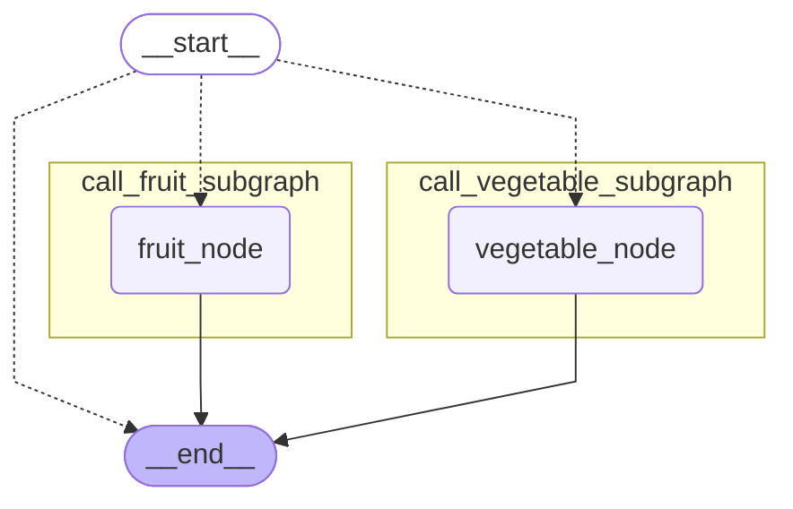

每个子图有独立的父图节点，命名空间为各自的节点名，完全隔离。**这是 Per-thread 模式下多次调用不同子图的推荐做法。**

#### 12.2.2.6. 场景六：Stateless 模式

子图完全无状态，不保存检查点，中断和多轮对话均不适用。适用于纯计算、无需追踪历史的场景。

```python
from typing import TypedDict, Annotated
from operator import add
from langgraph.graph import StateGraph, START, END
from langgraph.checkpoint.memory import InMemorySaver

# 构建子图
class SubgraphState(TypedDict):
    raw_text: str
    clean_texts: Annotated[list[str], add]

def strip_node(state: SubgraphState) -> SubgraphState:
    raw_text = state["raw_text"]
    clean_text = raw_text.strip()

    return {
        "clean_texts": [clean_text]
    }

builder = StateGraph(state_schema=SubgraphState)
builder.add_node("strip_node", strip_node)
builder.add_edge(START, "strip_node")
builder.add_edge("strip_node", END)

# ==================================================
# 【策略切换点】只需修改这一行
subgraph = builder.compile(checkpointer=False)  # Stateless：无检查点
# subgraph = builder.compile(checkpointer=True)   # Per-thread：有状态（对比用）
# ==================================================

# 构建父图
class ParentState(TypedDict):
    input_texts: list[str]
    output_texts: Annotated[list[str], add]

def call_subgraph(state: ParentState) -> ParentState:
    input_texts = state["input_texts"]

    output_texts = []
    for input_text in input_texts:
        res = subgraph.invoke({"raw_text": input_text})
        output_texts += res["clean_texts"]

    return {
        "output_texts": output_texts
    }

builder = StateGraph(state_schema=ParentState)
builder.add_node("call_subgraph", call_subgraph)
builder.add_edge(START, "call_subgraph")
builder.add_edge("call_subgraph", END)

checkpointer = InMemorySaver()
parent_graph = builder.compile(checkpointer=checkpointer)

config = {"configurable": {"thread_id": "stateless-demo"}}

first_response = parent_graph.invoke(
    {
        "input_texts": ["  LangGraph 真有意思 ", "  我喜欢 LangChain "]
    },
    config = config
)
print("=" * 30, "-> 第一次运行结果 <-", "=" * 30)
print(first_response)

second_response = parent_graph.invoke(
    {
        "input_texts": ["  Hello, LangGraph  ", "  Hello, LangChain "]
    },
    config = config
)
print("=" * 30, "-> 第二次运行结果 <-", "=" * 30)
print(second_response)

from IPython.display import display, Image
display(
    Image(
        parent_graph
        .get_graph(xray=True)
        .draw_mermaid_png()
    )
)
```

**Stateless 运行结果**

```
============================== -> 第一次运行结果 <- ==============================
{'input_texts': ['  LangGraph 真有意思 ', '  我喜欢 LangChain '], 'output_texts': ['LangGraph 真有意思', '我喜欢 LangChain']}
============================== -> 第二次运行结果 <- ==============================
{'input_texts': ['  Hello, LangGraph  ', '  Hello, LangChain '], 'output_texts': ['LangGraph 真有意思', '我喜欢 LangChain', 'Hello, LangGraph', 'Hello, LangChain']}
```

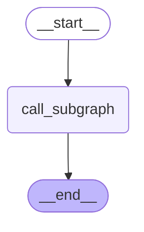

渲染的图结构中，子图节点内部没有展开子图拓扑——无状态模式的子图内部状态不可访问。

**Per-thread 对比结果**（仅改为 `builder.compile(checkpointer=True)`）：

```
============================== -> 第一次运行结果 <- ==============================
{'input_texts': ['  LangGraph 真有意思 ', '  我喜欢 LangChain '], 'output_texts': ['LangGraph 真有意思', '我喜欢 LangChain']}
============================== -> 第二次运行结果 <- ==============================
{'input_texts': ['  Hello, LangGraph  ', '  Hello, LangChain '], 'output_texts': ['LangGraph 真有意思', '我喜欢 LangChain', 'LangGraph 真有意思', 'Hello, LangGraph', '我喜欢 LangChain', 'Hello, LangChain']}
```


Per-thread 模式下第二次调用结果出现了重复（子图的历史 `clean_texts` 被累积），拓扑结构中也展开了子图。**Stateless 不会累积历史，每次调用都是干净的。**

#### 12.2.2.7. `Per-invocation`和`Per-thread`的设计哲学

默认子图检查点命名空间为 `<节点名称>:<任务ID>`。两种模式的核心差异在于对 `<任务ID>` 的处理：

| 维度 | **`Per-invocation`** | **`Per-thread`** |
|:---|:---|:---|
| 命名空间 | `<节点名称>:<任务ID>` | `<节点名称>`（去掉 `:<任务ID>`） |
| 设计意图 | `<任务ID>` 每次不同 → 每次调用状态独立 | `<节点名称>` 不变 → 跨多次调用状态连续 |
| 同节点多次调用 | `:<任务ID>\|1`, `:<任务ID>\|2` … | `\|1`, `\|2` … |
| 注意事项 | — | 调用顺序变化会导致检查点历史相互干扰；`get_state_history()` 存在 Bug，父图检查点仍记录 `:<任务ID>` 格式，需额外处理 |

#### 12.2.2.8. 总结

| 特性                | **`Per-invocation (default)`** | **`Per-thread`**  | **`Stateless`** |
| :------------------ | :----------------------------- | :---------------- | :-------------- |
| **`checkpointer=`** | **`None`**                     | **`True`**        | **`False`**     |
| 中断                | ✅                              | ✅                 | ❌               |
| 多轮对话            | ❌                              | ✅                 | ❌               |
| 多次调用不同子图    | ✅                              | ⚠️最好通过节点隔离 | ✅               |
| 多次调用相同子图    | ✅                              | ❌子图历史相互干扰 | ✅               |
| 观测子图检查点快照  | ⚠️可以观测，但每次调用独立      | ✅                 | ❌               |

## 12.3. 子图流式运行

只需要在父图调用 **`stream`** 时传递 **`subgraphs=True`** 即可，这样父图和子图的流数据都会汇入同一个流队列，再通过命名空间区分来源。

**需要注意的是**：**`subgraphs=True`** 是在原有父图流数据的基础上，**额外加入子图内部产生的流数据**，并不会用子图数据替代父图数据。它会同时流式返回父图和所有子图的输出。

### 12.3.1. 分析`chunk`格式

**`chunk`** 格式为

```python
(namespace, stream_mode, data)
```

此处的命名空间不同于检查点命名空间，是流处理内部专门用于区分父图和子图流数据的字段。

我们通过模式为 **`updates`** 的简单案例查看数据格式

**示例如下**

```python
from typing import TypedDict
from langgraph.graph import StateGraph, START, END

# 构建子图
class SubgraphState(TypedDict):
    raw_text: str # 未清洗文本
    stripped_text: str # 去除收尾空格的文本
    punctuated_text: str # 句尾添加句号的文本

def subgraph_strip_node(state: SubgraphState) -> SubgraphState:
    raw_text = state["raw_text"]
    stripped_text = raw_text.strip()

    return {
        "stripped_text": stripped_text
    }

def subgraph_punctuate_node(state: SubgraphState) -> SubgraphState:
    stripped_text = state["stripped_text"]
    punctuated_text = stripped_text + "。"

    return {
        "punctuated_text": punctuated_text
    }

builder = StateGraph(state_schema=SubgraphState)
builder.add_node("subgraph_strip_node", subgraph_strip_node)
builder.add_node("subgraph_punctuate_node", subgraph_punctuate_node)

builder.add_edge(START, "subgraph_strip_node")
builder.add_edge("subgraph_strip_node", "subgraph_punctuate_node")
builder.add_edge("subgraph_punctuate_node", END)

subgraph = builder.compile()

# 构建父图
class ParentState(TypedDict):
    input_text: str # 输入的未清洗的文本
    cleaned_text: str # 清洗后的文本

def call_subgraph(state: ParentState) -> ParentState:
    input_text = state["input_text"]

    res = subgraph.invoke({"raw_text": input_text})
    cleaned_text = res["punctuated_text"]
    return {
        "cleaned_text": cleaned_text
    }

builder = StateGraph(state_schema=ParentState)
builder.add_node("call_subgraph", call_subgraph)

builder.add_edge(START, "call_subgraph")
builder.add_edge("call_subgraph", END)

parent_graph = builder.compile()

input_text = "   LangGraph 真有意思        "
for chunk in parent_graph.stream(
    {"input_text": input_text},
    subgraphs=True,
    stream_mode=["updates"]
):
    print(chunk)

from IPython.display import display, Image
display(
    Image(
        parent_graph
        .get_graph(xray=True)
        .draw_mermaid_png()
    )
)
```

**运行结果如下**

```python
(
    (
        'call_subgraph:4daa7290-d5c9-ae96-849e-d2f1dafadd17',
    ),
    'updates',
    {
        'subgraph_strip_node': {
            'stripped_text': 'LangGraph 真有意思'
        }
    }
)
(
    (
        'call_subgraph:4daa7290-d5c9-ae96-849e-d2f1dafadd17',
    ),
    'updates',
    {
        'subgraph_punctuate_node': {
            'punctuated_text': 'LangGraph 真有意思。'
        }
    }
)
(
    (),
    'updates',
    {
        'call_subgraph': {
            'cleaned_text': 'LangGraph 真有意思。'
        }
    }
)
```

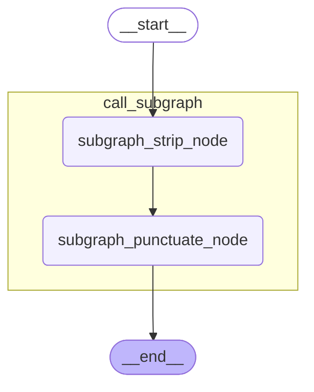


**流数据命名空间规则**：

| 来源 | 命名空间 | 备注 |
|:---|:---|:---|
| 父图 | `()`（空元组） | |
| 子图（常规） | `(<父图节点名>:<父图任务ID>,)` | |
| 子图（Per-thread） | `(<父图节点名>,)` | 与检查点命名空间一致 |

### 12.3.2. 多轮对话消息流处理

**示例如下**

```python
from typing import TypedDict
from langgraph.graph import StateGraph, START, END, MessagesState
from langgraph.checkpoint.memory import InMemorySaver
from langchain.messages import HumanMessage, SystemMessage
from langchain_deepseek import ChatDeepSeek

from dotenv import load_dotenv
load_dotenv(override=True)

model = ChatDeepSeek(
    model="deepseek-v4-flash",
    extra_body={
        "thinking": {
            "type": "disabled"
        }
    }
)

# 构建子图
class SubgraphState(MessagesState):
    system_prompt: SystemMessage

def llm_mode(state: SubgraphState) -> SubgraphState:
    system_prompt = state["system_prompt"]
    messages = state["messages"]

    response = model.invoke([system_prompt] + messages)
    return {
        "messages": [response]
    }

builder = StateGraph(state_schema=SubgraphState)
builder.add_node("llm_mode", llm_mode)
builder.add_edge(START, "llm_mode")
builder.add_edge("llm_mode", END)

subgraph = builder.compile(checkpointer=True)

# 构建父图
class ParentState(TypedDict):
    user_input: str
    assistant_response: str

def call_subgraph(state: ParentState) -> ParentState:
    user_input = state["user_input"]

    response = subgraph.invoke(
        {
            "system_prompt": SystemMessage("你是个善解人意的助手"),
            "messages": [HumanMessage(user_input)]
        }
    )

    assistant_response = response["messages"][-1].content

    return {
        "assistant_response": assistant_response
    }

builder = StateGraph(state_schema=ParentState)
builder.add_node("call_subgraph", call_subgraph)
builder.add_edge(START, "call_subgraph")
builder.add_edge("call_subgraph", END)

checkpointer = InMemorySaver()
parent_graph = builder.compile(checkpointer=checkpointer)

config = {"configurable": {"thread_id": "subgraph_stream_test"}}

print("\n", "=" * 30, "-> 第一次运行结果 <-", "=" * 30)
# chunk 形如
# (('call_subgraph',), 'messages', (AIMessageChunk(content='', additional_kwargs={}, response_metadata={'model_provider': 'deepseek'}, id='lc_run--019efd65-c54e-7012-912e-29ff4f84328e', tool_calls=[], invalid_tool_calls=[], tool_call_chunks=[]), {'thread_id': 'subgraph_stream_test', 'langgraph_step': 1, 'langgraph_node': 'llm_mode', 'langgraph_triggers': ('branch:to:llm_mode',), 'langgraph_path': ('__pregel_pull', 'llm_mode'), 'langgraph_checkpoint_ns': 'call_subgraph|llm_mode:55577c3e-22da-877a-c77b-f16bdbcd2c6c', 'checkpoint_ns': 'call_subgraph:9c469391-f094-1c1b-c5d7-6578f1603151', 'ls_provider': 'deepseek', 'ls_model_name': 'deepseek-v4-flash', 'ls_model_type': 'chat', 'ls_temperature': None}))
for chunk in parent_graph.stream(
    {
        "user_input": "花儿为什么这样红？"
    },
    config=config,
    subgraphs=True,
    stream_mode=["messages"]
):
    print(chunk[2][0].content, end="", flush=True)

print("\n", "=" * 30, "-> 第二次运行结果 <-", "=" * 30)
for chunk in parent_graph.stream(
    {
        "user_input": "刚才我们聊了什么？"
    },
    config=config,
    subgraphs=True,
    stream_mode=["messages"]
):
    print(chunk[2][0].content, end="", flush=True)

from IPython.display import display, Image
display(
    Image(
        parent_graph
        .get_graph(xray=True)
        .draw_mermaid_png()
    )
)
```

**运行结果如下**

```python

 ============================== -> 第一次运行结果 <- ==============================
“花儿为什么这样红”是一个经典的问题，可以从不同角度来理解：

1. **自然科学的视角**：花朵的颜色主要由花瓣中的色素决定，尤其是**花青素**（anthocyanins）。花青素在酸性环境下呈现红色，在碱性环境下偏向蓝色。某些花朵（如玫瑰、山茶花）细胞液偏酸性，因此吸收阳光中的蓝绿光，反射红光，让我们看到鲜艳的红色。此外，红色也能吸引蜂鸟等传粉动物，帮助植物繁殖。

2. **文化艺术的视角**：这是一首传唱已久的中国民歌（《花儿为什么这样红》），由雷振邦作曲，是电影《冰山上的来客》的插曲。歌词用“花儿”比喻纯洁、热烈的情感，红色象征着爱情、勇气或革命的赤诚。

3. **诗意隐喻**：就像“花儿为什么这样红”可以指代生命的热情、青春的绽放，或者经风雨后更加绚烂的坚韧。红色的花朵也常被赋予“美好而短暂”的哲学意味。

如果你指的是特定语境（比如学生物的朋友、教孩子、写赏析），我可以把回答调整得更具体。🌹
 ============================== -> 第二次运行结果 <- ==============================
我们刚才聊了“花儿为什么这样红”这个话题。我分别从自然科学（花青素与酸碱性）、文化艺术（经典民歌《花儿为什么这样红》）以及诗意隐喻三个角度做了解答。如果你有更多想深入的方向，随时告诉我～
```

实际测试可以看到模型返回的消息是逐`token` 返回的。


## 12.4. 子图动态路由

在子图中可以通过 **`Command`** 动态路由到父图节点，只要将参数 **`graph`** 的值设置为 **`Command.PARENT`** 即可，如下所示

```python
return Command(
    update={
        "fruits": fruits,
        "vegetables": vegetables
    },
    goto="router_node",
    graph=Command.PARENT
)
```

 **示例如下**

```python
from typing import TypedDict, Literal
from langgraph.graph import StateGraph, START, END
from langgraph.types import Command
from loguru import logger

# ==================== 子图 ====================
class SubState(TypedDict):
    data: str

def sub_node(state: SubState) -> Command:
    """子图节点：执行后动态路由回父图的 parent_router"""
    logger.info("[子图] sub_node 执行")
    return Command(
        update={"data": state["data"] + " → 子图"},
        goto="node_b",       # 路由到父图节点
        graph=Command.PARENT,       # 指定目标为父图
    )

sub_builder = StateGraph(state_schema=SubState)
sub_builder.add_node("sub_node", sub_node)
sub_builder.add_edge(START, "sub_node")
sub_graph = sub_builder.compile()

# ==================== 父图 ====================
class ParentState(TypedDict):
    data: str

def node_a(state: ParentState) -> ParentState:
    print("[父图] node_a 执行")
    return {"visited_a": True}

def node_b(state: ParentState) -> ParentState:
    print("[父图] node_b 执行")
    return {"visited_b": True}

parent_builder = StateGraph(state_schema=ParentState)
parent_builder.add_node(
    "sub_graph", sub_graph
)

parent_builder.add_node("node_a", node_a)
parent_builder.add_node("node_b", node_b)
parent_builder.add_edge(START, "sub_graph")
parent_builder.add_edge("node_a", "node_b")
parent_builder.add_edge("node_b", END)

parent_graph = parent_builder.compile()

result = parent_graph.invoke({"data": "初始"})
print(f"\n最终结果: {result}")

from IPython.display import display
display(parent_graph)
```

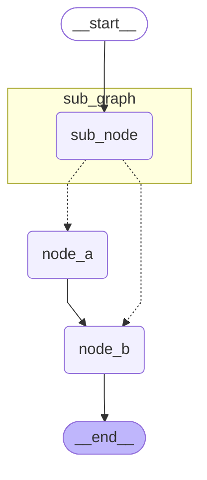

**要点**：

1. 子图通过 `Command(goto="parent_router", graph=Command.PARENT)` 将执行流动态路由回父图的指定节点

2. 子图返回值类型注解不能用 `Command[Literal["parent_router"]]` 的形式，因为子图并不知道父图节点，静态类型校验会报错

   ```python
   ValueError: Found edge ending at unknown node `parent_router`
   ```

3. 添加子图节点时通过 **`destinations`** 声明下游节点，便于渲染图结构时正确描绘拓扑关系

   ```python
   builder.add_node(
       "sub_graph", sub_graph,
       destinations=("parent_router",)
   )
   ```

   不加 **`destinations`** 不会影响动态路由，只是渲染的图结构不能正确描绘拓扑。
# 13. 运行图设计模式

## 13.1. 概述

**`LangGraph`** 官方总结了常用的状态图设计模式，如下

| 模式                      | 图结构                    | 运行时动态性 | 核心 `LangGraph` 能力                         |
| ------------------------- | ------------------------- | ------------ | --------------------------------------------- |
| **`Prompt Chaining`**     | 顺序链                    | 低           | 静态边、条件边                                |
| **`Parallelization`**     | 固定 **`Fan-out/Fan-in`** | 低           | 并行超步、汇聚                                |
| **`Routing`**             | 条件分支                  | 中           | 结构化输出、条件边                            |
| **`Orchestrator-worker`** | 动态 **`Fan-out/Fan-in`** | 高           | **`Send`**、**`WorkerState`**、**`Reducer`**  |
| **`Evaluator-optimizer`** | 反馈循环                  | 中           | 条件边、循环、反馈状态                        |
| **`Agent`**               | 自主决策循环              | 最高         | **`MessagesState`**、工具调用、**`ToolNode`** |

## 13.2. 实现

### 13.2.1. `Prompt Chaining`：提示词链

#### 13.2.1.1. 核心思想

将一个复杂任务拆分成若干个顺序执行的小任务：

```text
输入
 ↓
任务 A
 ↓
任务 B
 ↓
任务 C
 ↓
输出
```

后一个节点依赖前一个节点的结果。

适合：

* 翻译 → 校对 → 润色
* 生成内容 → 检查一致性 → 修订
* 提取信息 → 分类 → 格式化
* 需求分析 → 生成代码 → 代码解释

官方示例是：

```text
生成笑话
   ↓
检查是否合格
  ├─ 合格 → END
  └─ 不合格 → 改进笑话 → 最终润色 → END
```

所以 **`Prompt Chaining`** 不一定只是简单的直线，也可以在中间加入一个 **`Gate`，质量门控节点**。

**`Prompt Chaining`** 的核心是：

> **将复杂任务拆解为可独立验证的阶段，并把每一阶段的结果记录下来向后传递。**

它的优点是执行过程稳定且易于调试；缺点是流程固定，无法处理未知数量或高度动态的任务。

#### 13.2.1.2. 示例

**示例如下**

```python
from typing import TypedDict, Literal
from langgraph.graph import StateGraph, START, END

from langchain.messages import HumanMessage
from langchain_deepseek import ChatDeepSeek
from dotenv import load_dotenv
load_dotenv(override=True)

model = ChatDeepSeek(
    model="deepseek-v4-flash",
    extra_body={
        "thinking": {
            "type": "disabled"
        }
    }
)

# 图状态
class OverAllState(TypedDict):
    topic: str
    joke: str
    improved_joke: str
    final_joke: str

# 节点
def generate_joke(state: OverAllState) -> OverAllState:
    """第一次调用大模型，生成初始笑话"""

    msg = model.invoke(
        [HumanMessage(content=f"写一个关于“{state['topic']}”的简短笑话")]
    )
    return {"joke": msg.content}

def check_punchline(state: OverAllState) -> Literal["pass", "no_pass"]:
    """判断笑话中是否包含包袱"""

    # 简单判断：笑话中是否包含问号或感叹号
    if "?" in state["joke"] or "!" in state["joke"]:
        return "pass"
    return "no_pass"

def improve_joke(state: OverAllState) -> OverAllState:
    """第二次调用大模型，通过添加双关语改进笑话"""

    msg = model.invoke(
        [HumanMessage(content=f"通过添加双关语，让下面这个笑话变得更有趣：\n{state['joke']}")]
    )
    return {"improved_joke": msg.content}

def polish_joke(state: OverAllState) -> OverAllState:
    """第三次调用大模型，对笑话进行最终润色"""

    msg = model.invoke(
        [HumanMessage(content=f"为下面这个笑话添加一个出人意料的反转：\n{state['improved_joke']}")]
    )
    return {"final_joke": msg.content}

# 构建工作流
builder = StateGraph(state_schema=OverAllState)

# 添加节点
builder.add_node("generate_joke", generate_joke)
builder.add_node("improve_joke", improve_joke)
builder.add_node("polish_joke", polish_joke)

# 添加边，连接各个节点
builder.add_edge(START, "generate_joke")
builder.add_conditional_edges(
    "generate_joke",
    check_punchline,
    {
        "no_pass": "improve_joke",
        "pass": END,
    },
)
builder.add_edge("improve_joke", "polish_joke")
builder.add_edge("polish_joke", END)

# 编译工作流
graph = builder.compile()

# 调用工作流
response = graph.invoke({"topic": "猫"})
print(response)

# 绘制拓扑结构
from IPython.display import display
display(graph)
```

**运行结果如下**

```python
{
    'topic': '猫',
    'joke': '一只猫去面试，面试官问：“你有什么特长？”  \n猫淡定地回答：“我能用尾巴画圆。”  \n面试官惊讶：“真的吗？演示一下。”  \n猫转身，尾巴甩了几下，画出一个完美的圆。  \n面试官鼓掌：“太好了！你被录取了！”  \n第二天，猫上班了，发现它被送到了数学实验室——负责画π。',
    'improved_joke': '加了一点数学梗和双关后，版本如下：\n\n---\n\n一只猫去面试，面试官问：“你有什么特长？”  \n猫淡定地回答：“我能用尾巴画圆。”  \n面试官惊讶：“真的吗？演示一下。”  \n猫转身，尾巴甩了几下，画出一个完美的圆。  \n面试官鼓掌：“太好了！你被录取了！”  \n\n第二天，猫上班了，发现它被送到了数学实验室——**负责画π**。  \n\n猫叹了口气，说：“**原来我的‘圆’满人生，终究逃不过π的‘鼠’命。”**  \n\n（双关解析：  \n1. “π”音同“派”，既指圆周率，也暗示“被派遣”去画圆。  \n2. “鼠命”谐音“宿命”，同时猫抓老鼠，这里暗指猫被困在数学“鼠”洞（无限不循环小数）里，永远画不完。）',
    'final_joke': '---\n\n**反转版：**  \n第二天，猫上班了，发现它被送到了数学实验室——**负责画π**。  \n\n猫叹了口气，说：“原来我的‘圆’满人生，终究逃不过π的‘鼠’命。”  \n\n话音刚落，实验室主任推门进来，是个戴眼镜的仓鼠。仓鼠拍了拍猫的尾巴，微笑道：“别担心，我们用的是**有理数**——你每天只用画前100位，剩下的**无限循环**，由我们**鼠**类负责演算。”  \n\n猫愣了一下，突然跳起来：“等等！你是说——我画圆，你们算剩下的尾巴？”  \n\n仓鼠点头：“对，这叫……**π的‘分工’合作**。”  \n\n猫沉默三秒，忽然掏出手机：“那我得先给抓老鼠的同行打个电话——告诉他们，**‘有理’走遍天下，无理寸步难行**。”  \n\n（双关补充：  \n1. **“有理数”** 双关：既指数学上有理数（可终止或循环），也暗示“有道理的反转”——猫的“无限宿命”被仓鼠强行打断。  \n2. **“剩下的尾巴”** 双关：猫的尾巴画圆，但仓鼠们负责“补完”无限小数，字面与数学双关。  \n3. **“有理走遍天下”** 化用俗语，暗讽“有理数”才是猫的出路，而“无理”的π已变成职场协作梗。）'
}
```

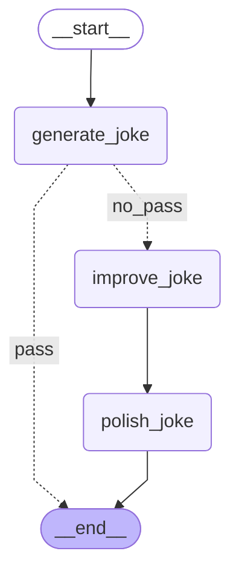


---

### 13.2.2. `Parallelization`：并行化

#### 13.2.2.1. 核心思想

把相互独立的任务同时执行，最后汇总结果：

```text
                 ┌→ 任务 A ─┐
输入 → Fan-out  ──┼→ 任务 B ─┼→ 聚合 → 输出
                 └→ 任务 C ─┘
```

官方将并行化分成两种用途：

1. **任务拆分**
   * 一个节点检查关键词
   * 一个节点检查格式
   * 一个节点检查事实准确性
   
2. **多次独立判断**
   * 多个模型或多个提示词分别评分
   * 最后投票、平均或综合判断

前者主要提升速度，后者主要提升置信度。

#### 13.2.2.2. 示例

**示例如下**

```python
from typing import TypedDict
from langgraph.graph import StateGraph, START, END

from langchain.messages import HumanMessage
from langchain_deepseek import ChatDeepSeek

from dotenv import load_dotenv
load_dotenv(override=True)

model = ChatDeepSeek(
    model="deepseek-v4-flash",
    extra_body={
        "thinking": {
            "type": "disabled"
        }
    }
)

# 图状态
class OverAllState(TypedDict):
    topic: str
    joke: str
    story: str
    poem: str
    combined_output: str

# 节点
def call_model_1(state: OverAllState) -> OverAllState:
    """第一次调用大模型，生成笑话"""

    msg = model.invoke(
        [HumanMessage(content=f"写一个关于“{state['topic']}”的简短的笑话")]
    )
    return {"joke": msg.content}

def call_model_2(state: OverAllState) -> OverAllState:
    """第二次调用大模型，生成故事"""

    msg = model.invoke(
        [HumanMessage(content=f"写一个关于“{state['topic']}”的简短的故事")]
    )
    return {"story": msg.content}

def call_model_3(state: OverAllState) -> OverAllState:
    """第三次调用大模型，生成诗歌"""

    msg = model.invoke(
        [HumanMessage(content=f"写一首关于“{state['topic']}”的简短的诗")]
    )
    return {"poem": msg.content}

def aggregator(state: OverAllState) -> OverAllState:
    """将笑话、故事和诗歌合并为单一输出"""

    combined = f"下面是一个关于“{state['topic']}”的故事、笑话和诗歌！\n\n"
    combined += f"故事：\n{state['story']}\n\n"
    combined += f"笑话：\n{state['joke']}\n\n"
    combined += f"诗歌：\n{state['poem']}"
    return {"combined_output": combined}

# 构建工作流
builder = StateGraph(state_schema=OverAllState)

# 添加节点
builder.add_node("call_model_1", call_model_1)
builder.add_node("call_model_2", call_model_2)
builder.add_node("call_model_3", call_model_3)
builder.add_node("aggregator", aggregator)

# 添加边，连接各个节点
builder.add_edge(START, "call_model_1")
builder.add_edge(START, "call_model_2")
builder.add_edge(START, "call_model_3")
builder.add_edge(["call_model_1", "call_model_2", "call_model_3"], "aggregator")
builder.add_edge("aggregator", END)

graph = builder.compile()

# 调用工作流
response = graph.invoke({"topic": "猫"})
print(response)

from IPython.display import display
display(graph)
```

**运行结果如下**

```python
{
    'topic': '猫',
    'joke': '“为什么猫总是赢不了电脑游戏？”\n“因为鼠标（鼠）一出现，它就光顾着抓屏（屏幕）了……”',
    'story': '# 猫的故事\n\n老张退休那年，在楼下捡到一只瘦骨嶙峋的橘猫。\n\n他本不爱猫，但看它可怜，便每天在楼道口放一碗剩饭。猫很警惕，非要等他走远了才肯吃。就这样喂了三个月，猫终于允许他靠近一臂的距离。\n\n半年后的一天夜里，老张突发心梗，倒在客厅地板上，手机摔在茶几底下，怎么也够不着。意识模糊间，他感到一团温热的东西贴上了他的胸口——是那只橘猫。它不知怎么钻进了他家门。\n\n猫用头蹭他的手，蹭他的脸，见他没反应，便冲进屋里的每一个房间，歇斯底里地叫。最后它跳上窗台，用爪子疯狂拍打玻璃，叫声惊动了楼下乘凉的邻居。\n\n120赶到时，老张已经在地上躺了将近一个小时。医生说，再晚十分钟，就悬了。\n\n出院后，橘猫正式住进了老张家。老张给它取名“富贵”，逢人就说：“我家富贵啊，有九条命，分了我一条。”\n\n富贵永远听不懂这些话。它只是每天黄昏，准时跳上老张的膝盖，把一团温暖塞进他的怀里，呼噜呼噜地睡去。',
    'poem': '## 《猫》\n\n黄昏被毛茸茸地踩碎，\n肚皮起伏如钟摆，\n眼睫间，星辰坠落。\n当琥珀瞳孔转动，\n整片夜色都来蜷卧。',
    'combined_output': '下面是一个关于“猫”的故事、笑话和诗歌！\n\n故事：\n# 猫的故事\n\n老张退休那年，在楼下捡到一只瘦骨嶙峋的橘猫。\n\n他本不爱猫，但看它可怜，便每天在楼道口放一碗剩饭。猫很警惕，非要等他走远了才肯吃。就这样喂了三个月，猫终于允许他靠近一臂的距离。\n\n半年后的一天夜里，老张突发心梗，倒在客厅地板上，手机摔在茶几底下，怎么也够不着。意识模糊间，他感到一团温热的东西贴上了他的胸口——是那只橘猫。它不知怎么钻进了他家门。\n\n猫用头蹭他的手，蹭他的脸，见他没反应，便冲进屋里的每一个房间，歇斯底里地叫。最后它跳上窗台，用爪子疯狂拍打玻璃，叫声惊动了楼下乘凉的邻居。\n\n120赶到时，老张已经在地上躺了将近一个小时。医生说，再晚十分钟，就悬了。\n\n出院后，橘猫正式住进了老张家。老张给它取名“富贵”，逢人就说：“我家富贵啊，有九条命，分了我一条。”\n\n富贵永远听不懂这些话。它只是每天黄昏，准时跳上老张的膝盖，把一团温暖塞进他的怀里，呼噜呼噜地睡去。\n\n笑话：\n“为什么猫总是赢不了电脑游戏？”\n“因为鼠标（鼠）一出现，它就光顾着抓屏（屏幕）了……”\n\n诗歌：\n## 《猫》\n\n黄昏被毛茸茸地踩碎，\n肚皮起伏如钟摆，\n眼睫间，星辰坠落。\n当琥珀瞳孔转动，\n整片夜色都来蜷卧。'
}
```

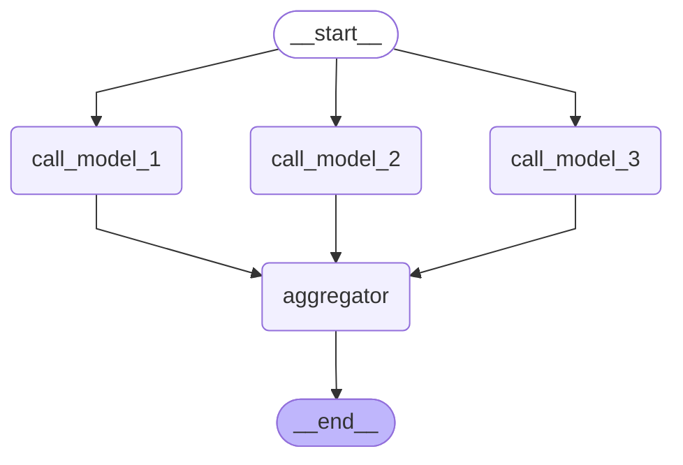


---

### 13.2.3. `Routing`：路由

#### 13.2.3.1. 核心思想

先识别输入类型，再把请求送到专门的处理流程：

```text
                  ┌→ 退款流程
输入 → 路由判断节点 ─┼→ 售价咨询流程
                  └→ 商品推荐流程
```

它适合不同类型请求需要不同处理逻辑的场景，例如：

* 售前、售后、退款分类
* 普通问答、代码生成、数据分析
* 文本、图片、音频请求分类
* 不同领域知识库的选择

#### 13.2.3.2. 设计原则

最佳实践：

* **`LLM` 节点**负责语义判断；
* **路由函数**负责把结构化结果映射到节点；
* **业务节点**负责真正处理任务。

不要让路由 LLM 直接返回任意节点名，否则模型输出和图结构会过度耦合，也难以进行类型检查和异常兜底。

#### 13.2.3.3. 示例

**示例如下**

```python
from pydantic import BaseModel, Field
from typing import Literal,TypedDict
from langgraph.graph import StateGraph, START, END
from langchain.messages import HumanMessage, SystemMessage

from langchain_deepseek import ChatDeepSeek

from dotenv import load_dotenv
load_dotenv(override=True)

model = ChatDeepSeek(
    model="deepseek-v4-flash",
    extra_body={
        "thinking": {
            "type": "disabled"
        }
    }
)

# 定义用于结构化输出的 Schema，作为路由判断依据
class Route(BaseModel):
    step: Literal["poem", "story", "joke"] = Field(
        None,
        description="路由流程中的下一执行步骤",
    )

# 为大模型添加结构化输出能力
router = model.with_structured_output(Route)

# 图状态
class OverAllState(TypedDict):
    input: str
    decision: str
    output: str

# 节点
def model_call_1(state: OverAllState) -> OverAllState:
    """生成故事"""

    result = model.invoke(
        [HumanMessage(content=state["input"])]
    )
    return {"output": result.content}


def model_call_2(state: OverAllState) -> OverAllState:
    """生成笑话"""

    result = model.invoke(
        [HumanMessage(content=state["input"])]
    )
    return {"output": result.content}


def model_call_3(state: OverAllState) -> OverAllState:
    """生成诗歌"""

    result = model.invoke(
        [HumanMessage(content=state["input"])]
    )
    return {"output": result.content}


def model_call_router(state: OverAllState) -> OverAllState:
    """将用户输入路由到合适的节点"""

    # 调用具有结构化输出能力的大模型，完成路由判断
    decision = router.invoke(
        [
            SystemMessage(
                content=(
                    "根据用户的请求，将其路由到 story、joke 或 poem。"
                    "请求编写故事时返回 story，请求编写笑话时返回 joke，"
                    "请求编写诗歌时返回 poem。"
                )
            ),
            HumanMessage(content=state["input"]),
        ]
    )

    return {"decision": decision.step}


# 条件边函数：根据路由决策选择下一个节点
def route_decision(
        state: OverAllState
) -> Literal[
    "model_call_1",
    "model_call_2",
    "model_call_3",
    END
]:
    # 返回接下来要执行的节点名称
    if state["decision"] == "story":
        return "model_call_1"
    elif state["decision"] == "joke":
        return "model_call_2"
    elif state["decision"] == "poem":
        return "model_call_3"
    return END


# 构建工作流
builder = StateGraph(OverAllState)

# 添加节点
builder.add_node("model_call_1", model_call_1)
builder.add_node("model_call_2", model_call_2)
builder.add_node("model_call_3", model_call_3)
builder.add_node("model_call_router", model_call_router)

# 添加边，连接各个节点
builder.add_edge(START, "model_call_router")
builder.add_conditional_edges(
    "model_call_router",
    route_decision,
    {
        # route_decision 返回的名称：接下来要执行的节点名称
        "model_call_1": "model_call_1",
        "model_call_2": "model_call_2",
        "model_call_3": "model_call_3",
    },
)
builder.add_edge("model_call_1", END)
builder.add_edge("model_call_2", END)
builder.add_edge("model_call_3", END)

# 编译工作流
graph = builder.compile()

# 调用工作流
state = graph.invoke({"input": "写一个关于猫的笑话"})
print(state["output"])

# 显示工作流图
from IPython.display import display
display(graph)
```

**运行结果如下**

```python
这是一个关于猫的冷笑话，希望你喜欢：

**猫为什么不喜欢洗澡？**

**因为它不想变成“落汤包”（肉包）。**

（笑点解析：谐音梗，把“落汤猫”说成“落汤包”，而猫胖胖的确实有点像包子。）
```

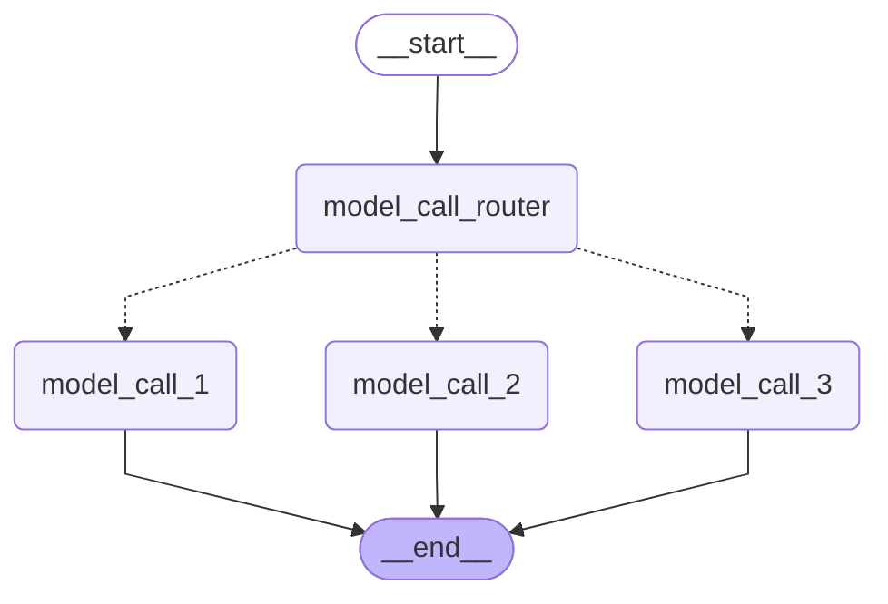

---

### 13.2.4. `Orchestrator-worker`：编排器—工作节点

#### 13.2.4.1. 核心思想

编排器先分析任务，动态生成若干子任务，再创建对应数量的 Worker：

```text
                         ┌→ Worker 1 ─┐
输入 → Orchestrator  ─────┼→ Worker 2 ─┼→ Synthesizer → 输出
                         ├→ Worker 3 ─┤
                         └→ Worker N ─┘
```

它通常包含三个组件：

| 组件 | 职责 |
|:---|:---|
| **`Orchestrator`**（编排器） | 分析任务、制定计划、生成子任务列表 |
| **`Workers`**（工作节点） | 分别处理各子任务，通常并行执行 |
| **`Synthesizer`**（聚合节点） | 汇总所有 Worker 结果，生成最终答案 |

适合任务数量无法预先确定的场景，例如：

* 根据主题动态生成报告章节
* 修改未知数量的代码文件
* 为多个数据源分别执行分析
* 将长文档动态拆分为若干部分处理

#### 13.2.4.2. 和`Parallelization`的区别

| 模式 | 任务数量 |
|:---|:---|
| **`Parallelization`** | 编译图时已确定（静态） |
| **`Orchestrator-worker`** | 运行时动态计算 |

#### 13.2.4.3. 本质

**`Orchestrator-worker`** 本质上就是 **`Map-Reduce`**，我们在前面的课程中已经实现过了

```text
Orchestrator：生成 Map 任务
Send：动态分发
Worker：执行 Map
Reducer：合并中间结果
Synthesizer：执行 Reduce
```

#### 13.2.4.4. 示例

**示例如下**

```python
from typing import Annotated, List, TypedDict
from collections.abc import Sequence

from langchain_core.messages import SystemMessage, HumanMessage
from langgraph.graph import StateGraph, START, END
from langgraph.types import Send
from langchain_deepseek import ChatDeepSeek

from operator import add
from dotenv import load_dotenv
from pydantic import BaseModel, Field

load_dotenv(override=True)

model = ChatDeepSeek(
    model="deepseek-v4-flash",
    extra_body={
        "thinking": {
            "type": "disabled"
        }
    }
)

# 结构化输出的 Schema
class Section(BaseModel):
    name: str = Field(
        description="报告的章节名称",
    )
    description: str = Field(
        description="本节主题和核心思想的概述",
    )

class Sections(BaseModel):
    sections: List[Section] = Field(
        description="报告的章节列表",
    )

# 编排器
planner = model.with_structured_output(Sections)

# 图状态
class OverAllState(TypedDict):
    topic: str  # 报告主题
    sections: list[Section]  # 报告章节列表
    completed_sections: Annotated[
        list, add
    ]  # 所有工作节点并行写入该字段
    final_report: str  # 最终报告


# 工作节点状态
class WorkerState(TypedDict):
    section: Section
    completed_sections: Annotated[list, add]

# 节点
def orchestrator(state: OverAllState) -> OverAllState:
    """编排器：生成报告编写计划"""

    # 生成报告章节规划
    report_sections = planner.invoke(
        [
            SystemMessage(content="为这份报告生成一个章节规划。"),
            HumanMessage(content=f"报告主题如下：{state['topic']}"),
        ]
    )

    return {"sections": report_sections.sections}

def model_call(state: WorkerState) -> WorkerState:
    """工作节点：编写报告中的一个章节"""

    # 生成章节内容
    section = model.invoke(
        [
            SystemMessage(
                content=(
                    "根据提供的章节名称和章节描述编写报告内容。"
                    "不要在每个章节前添加额外的开场说明。"
                    "使用 Markdown 格式。"
                )
            ),
            HumanMessage(
                content=(
                    f"章节名称：{state['section'].name}\n"
                    f"章节描述：{state['section'].description}"
                )
            ),
        ]
    )

    # 将生成的章节写入已完成章节列表
    return {"completed_sections": [section.content]}


def synthesizer(state: OverAllState) -> OverAllState:
    """将所有章节合成为完整报告"""

    # 获取所有已完成的章节
    completed_sections = state["completed_sections"]

    # 将已完成章节拼接为最终报告
    completed_report_sections = "\n\n---\n\n".join(completed_sections)

    return {"final_report": completed_report_sections}


# 条件边函数：为规划中的每个章节创建一个 model_call 工作节点
def assign_workers(state: OverAllState) -> Sequence[Send]:
    """为规划中的每个章节分配一个工作节点"""

    # 使用 Send API 并行启动各个章节的编写任务
    return [Send("model_call", {"section": s}) for s in state["sections"]]


# 构建工作流
builder = StateGraph(state_schema=OverAllState)

# 添加节点
builder.add_node("orchestrator", orchestrator)
builder.add_node("model_call", model_call)
builder.add_node("synthesizer", synthesizer)

# 添加边，连接各个节点
builder.add_edge(START, "orchestrator")
builder.add_conditional_edges(
    "orchestrator",
    assign_workers,
    ["model_call"],
)
builder.add_edge("model_call", "synthesizer")
builder.add_edge("synthesizer", END)

# 编译工作流
graph = builder.compile()

# 调用工作流
state = graph.invoke(
    {"topic": "撰写一份关于大语言模型缩放定律的报告"}
)

from IPython.display import Markdown, display

# 显示工作流图
display(graph)
# 渲染报告
Markdown(state["final_report"])
```

**运行结果如下**

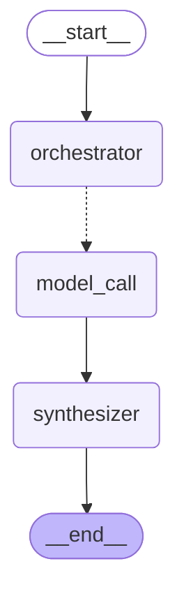


```markdown
引言
缩放定律是深度学习与人工智能领域中的核心理论基础之一。它揭示了模型性能与关键资源（如参数量、数据规模、计算算力）之间普遍存在的幂律关系，即当模型规模、训练数据量或计算预算成比例扩大时，模型的表现能力会呈现出可预测性的提升。这一发现最早源自对语言模型的系统性实证研究，随后在计算机视觉、多模态学习等众多任务中被广泛验证，深刻改变了现代AI研究的范式。

缩放定律的重要性体现在多个层面。从学术研究角度看，它不仅为“更大的模型、更多的数据”提供了科学依据，还催生了以GPT、PaLM、LLaMA为代表的大规模预训练模型浪潮。从工程实践角度看，缩放定律为资源分配提供了量化指导——研究人员可以据此预测模型性能对计算预算的依赖关系，从而制定更高效的训练策略。此外，在探索模型能力涌现性的前沿领域，缩放定律更是理解大语言模型行为边界的关键工具。因此，深入剖析缩放定律的理论内涵、实验验证与局限性，对于把握AI发展的底层逻辑具有不可替代的价值。

本报告将系统梳理缩放定律的研究脉络。后续章节首先阐述语言模型缩放的基本原理与核心公式；随后通过经典实验案例展示缩放定律的实证表现，并讨论其在不同任务与架构中的泛化能力；在此基础上，分析缩放定律的物理极限与开放挑战，包括数据效率、规模收益递减等问题；最后总结缩放定律对AI未来发展的战略启示。全文力求在学术严谨性与可读性之间取得平衡，为读者提供一幅关于缩放定律的全局图景。

缩放定律的基本概念
缩放定律（Scaling Laws）是深度学习中描述模型性能如何随模型规模（参数数量）、数据集规模（训练数据量）以及计算量（训练使用的计算资源，通常以FLOPs表示）变化的经验性规律。这些规律揭示了在大规模训练中，模型性能（例如损失值或下游任务准确率）与上述三个因素之间存在较为平滑且可预测的幂律关系。

具体而言，缩放定律通常由以下关系组成：

模型规模（Model Size）：在给定的数据集和计算预算下，增加模型参数数量（例如从几亿到数千亿）能够显著提升性能，但收益呈现递减趋势。性能提升与模型参数量的幂次方成正比，即 ( L \propto N^{-\alpha} )，其中 ( L ) 为损失， ( N ) 为参数数量， ( \alpha ) 为缩放指数。

数据集规模（Dataset Size）：在固定模型结构和计算资源的情况下，增加训练数据量同样可以降低损失。类似地，损失与数据量的关系可表示为 ( L \propto D^{-\beta} )，其中 ( D ) 为数据集规模， ( \beta ) 为对应的缩放指数。这意味着数据量越大，模型过拟合的风险越小，性能提升越稳定。

计算量（Compute）：将模型规模和数据规模同时考虑，总训练计算量（以FLOPs衡量）与性能的关系可概括为 ( L \propto C^{-\gamma} )，其中 ( C ) 为计算量。研究表明，在最优资源配置下，增加计算量能可靠地提升性能，且存在一个近似固定的计算最优前沿。

这些关系表明，模型性能并非由单一因素决定，而是三者共同作用的结果。缩放定律的核心在于，当预算（计算成本）固定时，存在一组最优的模型规模与数据规模分配，使得性能最大化。例如，若计算预算充足，则应同时扩大模型参数和训练数据；若某一资源受限，则需根据缩放指数的相对大小调整比例。

缩放定律的一个关键结论是：大模型是样本高效的——即随着模型规模增大，同样的数据量能带来更大的性能提升；反过来，大模型也是计算高效的——即同样的计算预算，训练更大的模型（配合适量数据）往往比训练小模型更优。这些规律为现代大规模语言模型的设计，如GPT系列、LLaMA等，提供了理论基础：它们正是遵循“同时扩大模型、数据和计算量”的指导原则。

核心发现：损失函数的幂律关系
Kaplan等人的研究揭示了大语言模型的损失函数与模型参数规模（(N)）、训练数据规模（(D)）以及计算量（(C)，通常以FLOPs衡量）之间存在明确的幂律（Power-Law）关系。这一发现为大规模模型的扩展提供了可预测的量化基础。

1. 损失与参数规模的幂律关系
在固定数据规模（(D)）的情况下，模型测试损失（(L)）与参数规模（(N)）呈现出双向的幂律行为：

欠参数化区域：当 (N) 较小时，模型容量不足，损失较高。
过参数化区域：当 (N) 持续增大，损失开始随参数增长以平滑的幂律形式下降，最终收敛于数据规模所限制的最优损失（即“不可约损失”）。
该关系可近似描述为： [ L(N) \approx L_{\infty} + \alpha_N \cdot N^{-\gamma_N} ] 其中 (L_{\infty}) 表示数据质量决定的不可约损失，(\gamma_N) 为幂律指数（通常在0.07-0.10之间），(\alpha_N) 为缩放常数。

2. 损失与数据规模的幂律关系
相似地，在固定参数规模（(N)）时，损失函数与训练数据规模（(D)）也呈现幂律趋势。当数据量增加，模型通过摄取更多示例改进泛化能力，损失按如下形式降低： [ L(D) \approx L_{\infty} + \alpha_D \cdot D^{-\gamma_D} ] 实验表明，(\gamma_D) 的典型值在0.07-0.10范围内，与 (\gamma_N) 接近，暗示参数和数据对损失的贡献在结构上是对称的。

3. 损失与计算量的幂律关系
计算量（(C)）被视为参数规模与数据规模的复合函数：(C \approx 6N \cdot D)（基于Transformer的前向与后向传播成本）。通过等比例扩展参数和数据，损失与计算量之间也遵循幂律规律： [ L(C) \approx L_{\infty} + \alpha_C \cdot C^{-\gamma_C} ] 其中 (\gamma_C) 通常在0.05-0.08左右，略低于前两个指数，反映了优化效率随规模增大而递减的边际效应。

4. 幂律关系的核心含义
可预测的扩展：只要维持参数和数据规模的平衡增长，损失减少的速率可被幂律精确预测，从而指导资源分配。
收益递减法则：幂律指数越小（绝对值），意味着每增加一单位计算量所获得的损失改善越慢，最终接近不可约损失。
Compute-Optimal极限：结合各项幂律曲线，存在一个最优的参数-数据配比，使得在给定总计算预算下损失最小化，这也是后续Chinchilla法则的理论基础。
综上所述，损失函数的幂律关系构成了大模型性能超越的关键先验知识，它强调了在扩展过程中参数、数据和计算量必须协同增长，否则因资源浪费（如只增加参数而不增加数据）导致幂律提升停滞。

数据与计算效率
在深度学习中，模型性能的提升往往依赖于增加参数数量与数据规模，但现实中的计算预算（如GPU时长、电力或成本）通常是有限的。如何在给定的计算预算下，最优地分配参数规模与数据规模，以实现最佳的模型性能，是数据与计算效率研究的核心问题。这涉及到缩放定律的深入理解以及训练策略的优化。

1. 缩放定律回顾与计算预算视角
根据经典的神经语言模型缩放定律（如Kaplan等人于2020年提出的研究，以及DeepMind的Chinchilla研究），模型性能（通常用验证损失衡量）受三个主要因素影响：模型参数数量（N）、训练数据Token数量（D）和计算预算（C）。缩放定律通常可以近似为幂律关系：损失 L(N,D) ≈ A/N^α + B/D^β + E，其中α和β是缩放指数，E是数据不可压缩的熵。计算预算与N和D并非独立，在大规模训练中，计算量主要来自前向和反向传播，通常近似为 C ≈ 6 * N * D（对于Transformer结构，忽略通信和嵌入层开销）。

给定固定的计算预算C，如果分配过少参数而使用过多数据（N过小，D过大），参数容量不足以捕捉数据中的模式，导致欠拟合；反之，如果参数过多而数据不足（N过大，D过小），模型会过拟合，无法通过足够的样本来泛化。最优分配的目标是找到N和D，使得在C固定的条件下，验证损失L最小化。

2. 计算最优训练：参数与数据的平衡点
Chinchilla缩放定律的研究指出，对于许多计算预算，最优的参数与数据规模满足近似关系：N_opt ∝ C^a 且 D_opt ∝ C^b，其中 a 和 b 之和接近1，且 a 通常小于 b。具体地，Chinchilla研究发现，对于使用Adam优化器的Transformer语言模型，当预算增加时，最优的参数和数据分配比例大致保持恒定，即 对于每个参数，约应分配20个训练Token（这一比例因模型架构和任务有所不同，但提供了一个直观的指导）。

例如，在计算预算为1e20 FLOPs的情况下，最优配置可能是约70B参数配合1.4T训练Token；而预算增加到2e20 FLOPs时，最优可能变为100B参数配合2T Token。这一发现反驳了早期“仅扩大参数而忽视数据”的做法，强调在固定预算下，同时按比例放大数据和参数比单独放大其中一个更有效。

3. 计算资源有限时的策略
当计算预算远小于现代主流规模（如单个GPU或小型集群）时，最优分配的策略需要更细致的考量：

预算极小的情况（如单GPU、几天训练）：参数规模和数据规模可能都受到硬件限制。此时，优先考虑模型容量，但需避免参数量超出能有效训练的最小数据量。通常，使用预训练模型微调比从头训练更高效，因为预训练模型已经在大规模数据上获得了通用表征，少量下游数据即可适配，从而将计算预算集中用于微调步骤。

中等预算（如多GPU、数周训练）：可参考缩放定律的比例关系。假设预算为C，根据N_opt ∝ C^0.5和D_opt ∝ C^0.5（此比例来自某些缩放研究，具体指数需要实验校准），推算合适的参数和Token数。实践中，可从公开的缩放曲线（如LLaMA、Chinchilla等）中提取经验公式，例如对于Transformer-LM，每增加一倍计算预算，同时将参数和Token增加约1.4倍（即C^0.5增长）。

预算极度受限且追求低成本：在边缘设备或快速原型开发中，计算效率意味着最小的参数规模实现足够好的性能。此时，推荐使用知识蒸馏、模型压缩或稀疏训练等方法。但这些方法本身需消耗计算资源，需权衡是否优于直接缩放

4. 数据效率的多重维度
除了参数与数据总量的分配，数据本身的特性也影响计算效率：

数据质量 vs. 数量：在有限计算预算下，使用高质量、代表性强的数据（例如经过筛选、去重、平衡类别的数据）往往比盲目增加数据量更有效。数据质量提升可降低所需的数据量，从而减少训练所需的计算量。

数据复用与课程学习：对数据进行多次训练（epoch）会引入过拟合风险，但在数据量不足时，适当的重复训练（如使用数据增强）可以增加有效样本数。课程学习（先易后难的数据顺序）可加速收敛，减少达到特定损失所需的计算步数。

主动学习与数据选择：在训练期间动态选择最具有信息性的数据子集进行训练，避免在容易或冗余样本上浪费计算资源。例如，基于损失值或不确定性采样，仅使用部分数据即可达到接近全量数据的性能。

5. 实际分配建议与工具使用
在工程实践中，最优分配可通过以下步骤实现：

建立小规模缩放曲线：使用计算预算的1%或更少进行小规模实验，训练不同（N,D）组合的模型，拟合幂律关系，推断出当前预算下的最优比例。
利用搜索或公式：参考已发表的缩放定律常数（如Chinchilla的20 Token/参数法则），但需注意这基于特定架构和数据集，应在目标数据上进行验证。
考虑数据生成成本：若数据获取比计算更昂贵（如需要人工标注），则应优先增大参数并使用预训练模型微调；反之，若计算昂贵而数据丰富（如互联网文本），则倾向于更多数据。
分阶段训练：若预算允许，可先训练一个大模型，再用其蒸馏小模型，是一种“先扩大参数，再缩小”的策略，但需要额外计算用于蒸馏。
总之，在有限计算预算下，最优地分配参数与数据规模的核心在于打破“越大越好”的直觉，理解缩放定律的隐含平衡，并通过质量控制和数据效率提升来最大化计算投入的回报。通过系统性实验和理论指导，可在固定成本下获得显著的性能提升。

超越损失：缩放定律对下游任务的影响
缩放定律最初源于对预训练损失随模型规模、数据量和计算量变化的观察，但其意义远不止于优化训练曲线。随着模型规模的增长，许多下游任务展现出超越简单损失改善的质性变化，呈现出涌现能力、上下文学习能力增强等非连续现象。本章将深入分析缩放定律如何预测并影响这些下游任务的表现，揭示规模提升带来的能力跃迁及其内在机制。

涌现能力：缩放定律的阶跃性预测
缩放定律通常描绘损失随规模平滑下降，但在下游任务上，模型能力并非线性提升，而是在达到特定规模后突然显现。例如，在算术推理、多步逻辑链、代码生成等任务中，小模型几乎无法完成，而大模型在参数跨过某个阈值时，准确率从接近零跃升至显著水平。这种涌现现象与实际任务性能的S形增长曲线相对应，而缩放定律通过预测模型不同区域的表示质量，揭示了涌现的触发条件：当模型参数量、数据量和训练步数满足特定组合时，隐层表征的容量与任务复杂度首次匹配。具体而言，缩放定律提供的幂律关系可以粗略估计模型在给定计算预算下的最优规模，当最优规模超过任务所需的最小表示容量时，涌现现象开始出现。因此，缩放定律并非保证所有任务同时涌现，而是定义了不同任务的能力门槛，预期在更大规模下能解锁更多高阶能力。

上下文学习能力的缩放效应
上下文学习——即模型无需梯度更新，仅通过在提示中提供少量示例即可执行新任务——是大规模语言模型最突出的特性之一。研究发现，上下文学习的性能与模型规模存在强正相关：小模型几乎不具备有效的上下文学习能力，随着参数规模扩大，模型能从示例中提取的模式更加准确，泛化偏差降低。缩放定律在此表现为：模型在上下文学习任务上的准确率通常符合对数或幂律增长，与预训练损失下降趋势并行。其背后的原因在于，随着规模增大，模型的前馈层和注意力头数增加，使得它能在前向传播中并行模拟更多的“推理步骤”，实现了内隐的梯度下降模拟。缩放定律预测，在固定计算预算下，规模更大的模型在上下文学习上的收益将超过同等效率的微调方法，从而引导研究者在提示工程和大规模预训练之间做出资源分配决策。

任务泛化与分布外表现
缩放定律对下游任务的影响不仅限于在分布内示例上的表现，更关键的是对分布外泛化能力的提升。实验表明，随着模型规模增长，模型在不同任务类别、不同领域、甚至不同语言之间的迁移性能稳定提升。这源于缩放定律中“数据多样性”的维度——更大的模型能更充分地利用多源数据中的结构共性，从而在未明确训练的领域形成鲁棒的假设。例如，在数学推理任务上，缩放定律使得模型能将从自然语言中学到的逻辑模式迁移至符号推理，表现出更强的类比和抽象能力。然而，这种迁移并非均匀：某些依赖低频知识或特殊模式的任务，可能仍需要接近边界规模才能突破泛化瓶颈。缩放定律因此为任务选择提供了依据——优先将计算资源分配给那些对规模敏感、且具有明确泛化回报的任务。

任务特定缩放曲线与优化经济性
不同下游任务对模型规模、数据量和计算量的响应曲线各异。有些任务（如简单分类或QA）在中小规模模型上即饱和，进一步扩展规模带来的收益递减很快；而另一些任务（如复杂推理、多语言理解）则持续受益于规模扩大。通过构建任务特定的缩放曲线（通常为幂律或指数饱和形式），研究者可以预测在给定计算预算下，投入资源以提升模型规模、增加训练数据或优化数据质量三者中的最优选择。例如，对于认知密集型任务，在模型规模上的投入回报率往往高于数据增量；而对于知识密集型任务，数据多样性可能更重要。这种缩放定律的延伸应用，使得模型部署决策更加数据驱动，避免了盲目扩大规模导致的经济浪费。

涌现能力背后的机制：表示压缩与结构对齐
进一步分析，缩放定律对涌现能力的积极影响可以理解为：大规模模型通过高维表示实现了对任务本质结构的压缩与对齐。在小规模模型中，隐层表示空间难以同时编码多个复杂模式，导致任务相关信号被噪声淹没。而当模型规模超过临界点，表示空间的各个维度开始分离出可解释的语义轴（如因果关系、时态关系、空间关系等）。缩放定律预测这些表示维度的“分化临界点”，在该点之后，模型能够以更少的冲突编码多个任务的隐含规则。此外，注意力模式的稳定化——即多头注意力在大型模型中形成更聚焦的依赖关系——进一步支撑了长程逻辑和上下文结构的捕捉，从而直接提升了下游任务的逻辑一致性和准确性。

缩放极限与下游任务瓶颈
尽管缩放定律整体上乐观地预测了规模带来的收益，但对下游任务的影响并非无限。随着模型参数进一步增大，部分任务（特别是需要外部知识更新或实时推理的任务）会遇到内存带宽瓶颈、指令遵循退化或幻觉加剧等问题。缩放定律在此提示，当模型规模超过数据质量所能支撑的有效容量时，损失的下行趋势放缓，而下游任务的性能可能进入“平台期”甚至出现波动。例如，极端大的模型可能对上下文中的干扰信息更敏感，导致在简单任务上的表现反常。因此，未来在追求更优下游任务表现时，不仅需要继续扩展规模，还必须结合数据治理、对齐训练和检索增强等手段，以跨越缩放定律在应用层面的新瓶颈。

3.3 Chinchilla缩放定律与最优计算分配
在深度学习的规模探索中，DeepMind提出的Chinchilla研究引入了关于模型与数据规模分配的新视角。以往的研究，如Kaplan等人提出的缩放定律，倾向于认为在增加模型参数时，数据规模可以相对缓慢地增长，即模型越大，性能随计算量提升的边际收益越显著。然而，Chinchilla研究对此提出了挑战。

核心观点：对于给定的计算预算（即总计算量，通常以FLOPs衡量），模型参数数量与训练数据规模（Token数量）应当等比例缩放。换言之，当计算预算增加时，为了达到最优性能，必须同时增加模型的参数和训练数据量，且两者间存在一个最优的比例关系。

研究方法。Chinchilla团队通过系统地变化模型大小（参数数量）和训练数据量（Token数量），在固定计算预算下评估模型性能。他们发现，在以往的研究中，许多大型模型（如GPT-3）实际上是在“计算欠调度”状态下训练的——即模型过大而数据不足。这意味着，在同样的计算预算下，如果一个模型较小但训练在更多的数据上，它可能会取得更好的性能。

关键结论。Chinchilla揭示了最优计算分配的法则：

最优模型参数与训练Token数应遵循大致相等的缩放率。
具体而言，对于主流Transformer模型，最优的模型参数数量（N）与训练Token数量（D）之间满足：N ∝ D。这意味着，当计算预算翻倍时，应同时将模型大小和数据量分别增加约1.4倍（即N ∝ C^0.5, D ∝ C^0.5，其中C为计算量）。
实际影响。基于这一发现，DeepMind训练了Chinchilla模型：一个拥有70亿参数的模型，但使用1.4万亿个Token进行训练。与当时更大规模的模型（如Gopher，2800亿参数，仅3000亿Token训练）相比，在相同的计算预算下，Chinchilla在多种自然语言处理任务中表现更优或相当。这证明了“小而精”的缩放策略的潜力：与其盲目增大模型，不如在模型和数据间取得更平衡的分配。

理论意义。Chinchilla缩放定律重新定义了“缩放”的内涵——它不再是单纯的参数扩展，而是计算资源在模型复杂度（参数空间）和数据复杂度（经验分布覆盖度）之间的优化分配。这一观点为后续的模型训练（如LLaMA系列）提供了重要指导，强调了数据质量与规模的重要性不亚于模型架构的复杂性。

缩放定律的局限性与挑战
缩放定律的边界

缩放定律（Scaling Laws）揭示了模型性能与模型参数、数据量、计算量之间的幂律关系，但这一规律并非无限制成立。随着模型规模的持续增长，性能提升呈现边际递减趋势，最终趋近于一个理论或实际的上限。该边界的出现源于多重因素：首先，现有训练数据的质量与多样性存在天花板，即使增加数据量，新数据提供的信息增益也会下降；其次，模型容量受限于硬件架构（如内存带宽、计算单元效率），极端规模的模型可能触发通信瓶颈或能耗约束；再者，缩放定律本身假设了理想化的训练条件，未考虑实际训练中的噪声、分布偏移等扰动。因此，简单地堆叠参数和计算资源已难以突破性能瓶颈，研究者需重新审视缩放定律的适用范围。

数据稀缺的困境

高质量训练数据的稀缺性是当前缩放定律面临的核心挑战之一。自然语言、图像等领域中，人工标注或精选数据的增长速率远落后于模型参数规模的扩展。无监督数据虽可大规模获取，但其噪声、冗余和不平衡分布可能导致模型学习到虚假相关性，而非真正有意义的模式。例如，在罕见语言任务或专业领域（如医学、法律）中，数据稀疏性直接限制了模型泛化能力。此外，基于互联网爬取的粗筛数据包含偏见、脏标签和版权问题，进一步加剧了数据质量与规模之间的张力。解决这一困境需要探索数据增强、半监督学习或合成数据生成等替代方案，但现有方法仍难以完全弥补真实数据的缺失。

训练不稳定性问题

大规模模型训练固有的不稳定性是缩放定律实际应用的又一障碍。当模型参数增至数百亿甚至万亿级别时，优化过程中的梯度爆炸、损失振荡、模式坍塌等问题显著增加。这主要由以下原因引起：深度网络中的梯度传播路径过长导致信号衰减；批量规模（batch size）与学习率之间的协变关系难以维护；分布式训练中的异步通信引入延迟和参数不一致。训练不稳定性不仅延长了收敛时间，还可能使模型陷入局部最优或产生灾难性遗忘。现有缓解手段（如梯度裁剪、混合精度训练、优化器调参）虽能部分缓解问题，但缺乏理论保证，尤其是当模型规模跨越特定临界点后，传统训练策略可能完全失效。

超越简单缩放的模型架构创新

面对缩放定律的局限性，研究者正转向非简单缩放的架构创新，以绕过参数扩张的性能瓶颈。例如，混合专家模型（MoE）通过稀疏激活机制，在增加总参数量的同时保持计算成本接近线性增长；维度扩展策略（如线性注意力、长序列建模）尝试替代传统transformer中的二次复杂度注意力机制；此外，结构化权重矩阵（如低秩分解、张量分解）能在不显著增加模型尺寸的前提下提升表达能力。这些创新揭示了更高效的缩放方向：而非盲目提升参数量，优化模型内部的信息流动效率、参数复用率以及计算资源分布。未来，结合神经架构搜索（NAS）或自演化设计的方法，可能进一步打破缩放定律的线性束缚，开辟新的性能增长路径。

结论与展望
本文围绕缩放定律（Scaling Laws）展开了系统性分析，揭示了大规模模型性能与计算资源、数据规模及参数数量之间存在的幂律关系。核心结论包括：模型性能在相当广泛的范围内随计算预算、数据集大小和参数数量的增加而稳定提升，这一规律为现代深度学习模型的规模化设计提供了理论依据与工程指导。然而，缩放并非无代价，边际收益递减、训练成本激增以及数据质量瓶颈成为进一步扩展的主要制约因素。

在未来研究方向上，稀疏模型（Sparse Models）展现出突破现有缩放瓶颈的潜力。通过引入混合专家系统（MoE）、参数高效微调及动态结构剪枝等机制，稀疏模型可在不显著增加计算开销的前提下，实现参数规模的有效放大。该方向有望打破密集模型中的线性缩放约束，推动模型容量与效率的协同增长。

多模态缩放（Multimodal Scaling）是另一个值得关注的前沿领域。当前缩放定律多聚焦于单一模态（如文本或图像），而跨模态联合训练下性能与资源间的映射关系尚不明确。未来亟需建立针对多模态输入的统一缩放框架，探索视觉、语言、音频等异构数据在共同训练过程中的交互效应与计算效率优化策略。

此外，训练数据质量与来源的多样性、模型泛化边界、以及缩放定律在非自监督学习范式（如强化学习、在线学习）中的适用性，构成后续研究需要深入探讨的关键议题。随着实际部署对能耗、推理速度和环境可持续性提出更高要求，缩放定律的应用亦需与资源约束感知模型设计及低碳训练方法相结合。总之，未来研究需在理解缩放基本规律的基础上，拓展其边界，提升其可控性，并为其在更广泛人工智能系统中的部署提供理论支持与实践路径。
```

---

### 13.2.5. `Evaluator-optimizer`：评估器—优化器

#### 13.2.5.1. 核心思想

一个节点生成结果，另一个节点评估结果；不合格就携带反馈重新生成：

```text
          ┌──────────────────────┐
          ↓                      │
输入 → Generator → Evaluator ────┤
                      ├─ 不合格 ─┘
                      └─ 合格 → END
```

适合：

* 翻译质量迭代
* 代码生成与代码审查
* 文案生成与合规检查
* **`SQL`** 生成与语法验证
* 报告生成与事实检查
* 人工审批后修改

这种模式适用于存在明确质量标准，但通常需要多轮修改才能满足标准的任务。评估者既可以是 **`LLM`**，也可以是规则、测试程序或人类。

#### 13.2.5.2. 必要的控制

为了避免无限循环，必须引入递归限制，可以是

- 优雅退出的主动方法
- 异常中断的被动方法

我们在介绍循环结构时已经系统讲解过了。

#### 13.2.5.3. 示例

**示例如下**

```python
from typing import TypedDict, Literal
from langgraph.graph import StateGraph, START, END
from langchain.messages import HumanMessage
from langchain_deepseek import ChatDeepSeek

from dotenv import load_dotenv
from pydantic import BaseModel, Field

load_dotenv(override=True)

model = ChatDeepSeek(
    model="deepseek-v4-flash",
    extra_body={
        "thinking": {
            "type": "disabled"
        }
    }
)

# 图状态
class OverAllState(TypedDict):
    joke: str
    topic: str
    feedback: str
    funny_or_not: str

# 定义用于结构化输出的 Schema，作为笑话评估依据
class Feedback(BaseModel):
    grade: Literal["好笑", "不好笑"] = Field(
        description="判断这个笑话是否好笑。",
    )
    feedback: str = Field(
        description="如果笑话不好笑，请给出具体的改进建议。",
    )

# 为大模型添加结构化输出能力，定义评估器
evaluator = model.with_structured_output(Feedback)

# 节点
def model_call_generator(state: OverAllState) -> OverAllState:
    """大模型生成笑话"""

    if state.get("feedback"):
        msg = model.invoke(
            f"""
            写一个关于“{state['topic']}”的笑话。

            请参考下面的改进建议：
            {state['feedback']}
            """
        )
    else:
        msg = model.invoke(f"写一个关于“{state['topic']}”的笑话")

    return {"joke": msg.content}


def model_call_evaluator(state: OverAllState) -> OverAllState:
    """大模型评估笑话"""

    grade = evaluator.invoke(
        f"""
        请评估下面这个笑话是否好笑：

        {state['joke']}
        """
    )

    return {
        "funny_or_not": grade.grade,
        "feedback": grade.feedback,
    }


# 条件边函数：根据评估结果决定结束流程，或者返回笑话生成节点
def route_joke(state: OverAllState) -> Literal["accept", "reject_and_feedback", END]:
    """根据评估结果决定接受笑话或根据反馈重新生成"""

    if state["funny_or_not"] == "好笑":
        return "accept"
    elif state["funny_or_not"] == "不好笑":
        return "reject_and_feedback"
    return END

# 构建工作流
builder = StateGraph(state_schema=OverAllState)

# 添加节点
builder.add_node("model_call_generator", model_call_generator)
builder.add_node("model_call_evaluator", model_call_evaluator)

# 添加边，连接各个节点
builder.add_edge(START, "model_call_generator")
builder.add_edge("model_call_generator", "model_call_evaluator")
builder.add_conditional_edges(
    "model_call_evaluator",
    route_joke,
    {
        # route_joke 返回的名称：接下来要执行的节点
        "accept": END,
        "reject_and_feedback": "model_call_generator",
    },
)

# 编译工作流
graph = builder.compile()

# 调用工作流
state = graph.invoke({"topic": "猫"})
print(state["joke"])

# 显示工作流图
from IPython.display import display
display(graph)
```

**运行结果如下**

```python
# 关于猫的笑话

一只猫去应聘当保安。

面试官问：“你有什么特长？”

猫说：“我精通‘猫步’，走路悄无声息，可以抓到任何小偷。”

面试官点头：“不错。那面对危险情况，你会怎么处理？”

猫淡定地说：“我会用‘九条命’精神，即使失败一次，还有八次机会总结经验。”

面试官很满意：“那我们决定录用你。不过，我们有个夜班岗位，你介意夜间工作吗？”

猫“喵”了一声：“正合我意，白天我要晒着太阳睡觉的。”

然后面试官又问：“最后一个问题——你如果发现仓库里有老鼠，会怎么处置？”

猫瞪大了眼睛：“老鼠？那是我请来的线人！没有老鼠，我怎么假装抓到战绩，让你们给我加罐头？”

面试官：“……你被开除了。”

猫耸耸肩：“无所谓，反正我还有八条命去找下一份工作。”
```

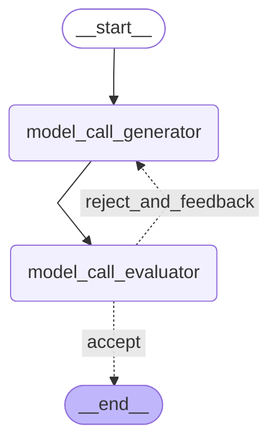

---

### 13.2.6. `Agent`：智能体循环

#### 13.2.6.1. 核心思想

前面的运行图设计模式都属于 **`Workflow`**，**`Agent`** 与 **`Workflow`** 最大的不同是：

> 开发者不再预先确定每一步具体执行什么，而是让 **`LLM`** 根据当前消息和工具结果决定下一步行为。

基本拓扑是：

```text
          ┌─────────────────┐
          ↓                 │
输入 → LLM 决策 → 是否调用工具
                ├─ 是 → Tool ┘
                └─ 否 → END
```

即最基础的 **`ReAct`** 架构，我们已经不止一次介绍并实现过 **`ReAct`** 架构的 **`Agent`**

**`Agent`** 适合问题求解步骤和工具调用顺序无法预先确定的场景。开发者仍然负责提供工具集合、系统提示词、权限和边界，但具体执行过程由模型动态决定。

#### 13.2.6.2. 示例

**示例如下**

```python
from typing import Literal
from langgraph.graph import StateGraph, START, END, MessagesState
from langgraph.prebuilt.tool_node import ToolNode

from langchain.messages import HumanMessage
from langchain_deepseek import ChatDeepSeek
from langchain.tools import tool

from dotenv import load_dotenv
load_dotenv(override=True)

model = ChatDeepSeek(
    model="deepseek-v4-flash",
    extra_body={
        "thinking": {
            "type": "disabled"
        }
    }
)

@tool(parse_docstring=True)
def get_weather(city: str) -> str:
    """
    根据城市查询当日天气

    Args:
        city: 城市名称
    """
    return f"{city} 今天天气不错"

tools = [get_weather]
model_with_tools = model.bind_tools(tools=tools)

def model_node(state: MessagesState) -> MessagesState:
    messages = state["messages"]
    response = model_with_tools.invoke(input=messages)

    return {
        "messages": [response]
    }

def router(state: MessagesState) -> Literal["tool_node", END]:
    last_msg = state["messages"][-1]

    if last_msg.tool_calls:
        return "tool_node"
    return END

builder = StateGraph(state_schema=MessagesState)
builder.add_node("model_node", model_node)
builder.add_node("tool_node", ToolNode(tools=tools))

builder.add_edge(START, "model_node")
builder.add_conditional_edges("model_node", router, path_map=["tool_node", END])
builder.add_edge("tool_node", "model_node")

graph = builder.compile()

response = graph.invoke({"messages": [HumanMessage(content="今天北京天气怎么样？")]})
for msg in response["messages"]:
    msg.pretty_print()

from IPython.display import display
display(graph)
```

**运行结果如下**

```python
================================ Human Message =================================

今天北京天气怎么样？
================================== Ai Message ==================================

好的，我来帮你查询一下今天北京的天气情况。
Tool Calls:
  get_weather (call_00_3kFtzQHjGl7VJkfBi5280445)
 Call ID: call_00_3kFtzQHjGl7VJkfBi5280445
  Args:
    city: 北京
================================= Tool Message =================================
Name: get_weather

北京 今天天气不错
================================== Ai Message ==================================

今天北京的**天气不错**哦！☀️

看起来是个适合出门活动的好天气，不用太担心下雨或恶劣天气的问题。如果你有具体的户外活动计划，应该会比较顺利。

请问还有其他需要帮忙的吗？😊
```

```mermaid
---
config:
  flowchart:
    curve: linear
---
graph TD;
	__start__([<p>__start__</p>]):::first
	model_node(model_node)
	tool_node(tool_node)
	__end__([<p>__end__</p>]):::last
	__start__ --> model_node;
	model_node -.-> __end__;
	model_node -.-> tool_node;
	tool_node --> model_node;
	classDef default fill:#f2f0ff,line-height:1.2
	classDef first fill-opacity:0
	classDef last fill:#bfb6fc
```

