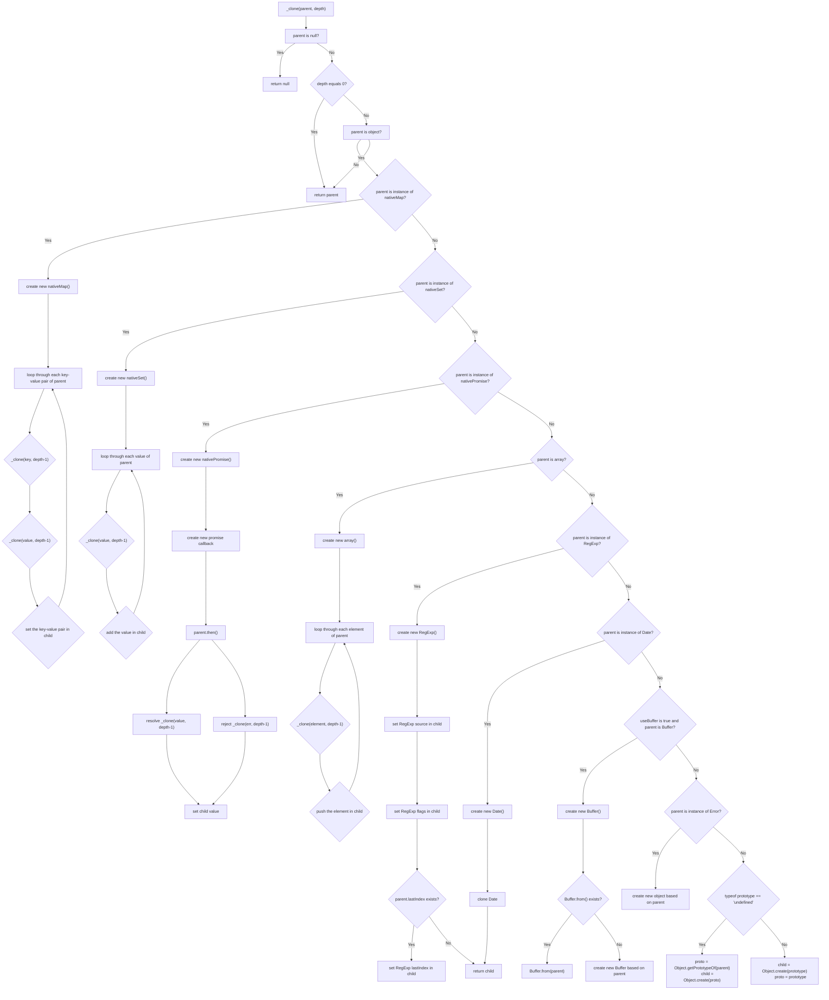

# Lodash

主要记录一些看不懂的方法，和一些面试频率蛮高的方法

## 1. `_.differenceBy(array, [values], [iteratee=_.identity])`

`[iteratee=_.identity]` *(Array|Function|Object|string)*: iteratee 调用每个元素。

```js
_.differenceBy([3.1, 2.2, 1.3], [4.4, 2.5], Math.floor);
// => [3.1, 1.3]
 
// The `_.property` iteratee shorthand.
_.differenceBy([{ 'x': 2 }, { 'x': 1 }], [{ 'x': 1 }], 'x');
// => [{ 'x': 2 }] 
```

`_.differenceBy()` 是 lodash 中的一个方法，用于比较两个数组，返回第一个数组中在第二个数组中不存在的元素集合。它可以接受一个可迭代对象，一个或多个值，或一个迭代函数作为参数。

该方法的第一个参数是要进行差异比较的数组，第二个参数是要排除的数组，第三个参数是一个迭代函数或一个字符串。如果提供了迭代函数，它将用于比较数组中的每个元素。如果提供了字符串，则将使用该字符串来获取每个元素的属性值，然后进行比较。

例如，`_.differenceBy([3.1, 2.2, 1.3], [4.4, 2.5], Math.floor)` 将返回一个数组 `[3.1, 1.3]`，因为 `Math.floor(3.1)` 等于3和 `Math.floor(2.2)` 等于 2，而 `Math.floor(4.4)` 和 `Math.floor(2.5)` 为4和2，所以 3.1 和 1.3 在第二个数组中不存在。

另外一个例子是 `_.differenceBy([{ 'x': 2 }, { 'x': 1 }], [{ 'x': 1 }], 'x')`。这个例子将返回一个包含一个对象 `{ 'x': 2 }` 的数组，因为只有 `{ 'x': 2 }` 在第二个数组中不存在，而 `{ 'x': 1 }` 存在于第二个数组中。在这个例子中，我们使用了字符串 `'x'` 作为迭代函数，因此比较每个对象的 `x` 属性值。

## 2. ` _.differenceWith(array, [values], [comparator])`

`comparator]` *(Function)*: comparator 调用每个元素。

```js
var objects = [{ 'x': 1, 'y': 2 }, { 'x': 2, 'y': 1 }];
 
_.differenceWith(objects, [{ 'x': 1, 'y': 2 }], _.isEqual);
// => [{ 'x': 2, 'y': 1 }]
```

## 3. `_.dropRightWhile(array, [predicate=_.identity])`

`dropRightWhile` 方法只会删除符合删除条件的元素，而不是把所有与删除条件不符合的元素全部保留。

Elements are dropped until `predicate` returns falsey.

predicate 会传入3个参数： (value, index, array)。

1. `array` *(Array)*: 要查询的数组。
2. `[predicate=_.identity]` *(Function)*: 这个函数会在每一次迭代调用。

```js
var users = [
  { 'user': 'barney',  'active': true },
  { 'user': 'fred',    'active': false },
  { 'user': 'pebbles', 'active': false }
];
 
_.dropRightWhile(users, function(o) { return !o.active; });
// => objects for ['barney']
 
// The `_.matches` iteratee shorthand.
// 删除用户数组中所有 "user" 属性为 "pebbles" 且 "active" 属性为 false 的对象。因此，在删除后将剩下 { 'user': 'barney',  'active': true } 和 { 'user': 'fred', 'active': false } 这两个对象。
_.dropRightWhile(users, { 'user': 'pebbles', 'active': false });
// => objects for ['barney', 'fred']
 
// The `_.matchesProperty` iteratee shorthand.
// 删除用户数组中所有 "active" 属性值为 false 的对象。因此，在删除后只剩下 { 'user': 'barney',  'active': true } 这个对象。
_.dropRightWhile(users, ['active', false]);
// => objects for ['barney']
 
// The `_.property` iteratee shorthand.
_.dropRightWhile(users, 'active');
// => objects for ['barney', 'fred', 'pebbles']
```

这里的最后一个例子为什么返回所有数据？？？？

## 4. `_.dropWhile(array, [predicate=_.identity])`

```js
var users = [
  { 'user': 'barney',  'active': true },
  { 'user': 'fred',    'active': false },
  { 'user': 'pebbles', 'active': false },
  {  'user': 'widdle' }
];

// The `_.property` iteratee shorthand.
_.dropRightWhile(users,'active');
// => objects for ['fred', 'pebbles', 'widdle']
```

## 5. `_.flattenDeep(array)`

有空去看下源码

## 6. `_.pullAllBy(array, values, [iteratee=_.identity])`

参数

1. `array` *(Array)*: 要修改的数组。
2. `values` *(Array)*: 要移除值的数组。
3. `[iteratee=_.identity]` *(Array|Function|Object|string)*: iteratee（迭代器）调用每个元素。

```js
var array = [{ 'x': 1 }, { 'x': 2 }, { 'x': 3 }, { 'x': 1 }];
 
_.pullAllBy(array, [{ 'x': 1 }, { 'x': 3 }], 'x');
console.log(array);
// => [{ 'x': 2 }]
```

我们想要从`array`数组中移除所有具有`'x'`属性值为`1`或`3`的对象。我们传递了一个包含这两个对象的数组作为`values`参数，并将`'x'`作为`iteratee`参数传递，这样lodash会根据对象的`'x'`属性进行匹配。因此，`{ 'x': 1 }`和`{ 'x': 3 }`这两个对象将被从`array`数组中移除。

## 7. `_.sortedUniq(array)`

*(Array)*: 返回一个新的不重复的数组。

## 8. `_.sortedUniqBy(array, [iteratee])`

## 9. `_.uniq(array)`

创建一个去重后的`array`数组副本。使用了[`SameValueZero`](http://ecma-international.org/ecma-262/6.0/#sec-samevaluezero) 做等值比较。只有第一次出现的元素才会被保留。

## 10. `_.without(array, [values])`

*(Array)*: 返回过滤值后的新数组。

## 11. `_.xor([arrays])`

*Array)*: 返回过滤值后的新数组。

## 12. `_.flatMap(collection, [iteratee=_.identity])`

创建一个扁平化（注：同阶数组）的数组，这个数组的值来自`collection`（集合）中的每一个值经过 `iteratee`（迭代函数） 处理后返回的结果，并且扁平化合并。 iteratee 调用三个参数： *(value, index|key, collection)*。

## 12. `_.flatMapDeep(collection, [iteratee=_.identity])`

这个方法类似[`_.flatMap`](https://www.lodashjs.com/docs/lodash.flatMapDeep#flatMap) 不同之处在于，[`_.flatMapDeep`](https://www.lodashjs.com/docs/lodash.flatMapDeep#flatMapDeep) 会继续扁平化递归映射的结果。

## 13. `_.flatMapDepth(collection, [iteratee=_.identity], [depth=1])`

## 14. `_.map(collection, [iteratee=_.identity])`

## 15. `_.reduce(collection, [iteratee=_.identity], [accumulator])`

## 16. `_.size(collection)`

## 17. `_.sortBy(collection, [iteratees=[_.identity]])`

创建一个元素数组。 以 iteratee 处理的结果升序排序。 这个方法执行稳定排序，也就是说相同元素会保持原始排序。

```js
function sortBy(collection, iteratees) {
  iteratees = Array.isArray(iteratees) ? iteratees : [iteratees];
  return Array.prototype.slice.call(collection)
    .sort(function(a, b) {
      return iteratees.reduce(function(result, iteratee) {
        if (result === 0) {
          var aVal = iteratee(a);
          var bVal = iteratee(b);
          return aVal > bVal ? 1 : aVal < bVal ? -1 : 0;
        }
        return result;
      }, 0);
    });
}
```

# 函数

## `_.debounce(func, [wait=0], [options=])`

## `_.delay(func, wait, [args])`

## `_.throttle(func, [wait=0], [options=])`

# 语言

## `_.clone(value)`

[structured clone algorithm](https://mdn.io/Structured_clone_algorithm)

## `_.cloneDeep(value)`

`cloneDeep` 需要关注的几个问题：类型判断、循环引用，内置类型可以用调用 `Object.prototype.toString.call` 这个方法来判断类型，自定义类型的拷贝可以使用 `new constructor` 的方式拷贝

```js
/**
 * @private
 * @param {*} 传入一个任意值
 * @param {boolean} bitmask 符号位，clone 的方式
 *  1 - 深 clone
 *  2 - 抹平继承属性
 *  4 - clone 用途
 * @param {Function} [customizer] 自定义 clone 函数
 * @param {string} [key] value 的所有 key 值
 * @param {Object} [object] value 的父对象
 * @param {Object} [stack] 存储被拷贝和拷贝对象的递归值，同时可以解决循环递归的问题
 * @returns {*} 返回一个拷贝值
 */
function baseClone(value, bitmask, customizer, key, object, stack) {
  var result,
    isDeep = bitmask & CLONE_DEEP_FLAG,
    isFlat = bitmask & CLONE_FLAT_FLAG,
    isFull = bitmask & CLONE_SYMBOLS_FLAG;
  // cloneDeepWith 需要的代码，可以自定义 clone 函数
  if (customizer) {
    result = object ? customizer(value, key, object, stack) : customizer(value);
  }
  if (result !== undefined) {
    return result;
  }
  // 非对象返回自身
  if (!isObject(value)) {
    return value;
  }
  // isArr 判断是否是数组
  var isArr = isArray(value);
  if (isArr) {
    /// isArr 结果为 true，拷贝数组
    result = initCloneArray(value);
    if (!isDeep) {
      return copyArray(value, result);
    }
  } else {
    // isArr 结果为 false
    // 获取 Tag，实质上是 Object.prototype.toString.call(value)，获取的变量类型
    var tag = getTag(value),
      isFunc = tag == funcTag || tag == genTag;
    // 拷贝 Array Buffer
    if (isBuffer(value)) {
      return cloneBuffer(value, isDeep);
    }
    // 类型是 object，开始拷贝 object
    if (tag == objectTag || tag == argsTag || (isFunc && !object)) {
      result = isFlat || isFunc ? {} : initCloneObject(value);
      if (!isDeep) {
        return isFlat
          ? copySymbolsIn(value, baseAssignIn(result, value))
          : copySymbols(value, baseAssign(result, value));
      }
    } else {
      // 判断是否是 Error、Function、WeakMap，注意4.17.20 版本 HTMLElement 没有加入 cloneableTags 中，返回 undefined
      if (!cloneableTags[tag]) {
        return object ? value : {};
      }
      // 根据 Tag 利用 initCloneByTag 拷贝新值并传入 result（创建 result）
      result = initCloneByTag(value, tag, isDeep);
    }
  }
  // Check for circular references and return its corresponding clone.
  // 检查是否循环引用（检查 stack 内是否有对应值），如果不是，暂时存储进 stack 的值；如果是，返回 stack 的值
  stack || (stack = new Stack());
  var stacked = stack.get(value);
  if (stacked) {
    return stacked;
  }
  stack.set(value, result);
  // set 和 map 拷贝，同样是获取 flag，利用 set 和 map 的内置方法
  if (isSet(value)) {
    value.forEach(function (subValue) {
      result.add(
        baseClone(subValue, bitmask, customizer, subValue, value, stack)
      );
    });
  } else if (isMap(value)) {
    value.forEach(function (subValue, key) {
      result.set(
        key,
        baseClone(subValue, bitmask, customizer, key, value, stack)
      );
    });
  }
  // 深拷贝这里 isFull isFlat 都是 false，因此 keysFunc === keys，函数用于判断是否类数组
  var keysFunc = isFull
    ? isFlat
      ? getAllKeysIn
      : getAllKeys
    : isFlat
    ? keysIn
    : keys;
  var props = isArr ? undefined : keysFunc(value);
  // 类数组用 for 循环将 prop 一一加入到 result 上
  arrayEach(props || value, function (subValue, key) {
    if (props) {
      key = subValue;
      subValue = value[key];
    }
    // 将键值递归的传入 result（baseClone的结果）
    assignValue(
      result,
      key,
      baseClone(subValue, bitmask, customizer, key, value, stack)
    );
  });
  return result;
}

```

## pvorb/clone

https://github.com/pvorb/clone

https://npmtrends.com/clone-vs-clone-deep-vs-deep-copy-vs-deepcopy-vs-lodash.clonedeep

```js
// https://github.com/pvorb/clone source code
const clone = (function () {
  "use strict";

  function _instanceof(obj, type) {
    return type != null && obj instanceof type;
  }

  let nativeMap;
  try {
    nativeMap = Map;
  } catch (_) {
    // maybe a reference error because no `Map`. Give it a dummy value that no
    // value will ever be an instanceof.
    nativeMap = function () {};
  }

  let nativeSet;
  try {
    nativeSet = Set;
  } catch (_) {
    nativeSet = function () {};
  }
  // 这段代码的意图可能是为了在不同的 JavaScript 运行环境中（如浏览器和 Node.js）都能够使用 Promise 对象。如果在某些旧的或不支持 Promise 的运行环境中运行该代码，则会将 nativePromise 变量赋值为一个空函数，以避免代码中使用 nativePromise 变量时出现错误。
  let nativePromise;
  try {
    nativePromise = Promise;
  } catch (_) {
    nativePromise = function () {};
  }

  /**
   * Clones (copies) an Object using deep copying.
   *
   * This function supports circular references by default, but if you are certain
   * there are no circular references in your object, you can save some CPU time
   * by calling clone(obj, false).
   *
   * Caution: if `circular` is false and `parent` contains circular references,
   * your program may enter an infinite loop and crash.
   *
   * @param `parent` - the object to be cloned
   * @param `circular` - set to true if the object to be cloned may contain
   *    circular references. (optional - true by default)
   * @param `depth` - set to a number if the object is only to be cloned to
   *    a particular depth. (optional - defaults to Infinity)
   * @param `prototype` - sets the prototype to be used when cloning an object.
   *    (optional - defaults to parent prototype).
   * @param `includeNonEnumerable` - set to true if the non-enumerable properties
   *    should be cloned as well. Non-enumerable properties on the prototype
   *    chain will be ignored. (optional - false by default)
   */
  function clone(parent, circular, depth, prototype, includeNonEnumerable) {
    //函数中需要先进行类型判断，如果 circular 参数是对象，则从中获取相应的属性值，以便后续使用。如果 circular 参数是布尔值，则无需进行任何处理，直接使用即可。
    if (typeof circular === "object") {
      depth = circular.depth;
      prototype = circular.prototype;
      includeNonEnumerable = circular.includeNonEnumerable;
      circular = circular.circular;
    }
    // maintain two arrays for circular references, where corresponding parents
    // and children have the same index
    const allParents = [];
    const allChildren = [];

    const useBuffer = typeof Buffer != "undefined";

    // 设置各个入参的默认属性
    if (typeof circular == "undefined") {
      circular = true;
    }

    if (typeof depth == "undefined") {
      depth = Infinity;
    }

    // recurse this function so we don't reset allParents and allChildren
    function _clone(parent, depth) {
      // cloning null always returns null
      if (parent === null) {
        return null;
      }

      if (depth === 0) {
        return parent;
      }
      /**
       * 以下是一些 typeof 运算符返回值不为 'object' 的情况：
       *
       * typeof 123 返回 'number'
       * typeof 'hello' 返回 'string'
       * typeof true 返回 'boolean'
       * typeof undefined 返回 'undefined'
       * typeof null 返回 'object'（注意这是一个 JavaScript 的历史遗留问题，null 实际上是一个空对象引用）
       * typeof [] 返回 'object'（数组是一种特殊的对象）
       * typeof function() {} 返回 'function'（函数也是一种特殊的对象）
       * 如果 parent 是一个数字、字符串、布尔值、undefined，或者一个函数，typeof parent 的结果都不会是 'object'，会触发该条件语句的执行。
       */

      let child;
      let proto;
      if (typeof parent != "object") {
        return parent;
      }

      if (_instanceof(parent, nativeMap)) {
        child = new nativeMap();
      } else if (_instanceof(parent, nativeSet)) {
        child = new nativeSet();
      } else if (_instanceof(parent, nativePromise)) {
        child = new nativePromise((resolve, reject) => {
          parent.then(
            (value) => {
              resolve(_clone(value, depth - 1));
            },
            (err) => {
              reject(_clone(err, depth - 1));
            }
          );
        });
      } else if (clone.__isArray(parent)) {
        child = [];
      } else if (clone.__isRegExp(parent)) {
        child = new RegExp(parent.source, __getRegExpFlags(parent));
        if (parent.lastIndex) {
          child.lastIndex = parent.lastIndex;
        }
      } else if (clone.__isDate(parent)) {
        child = new Date(parent.getTime());
      } else if (useBuffer && Buffer.isBuffer(parent)) {
        if (Buffer.from) {
          // Node.js >= 5.10.0
          child = Buffer.from(parent);
        } else {
          // Older Node.js versions
          child = new Buffer(parent.length);
          parent.copy(child);
        }
        return child;
        // 如果 parent 是一个 Error 类型的实例，那么通过 Object.create(parent) 创建的新对象将继承 parent 对象的所有属性和方法，并且原型链指向 Error.prototype。
      } else if (_instanceof(parent, Error)) {
        child = Object.create(parent);
      } else {
        // 如果都不是以上实例，需要根据 prototype 参数来决定新对象 child 的原型链。如果 prototype 参数为 undefined，则通过 Object.getPrototypeOf(parent) 获取到 parent 的原型，
        // 并以其为原型创建新对象 child；否则，直接以 prototype 参数指定的原型创建新对象 child。
        if (typeof prototype == "undefined") {
          proto = Object.getPrototypeOf(parent);
          child = Object.create(proto);
        } else {
          child = Object.create(prototype);
          proto = prototype;
        }
      }
      /**
       * 这段代码实现了对循环引用对象的处理。如果 circular 参数为 true，则表示需要处理循环引用，这时候在遍历 parent 对象的属性时，如果发现当前属性的值已经出现过，说明存在循环引用，
       * 为了避免无限递归调用导致堆栈溢出，这个属性值应该被跳过而不是再次调用 _clone 方法对它进行克隆。
       * 为了实现这个功能，代码中创建了两个数组 allParents 和 allChildren，用于保存已经遍历过的父对象和克隆后的子对象。每次遍历一个属性时，先在 allParents 数组中查找当前属性值是否已经出现过，
       * 如果出现过，直接返回对应的克隆对象 allChildren[index]，否则将当前父对象和对应的子对象分别添加到 allParents 和 allChildren 数组中。这样在遇到循环引用的情况时，就可以直接返回已经存在的克隆对象了。
       */

      if (circular) {
        const index = allParents.indexOf(parent);

        if (index != -1) {
          return allChildren[index];
        }
        allParents.push(parent);
        allChildren.push(child);
      }
      /**
       * 这段代码处理了原生 Map 对象的克隆操作。首先通过 _instanceof 方法判断 parent 是否是 Map 对象。如果是，就通过 forEach 方法遍历 Map 对象的每一个键值对，对键和值分别进行递归克隆操作，并将克隆后的键值对添加到新的 Map 对象 child 中。
       * 具体来说，对于每一个键值对，先使用 _clone 方法递归克隆它们，得到它们的克隆副本 keyChild 和 valueChild，然后将它们添加到 child 中，使用 set 方法，这样就完成了 Map 对象的克隆操作。
       */

      if (_instanceof(parent, nativeMap)) {
        parent.forEach((value, key) => {
          const keyChild = _clone(key, depth - 1);
          const valueChild = _clone(value, depth - 1);
          // map.set()
          child.set(keyChild, valueChild);
        });
      }

      if (_instanceof(parent, nativeSet)) {
        parent.forEach((value) => {
          const entryChild = _clone(value, depth - 1);
          // set.add()
          child.add(entryChild);
        });
      }

      for (var i in parent) {
        const attrs = Object.getOwnPropertyDescriptor(parent, i);
        if (attrs) {
          child[i] = _clone(parent[i], depth - 1);
        }
        // 使用 try...catch 来捕捉读取属性值时可能会抛出的 TypeError 或 ReferenceError 异常。在非严格模式下，如果在 parent 对象上的属性上只有 getter 而没有 setter，则试图设置其属性值会抛出 ReferenceError 异常；而在严格模式下，这种情况下则会抛出 TypeError 异常。对于这两种异常，代码中都通过 continue 语句来忽略这些属性的复制，不影响整个对象的深度克隆过程。
        try {
          const objProperty = Object.getOwnPropertyDescriptor(parent, i);
          if (objProperty.set === "undefined") {
            // no setter defined. Skip cloning this property
            continue;
          }
          child[i] = _clone(parent[i], depth - 1);
        } catch (e) {
          if (e instanceof TypeError) {
            // when in strict mode, TypeError will be thrown if child[i] property only has a getter
            // we can't do anything about this, other than inform the user that this property cannot be set.
            continue;
          } else if (e instanceof ReferenceError) {
            //this may happen in non strict mode
            continue;
          }
        }
      }
      // 这段代码主要处理 parent 对象中的 Symbol 属性。首先判断 parent 对象是否有 Symbol 属性（通过 Object.getOwnPropertySymbols 方法获取），如果有，则遍历每一个 Symbol 属性。对于每个 Symbol 属性，获取其对应的描述符对象 descriptor（包括属性特性值：enumerable、configurable、writable 和 value），并判断其是否可枚举（enumerable）。如果不可枚举，且 includeNonEnumerable 参数为 false，则跳过当前 Symbol 属性。否则，克隆 Symbol 属性的值，并将描述符对象赋值给 child 对象对应的 Symbol 属性，这里使用 Object.defineProperty 方法来设置属性的描述符，以便正确地克隆特殊属性。最终返回 child 对象。
      if (Object.getOwnPropertySymbols) {
        const symbols = Object.getOwnPropertySymbols(parent);
        for (var i = 0; i < symbols.length; i++) {
          // Don't need to worry about cloning a symbol because it is a primitive,
          // like a number or string.
          const symbol = symbols[i];
          var descriptor = Object.getOwnPropertyDescriptor(parent, symbol);
          if (descriptor && !descriptor.enumerable && !includeNonEnumerable) {
            continue;
          }
          child[symbol] = _clone(parent[symbol], depth - 1);
          Object.defineProperty(child, symbol, descriptor);
        }
      }
      // 这段代码的作用是克隆 parent 对象的所有非可枚举属性，即使用 Object.getOwnPropertyNames() 获取 parent 对象的所有属性名，并使用 Object.getOwnPropertyDescriptor() 获取每个属性的属性描述符，然后将属性值赋值给 child 对象，并使用 Object.defineProperty() 定义新属性。如果 includeNonEnumerable 为 false，则跳过非可枚举属性。
      // 具体流程如下：
      // 通过 Object.getOwnPropertyNames() 获取 parent 对象的所有属性名，并遍历这些属性名。
      // 使用 Object.getOwnPropertyDescriptor() 获取每个属性的属性描述符，并判断该属性是否为可枚举属性。如果是，则跳过该属性。
      // 将 parent 对象的该属性值赋值给 child 对象，并使用 Object.defineProperty() 将该属性定义到 child 对象上。
      if (includeNonEnumerable) {
        const allPropertyNames = Object.getOwnPropertyNames(parent);
        for (var i = 0; i < allPropertyNames.length; i++) {
          const propertyName = allPropertyNames[i];
          var descriptor = Object.getOwnPropertyDescriptor(
            parent,
            propertyName
          );
          if (descriptor && descriptor.enumerable) {
            continue;
          }
          child[propertyName] = _clone(parent[propertyName], depth - 1);
          Object.defineProperty(child, propertyName, descriptor);
        }
      }

      return child;
    }

    return _clone(parent, depth);
  }

  /**
   * Simple flat clone using prototype, accepts only objects, usefull for property
   * override on FLAT configuration object (no nested props).
   *
   * USE WITH CAUTION! This may not behave as you wish if you do not know how this
   * works.
   */
  clone.clonePrototype = function clonePrototype(parent) {
    if (parent === null) {
      return null;
    }

    const c = function () {};
    c.prototype = parent;
    return new c();
  };

  // private utility functions

  function __objToStr(o) {
    return Object.prototype.toString.call(o);
  }
  clone.__objToStr = __objToStr;

  function __isDate(o) {
    return typeof o === "object" && __objToStr(o) === "[object Date]";
  }
  clone.__isDate = __isDate;

  function __isArray(o) {
    return typeof o === "object" && __objToStr(o) === "[object Array]";
  }
  clone.__isArray = __isArray;

  function __isRegExp(o) {
    return typeof o === "object" && __objToStr(o) === "[object RegExp]";
  }
  clone.__isRegExp = __isRegExp;

  function __getRegExpFlags(re) {
    let flags = "";
    if (re.global) {
      flags += "g";
    }
    if (re.ignoreCase) {
      flags += "i";
    }
    if (re.multiline) {
      flags += "m";
    }
    return flags;
  }
  clone.__getRegExpFlags = __getRegExpFlags;

  return clone;
})();

if (typeof module === "object" && module.exports) {
  module.exports = clone;
}

```

`Buffer` 是一个用于处理二进制数据的全局对象，它是 Node.js 的核心模块之一，提供了一种创建、操作和转换二进制数据的方式。

在上述代码中，`Buffer` 被用于检查 `parent` 是否为一个 `Buffer` 对象，以及将 `parent` 转换成一个新的 `Buffer` 对象。

`Buffer` 对象是一种 `Uint8Array` 类型的类数组对象，它的元素是表示字节的整数值，取值范围是 0~255。`Buffer` 对象的长度是固定的，一旦创建就不能再改变。

在 Node.js 中，`Buffer` 可以通过 `new Buffer()` 构造函数或 `Buffer.from()` 静态方法来创建。但是从 Node.js v6.0.0 开始，`new Buffer()` 构造函数已被废弃，因为它可能会导致安全漏洞。建议使用 `Buffer.alloc()`、`Buffer.allocUnsafe()` 或 `Buffer.from()` 方法来创建 `Buffer` 对象。

在上述代码中，如果 `useBuffer` 为 `true` 并且 `parent` 是一个 `Buffer` 对象，函数会将 `parent` 转换成一个新的 `Buffer` 对象 `child`，以便后续操作。

如果当前的 Node.js 版本支持 `Buffer.from()` 方法，则使用该方法将 `parent` 转换成 `child`，否则使用 `new Buffer()` 构造函数创建一个长度与 `parent` 相同的新的 `Buffer` 对象 `child`，然后使用 `parent.copy()` 方法将 `parent` 的数据复制到 `child` 中。

需要注意的是，在 Node.js 中，`Buffer` 对象的使用需要格外小心，因为它们可能会带来一些安全问题，如缓冲区溢出等。

```js
if (typeof prototype == "undefined") {
  proto = Object.getPrototypeOf(parent);
  child = Object.create(proto);
} else {
  child = Object.create(prototype);
  proto = prototype;
}
```

该代码段根据输入参数 `parent` 和 `prototype` 创建一个新的对象 `child`，并将其原型设置为 `prototype`（如果 `prototype` 存在），或者 `parent` 的原型（如果 `prototype` 不存在）。

具体来说，首先检查 `prototype` 是否为 `undefined`。如果是，则说明用户没有传递 `prototype` 参数。此时，代码通过 `Object.getPrototypeOf()` 方法获取 `parent` 的原型 `proto`，然后使用 `Object.create()` 方法创建一个新对象 `child`，并将其原型设置为 `proto`。这样，`child` 的原型就和 `parent` 的原型相同。

如果 `prototype` 不是 `undefined`，则说明用户传递了 `prototype` 参数。此时，代码直接使用 `Object.create()` 方法创建一个新对象 `child`，并将其原型设置为 `prototype`。这样，`child` 的原型就和用户指定的 `prototype` 相同。

`Object.create()` 方法用于创建一个新对象，并将其原型设置为指定的原型。它的第一个参数是原型对象，第二个参数是可选的属性描述符对象，用于定义新对象的属性。`Object.getPrototypeOf()` 方法用于获取一个对象的原型。它的参数是一个对象，返回值是该对象的原型。



`Object.getOwnPropertyDescriptor()` 方法用来获取一个对象某个属性的描述符（descriptor），包括属性的值，可写性，可枚举性，可配置性。如果对象上没有这个属性，则返回 undefined。

`Object.getOwnPropertyDescriptor(obj, prop)` 方法接收两个参数，第一个参数是要获取属性描述符的对象，第二个参数是要获取描述符的属性名。

方法返回一个包含属性描述符的对象。如果对象中没有该属性，则返回 `undefined`。

属性描述符对象的结构如下：

```js
{
  value: 任意类型，表示属性的值,
  writable: 布尔值，表示属性是否可写（即是否可以赋值）,
  enumerable: 布尔值，表示属性是否可枚举（即是否可以使用 for...in 遍历）,
  configurable: 布尔值，表示属性是否可配置（即是否可以使用 delete 删除属性，是否可以修改属性描述符）
}
```

如果 `obj` 不是对象类型，`Object.getOwnPropertyDescriptor(obj, prop)` 方法会抛出一个类型错误。如果 `prop` 是 `obj` 的原型上的属性，方法返回的对象不包含 `value` 和 `writable` 属性，因为这些属性是在实例上定义的，而不是原型上的。

例如，以下是使用 `Object.getOwnPropertyDescriptor()` 方法获取对象属性描述符的示例：

```js
const obj = { a: 1 }
const descriptor = Object.getOwnPropertyDescriptor(obj, 'a')
console.log(descriptor)
// Output: { value: 1, writable: true, enumerable: true, configurable: true }
```

在上面的示例中，定义了一个包含一个属性 `a` 的对象。我们使用 `Object.getOwnPropertyDescriptor()` 方法获取 `a` 属性的属性描述符，并将其存储在变量 `descriptor` 中。最后，将描述符打印到控制台中，输出的结果是 `{ value: 1, writable: true, enumerable: true, configurable: true }`，这表明 `a` 属性是可写、可枚举和可配置的。

`Object.getOwnPropertyDescriptor()` 方法只能获取单个属性的描述符。如果需要获取对象上的所有属性描述符，可以使用 `Object.getOwnPropertyDescriptors()` 方法。

```js
function deepCopy(obj) {
  if (obj === null || typeof obj !== "object") {
    return obj;
  }

  // 处理循环引用
  let visited = new WeakMap();
  if (visited.has(obj)) {
    return visited.get(obj);
  }

  let clone;
  if (obj instanceof Date) {
    clone = new Date(obj.getTime());
  } else if (obj instanceof RegExp) {
    clone = new RegExp(obj);
  } else if (obj instanceof Map) {
    clone = new Map();
    for (let [key, value] of obj) {
      clone.set(key, deepCopy(value));
    }
  } else if (obj instanceof Set) {
    clone = new Set();
    for (let value of obj) {
      clone.add(deepCopy(value));
    }
  } else {
    clone = new obj.constructor();
    for (let key in obj) {
      if (obj.hasOwnProperty(key)) {
        // 处理 Symbol 类型
        if (typeof key === "symbol") {
          clone[key] = deepCopy(obj[key]);
        } else {
          clone[key] = deepCopy(obj[key]);
        }
      }
    }
  }

  visited.set(obj, clone);
  return clone;
}

// 测试
let obj1 = { a: 1, b: 2, c: new Date(), d: /ewff/g };
let date = new Date();
let regexp = new RegExp("/ab+c/", "i");
let obj = {
  date: date,
  regexp: regexp,
  map: new Map([
    ["a", 1],
    ["b", 2]
  ]),
  set: new Set([1, 2, 3]),
  symbol: Symbol("foo")
};

let copiedObj = deepCopy(obj);

console.log(copiedObj.date === date); // false
console.log(copiedObj.regexp === regexp); // false
console.log(copiedObj.map === obj.map); // false
console.log(copiedObj.set === obj.set); // false
console.log(copiedObj.symbol === obj.symbol); // false

// 互相没有被影响
let cloneObj = deepCopy(obj);
obj.arr.push(5);
cloneObj.arr.push(8);
console.log("obj", obj);
console.log("copy", cloneObj);
```